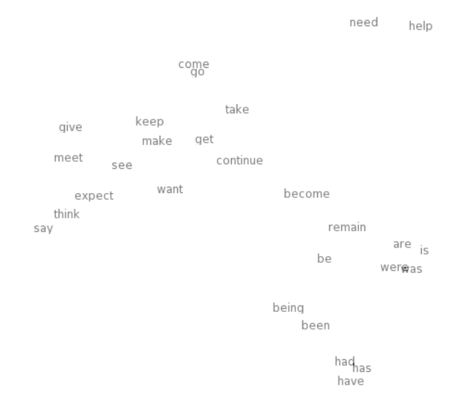
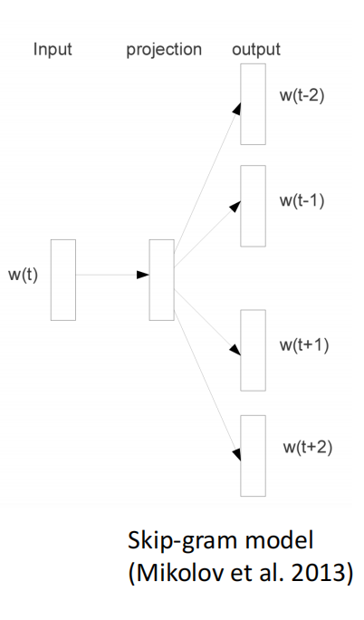
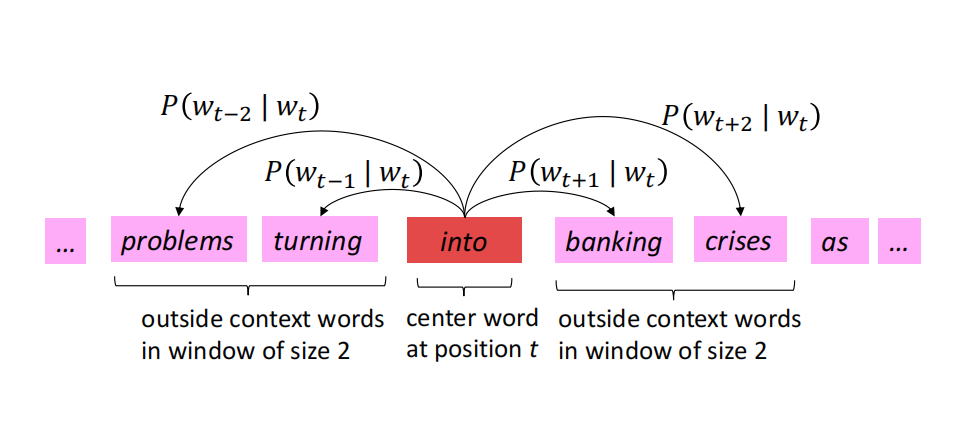

# Chapter 1: NLP and Word Vectors

NLP is aimed to use computer to process and analyze large amount of natural language data. So during this process, the most important thing is how to transform the natural language data into a format that computer can understand. 

In Computer Vision, we use pixels to represent the images and then we transform the pixels into a vector. So in NLP, can we also use vectors to represent the words? The answer is yes.

In traditional NLP, we have a vocabulary $V$ which contains all the words in the corpus. We can use one-hot encoding to represent the words. For example, if we have a vocabulary $V = \{cat, dog, apple\}$, then we can use the following one-hot encoding to represent the words:

$$ cat = [1, 0, 0] $$

$$ dog = [0, 1, 0] $$

$$ apple = [0, 0, 1] $$

But the problem of one-hot encoding is that it is a sparse representation. So we need to find a way to represent the words in a dense way. And at the same time, all of the vectors are orthogonal to each other, we cannot measure the similarity between the words. So we need to find a way to represent the words in a dense way and at the same time, we can measure the similarity between the words.

## Distributional semantics

We believe that a word's meaning is given by the words that frequently appear close-by. When a word $w$ appears in the text, its context is the set of words that appear nearby(within a fixed-size windows). 

## Word vectors

we will use a dense vector to represent the words. We can use the following way to represent the words:

$$ cat = [0.2, 0.3, 0.5] $$

$$ dog = [0.1, 0.4, 0.8] $$

$$ apple = [0.5, 0.6, 0.3] $$

Word vectors are also called word embeddings. We can use the word vectors to measure the similarity between the words. For example, we can use the cosine similarity to measure the similarity between the words:

$$ similarity(w1, w2) = \frac{w1 \cdot w2}{||w1|| \cdot ||w2||} $$

If we visualize the word vectors in semantic space, we can see that the words with similar meanings are clustered together. The image above shows that. We can see that has,had,have are clustered together. And the words with opposite meanings are far away from each other.

And [word2vec](https://arxiv.org/pdf/1301.3781) is a framework for learning the word vector. It is a way to learn how to reflect the natural language into the vectors.

The image above shows the skip-gram model. For a corpus $C$, skip-gram model use a center word $w(t)$ to predict the nearby words(in a fixed-size windows). The objective function of the skip-gram model is to maximize the probability of the nearby words given the center word.

The image above shows that process and the windows size is 2. The center word is "into". We need to calculate the conditional probability $P(w_{t+j}|w_t)$ of the nearby words given the center word. The nearby words are "problems", "turning", "banking", "crises". We need to maximize the probability of the nearby words given the center word.

We need to go through the whole corpus to learn the word vectors. We use Maximum Likelihood Estimation to learn the word vectors. We need to maximize the probability of the nearby words given the center word. And the likelihood function is:

$$ L(\theta) = \prod_{t=1}^{T} \prod_{-c \leq j \leq c, j \neq 0} P(w_{t+j}|w_t) $$

And the objective function of the loss function is:

$$ J(\theta) = -\frac{1}{T} \sum_{t=1}^{T} \sum_{-c \leq j \leq c, j \neq 0} \log P(w_{t+j}|w_t) $$

So the training from maximizing the likelihood is equivalent to minimizing the loss function. We can use the stochastic gradient descent to minimize the loss function.

So let's consider how to calculate the conditional probability $P(w_{t+j}|w_t)$?

For each words, there are two kinds of vectors: the center word vector and the context word vector. We use $v_c$ to represent the center word vector and $u_o$ to represent the context word vector. So given the center word $c$ and context word $o$, the conditional probability $P(o|c)$ is:

$$ P(o|c) = \frac{exp(u_o^T v_c)}{\sum_{w \in V} exp(u_w^T v_c)} $$

It is a softmax function. We can use the softmax function to calculate the conditional probability $P(o|c)$. And we can use the negative log likelihood to calculate the loss function.

Then the question is that, since we get a word2vec model. What is the input and what is the output?

The input of the word2vec model is the center word, which is represented by the one-hot encoding. The output of the word2vec model is the conditional probability of the nearby words given the center word. And we can get the nearby words by choosing the maximum conditional probability.

But the goal is to get the word vector. Skip-gram's output is the possibility of the nearby words given the center word. So how to get the word vector? The first layer's weight matrix is the word vector. We can use the first layer's weight matrix to get the word vector. Assume that the size of the vocabulary is $V$ and the size of the word vector is $N$. The first layer's weight matrix is $W_{V \times N}$. So the word vector of the word $w$ is the $w$-th row of the weight matrix $W$. And the word vector of the word $w$ is $W[w]$.

Also, we have context word vector. The context word vector is the final layer's weight matrix. The second layer's weight matrix is $W'_{N \times V}$. So the context word vector of the word $w$ is the $w$-th column of the weight matrix $W'$. And the context word vector of the word $w$ is $W'[w]$.

