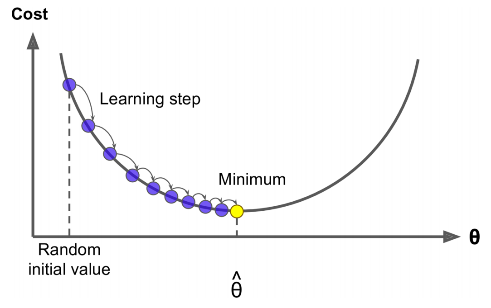
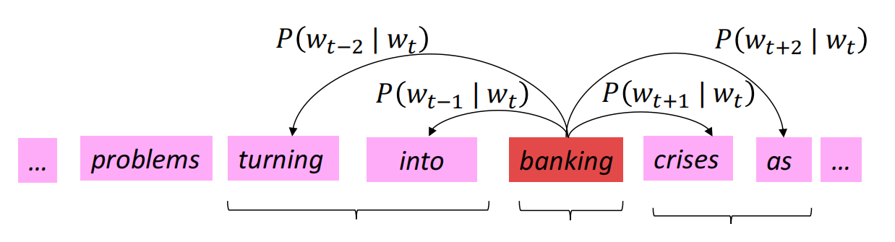
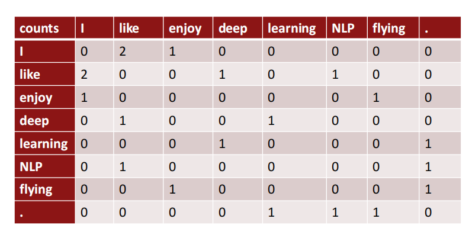
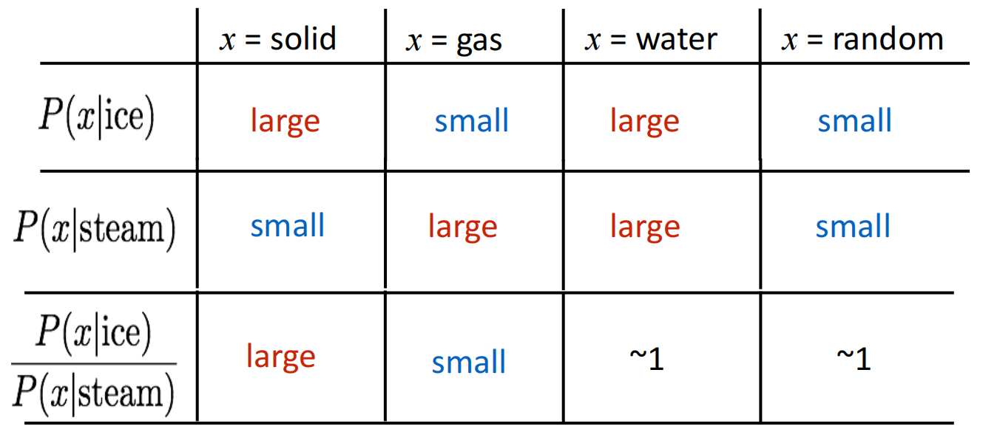
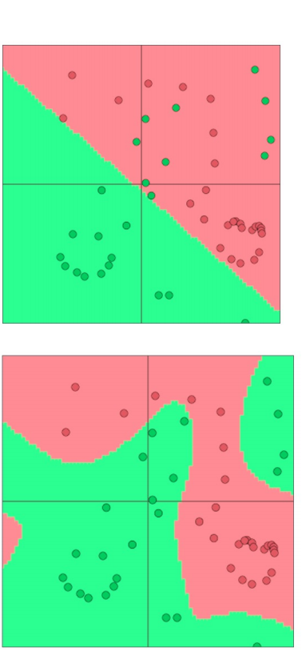
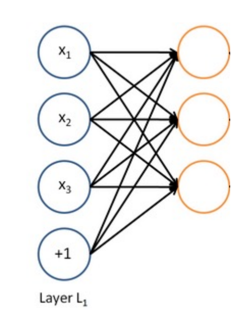

# Chapter 2: Word Vectors, Word Senses, and Neural Classifiers


## 2.1 Optimization

When we have a model and a objective function, we can use optimization algorithms to find the best parameters to maximize of minimize the objective function. 



The image above shows the optimization process. We use the gradient descent algorithm to find the minimum of the objective function. We know that $\theta$ is the parameter we want to find and probably it is a vector. In math, we know that if we want to find the minimum of a function, we can take the derivative of the function. The derivative of a function gives us the slope of the function at a point. So when we want to optimize a complex function, we can take a step in the direction of the negative gradient. The negative gradient gives us the direction of the steepest decrease of the function. We can take a step in that direction and we will be closer to the minimum. We can repeat this process until we reach the minimum.

The gradient descent algorithm is defined as follows:

$$
\theta = \theta - \alpha \nabla_{\theta} J(\theta)
$$
    
Where $\theta$ is the parameter we want to find, $\alpha$ is the learning rate, $\nabla_{\theta} J(\theta)$ is the gradient of the objective function with respect to the parameter $\theta$ and $J(\theta)$ is the objective function.

### Methods to do optimization

There are several methods to do optimization. Some of them are:

- Gradient Descent
- Stochastic Gradient Descent
- Mini-batch Gradient Descent

The difference between them is the way we compute the gradient and the way we update the parameters. In SGD, we will use a single example to compute the gradient and update the parameters. If the data point is $x^{(i)}$ and the label is $y^{(i)}$, the update rule is:

$$
\theta = \theta - \alpha \nabla_{\theta} J(\theta; x^{(i)}; y^{(i)})
$$

In mini-batch gradient descent, we will use a batch of examples to compute the gradient and update the parameters. If the batch of examples is $B$, the update rule is:

$$
\theta = \theta - \alpha \nabla_{\theta} J(\theta; B)
$$

Of course, the original objective function's input is just a data point, but we can extend it to a batch of examples. The objective function is the average of the objective function of each example in the batch.

And we can also use the whole dataset served as a batch. This is called batch gradient descent. The update rule is:

$$
\theta = \theta - \alpha \nabla_{\theta} J(\theta; D)
$$

Where $D$ is the whole dataset. But this is not practical because the dataset is too large and we can't fit it in memory. So we use mini-batch gradient descent.

## 2.2 Word Vectors



Last week, we consider the word2vec technique that used to learn how to reflect the words in a vector space which we call it semantic space. Each of the word serve as center word and context word. We try to use the center word to predict the context word which means we need to maximize $p(o|c)=\frac{exp(u_o^T v_c)}{\sum_{w=1}^{W} exp(u_w^T v_c)}$. 

We will maximize the likelihood function which is the product of the probability of each word in the vocabulary. The objective function is:

$$
J(\theta) = \frac{1}{T} \sum_{t=1}^{T} \sum_{-m \leq j \leq m, j \neq 0} \log p(w_{t+j} | w_t)
$$

Where $T$ is the number of words in the corpus, $m$ is the size of the context window, $w_t$ is the center word and $w_{t+j}$ is the context word.

And there remains one question: if we need to minimize the objective function, we use gradient descent algorithm. We need to take the derivative of the objective function with the parameter $\theta$. But in objective function, we don't have the parameter $\theta$. So how can we use the gradient descent algorithm to minimize the objective function?

The answer is that we can rewrite the objective function in terms of the parameters. We can rewrite the objective function as:

$$
J(\theta) = \frac{1}{T} \sum_{t=1}^{T} \sum_{-m \leq j \leq m, j \neq 0} \log p(w_{t+j} | w_t; \theta)
$$

Where $\theta$ is the parameter we want to find. We can rewrite the probability $p(w_{t+j} | w_t)$ as $p(w_{t+j} | w_t; \theta)$. We can rewrite the probability as a function of the parameter $\theta$. We can use the parameter $\theta$ to predict the probability of the context word given the center word.

Then, we will take derivative of the objective function, there are two terms that we need to compute the derivative. Due to the $\theta$ contains the center word vector and context word vector. So optimize the $\theta$ equals to optimize the $v_t$ and $v_{t+j}$. The first term is to the input vector $v_t$ and the second term is to the output vector $v_{t+j}$. With the softmax to calculate the possibility, the derivative of the objective function with respect to the input vector $v_{w_t}$ is:

$$\frac{\partial\log p(w_{t+j}|w_t;\theta)}{\partial v_{w_t}}=v_{w_{t+j}}^{\prime}-\sum_{w\in V}p(w|w_t;\theta)v_w^{\prime}$$

And for the output vector $v_{w_{t+j}}$ is:

$$\frac{\partial\log p(w_{t+j}|w_t;\theta)}{\partial v_{w_{t+j}}}=v_{w_t}(1-p(w_{t+j}|w_t;\theta))$$

We can use three layers to do so. 

1. Input layer : Input a one-hot vector of the center word $v$.
2. Hidden layer: The hidden layer is the input vector $v_t$. And it will choose the embedding vector of the center word $v_t$.
3. Output layer: It will calculate the probability of the context word given the center word. And it will cross the softmax function to get the probability in order to do prediction.

But there are obviously problem, the original calculation of the softmax function is too expensive(we need to consider the whole $V$). We need to calculate the probability of each word in the vocabulary. So we can use the negative sampling to solve this problem. We can rewrite the objective function as:

$$J_{neg-sample}(u_o,v_c,U)=-\log\sigma(u_o^Tv_c)-\sum_{k\in\{K\text{ sampled indices}\}}\log\sigma(-u_k^Tv_c)$$

Where $\sigma(x)=\frac{1}{1+exp(-x)}$ is the sigmoid function. We can use the negative sampling to sample $K$ negative examples. In this way, we avoid calculating the probability of each word in the vocabulary. We only need to calculate the probability of the positive example and the negative examples. We can use the gradient descent algorithm to minimize the objective function.

Negative sampling means we use a correct example and $K$ incorrect examples to calculate the probability. We need to maximize the first term and minimize the second term. If the windows size if $m$, there will be $2m+1$ words and $2km$ negative words. So in each step, there will be up $(2+2k)m+1$ words will be influence. So the gradient vector is sparse. We can use the sparse matrix to store the gradient vector.

In word2vec, we use a matrix to calculate the context word vector. A doubt is that can we capture the co-occurrence matrix directly? There are two latent solution for that. One is like word2vec, use a fixed windows size and another is use the whole document to calculate the co-occurrence matrix.



If there are three sentences in the document: 
- I like deep learning
- I like NLP
- I enjoy flying

We will have the matrix above. The whole size of the matrix is the $V \times V$. Although it is sparse, it still require a lot of storage. And if we use such a high dimension vector as the feasure, it will has less robust.

And some potential solution for the question above is SVD, PCA etc.

## GloVe



The core insight of GloVe is that we can use the ratio of the co-occurrence probability to learn the word vector. It first calculate the co-occurrence matrix $X_{ij}$ which is the number of times word $j$ appears in the context of word $i$. Then it will calculate the probability of the word $j$ appears in the context of word $i$:

$$P_{ij}=P(j|i)=\frac{X_{ij}}{X_i}$$

Where $X_i=\sum_{k}X_{ik}$ is the number of times word $i$ appears in the context of any word. Then it will calculate the ratio of the probability:

And the training loss is :

$$J=\sum_{i,j=1}^{V}f(X_{ij})(u_i^Tv_j+\tilde{b}_i+\tilde{b}_j-b_{ij})^2$$

Where $f$ is the weighting function, $b_i$ is the bias term, $b_{ij}$ is the bias term for the ratio of the probability. The weighting function is:


## 2.3 Evaluation

We can use the cosine similarity to evaluate the word vectors. We can use the cosine similarity to calculate the similarity between two words. The cosine similarity is defined as:

$$\text{cosine similarity}=\frac{u^Tv}{||u||_2||v||_2}$$

Where $u$ and $v$ are the word vectors of two words. The cosine similarity is between -1 and 1. If the cosine similarity is 1, the two words are similar. If the cosine similarity is -1, the two words are dissimilar. If the cosine similarity is 0, the two words are orthogonal.

## 2.4 Word Senses

The word sense is the meaning of a word. A word can have multiple meanings. For example, the word "bank" can mean a financial institution or the side of a river. The word "apple" can mean a fruit or a company. The word "bat" can mean a flying mammal or a piece of sports equipment. The word "crane" can mean a bird or a machine.

[This method](https://aclanthology.org/P12-1092.pdf) cluster word windows around words, retrain with each word assigned to multiple different clusters bank1, bank2, etc.

## 2.5 Neural Classifiers

Traditional classifiers will give a linear decision boundary. But the neural classifiers can give a non-linear decision boundary.



Unlike traditional classifiers, the neural classifiers both learn the input data features and the input data distributed representation. In deep neural network, we use activation function to learn the non-linear decision boundary. The activation function is a non-linear function which is applied to the output of the neuron. The activation function is defined as:

$$h(x)=\frac{1}{1+exp(-x)}$$

Or we can use the ReLU function which is defined as:

$$h(x)=\max(0,x)$$

The neural network is defined as:

$$h_1(x)=h(W_1x+b_1)$$

A very interesting point is that neural network is running several logistic regressions at the same time.



Each the yellow circle will receive the same inout $\textbf{x}$ and give their own output. We will use some ways to combine the output of each yellow circle. For example, if we use the pytorch "forward", we can use the following code:

```python
def forward(self, x):
    h1 = self.sigmoid(self.linear1(x))
    h2 = self.sigmoid(self.linear2(x))
    h3 = self.sigmoid(self.linear3(x))
    return h1 + h2 + h3
```

Which means we just add the output of each yellow circle. And each yellow circle may calculate by that:

$$h_1(x)=h(W_1x+W_2x+W_3x+b)$$

Let's consider why we need the activation function. If we don't use the activation function, the neural network will be a linear model. The output of the neural network will be a linear combination of the input. The activation function introduces non-linearity to the neural network. The neural network can learn the non-linear decision boundary.