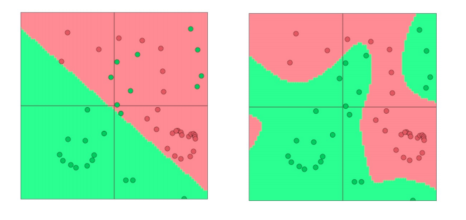

# Chapter 3: Backpropagation and Neural Networks

In chapter 2, we have already discussed the use of neural network to solve the NLP problem. Let's have a briefly review of it. Like the image below: 

We have:
$$
a_1 = f(W_{11}x+1 + W_{12}x_2 + W_{13}x_3 + b_1) \\
a_2 = f(W_{21}x+1 + W_{22}x_2 + W_{23}x_3 + b_2) \\
etc.
$$

In we use martix to represent the weights and bias, we have:
$$
a = f(\mathbf{W}\mathbf{x} + \mathbf{b})
$$

The $f$ is called activation function, which will introduce non-linearity to the model. The neccesary of non-linearity is that if we don't have non-linearity, the whole network will be a linear model, which is not powerful enough to solve the complex problem. And the decision boundary will be a straight line.

We use the SGD to train model, the update equation is below:

$$
\theta = \theta - \alpha \nabla_{\theta} J(\theta)
$$

Where $\theta$ is the parameter of the model, $\alpha$ is the learning rate, $J(\theta)$ is the loss function. The $\nabla_{\theta} J(\theta)$ is the gradient of the loss function. We can use the chain rule to calculate the gradient of the loss function.

Now the question is how to compute the gradient $\nabla_{\theta} J(\theta)$? We know that each model has lots of parameters, we need to optimize all of them. So the first problem is that how to compute the gradient for each of the parameter. We can use the vector and the matrix to represent the gradient. If the function with 1 output and n input is denoted as $f(\mathbf{x}) = f(x_1,x_2,\dots,x_n)$, its gradient of $\mathbf{x}$ is a vector of partial derivatives with respect to each input:

$$
\nabla_{\mathbf{x}} f(\mathbf{x}) = \left[ \frac{\partial f}{\partial x_1}, \frac{\partial f}{\partial x_2}, \dots, \frac{\partial f}{\partial x_n} \right]
$$

If the model has n input and m output which denoted as $\mathbf{f}(\mathbf{x}) = [f_1(x_1,x_2,\dots,x_n),\dots,f_m(x_1,x_2,\dots,x_n)]$, the gradient of the input is a matrix of partial derivatives with respect to each input and output:

$$
\nabla_{\mathbf{x}} f(\mathbf{x}) = \begin{bmatrix}
\frac{\partial f_1}{\partial x_1} & \frac{\partial f_1}{\partial x_2} & \dots & \frac{\partial f_1}{\partial x_n} \\
\frac{\partial f_2}{\partial x_1} & \frac{\partial f_2}{\partial x_2} & \dots & \frac{\partial f_2}{\partial x_n} \\
\vdots & \vdots & \ddots & \vdots \\
\frac{\partial f_m}{\partial x_1} & \frac{\partial f_m}{\partial x_2} & \dots & \frac{\partial f_m}{\partial x_n} \\
\end{bmatrix}
$$

If we meet the composition function, we can use the chain rule to calculate the gradient. The chain rule is that if $f$ and $g$ are two functions, the composition function is $h(x) = f(g(x))$, the gradient of $h$ with respect to $x$ is:

$$
\nabla_x h(x) = \nabla_x f(g(x)) = \nabla_{g(x)} f(g(x)) \nabla_x g(x)
$$

But it can only deal with the single variable functions, what if for multiple variables function? We can use multiply Jocobians to calculate the gradient. If $\mathbf{h} = f(mathbf{z})$ and $\mathbf{z} = \mathbf{W}\mathbf{x} + \mathbf{b} $. What is the result of $\nabla_{\mathbf{x}} \mathbf{h}$? We can use the chain rule to calculate it:

$$
\nabla_{\mathbf{x}} \mathbf{h} = \nabla_{\mathbf{x}} f(\mathbf{z}) = \nabla_{\mathbf{z}} f(\mathbf{z}) \nabla_{\mathbf{x}} \mathbf{z}
$$

If we use Jacobian to represent $\nabla_{\mathbf{x}} \mathbf{h} = \nabla_{\mathbf{x}} f(\mathbf{z}) = \nabla_{\mathbf{z}} f(\mathbf{z}) \nabla_{\mathbf{x}} \mathbf{z}$, we have:

$$
\begin{bmatrix}
\frac{\partial h_1}{\partial x_1} & \frac{\partial h_1}{\partial x_2} & \dots & \frac{\partial h_1}{\partial x_n} \\
\frac{\partial h_2}{\partial x_1} & \frac{\partial h_2}{\partial x_2} & \dots & \frac{\partial h_2}{\partial x_n} \\
\vdots & \vdots & \ddots & \vdots \\
\frac{\partial h_m}{\partial x_1} & \frac{\partial h_m}{\partial x_2} & \dots & \frac{\partial h_m}{\partial x_n} \\
\end{bmatrix} =    
\begin{bmatrix}
\frac{\partial h_1}{\partial z_1} & \frac{\partial h_1}{\partial z_2} & \dots & \frac{\partial h_1}{\partial z_m} \\
\frac{\partial h_2}{\partial z_1} & \frac{\partial h_2}{\partial z_2} & \dots & \frac{\partial h_2}{\partial z_m} \\
\vdots & \vdots & \ddots & \vdots \\
\frac{\partial h_m}{\partial z_1} & \frac{\partial h_m}{\partial z_2} & \dots & \frac{\partial h_m}{\partial z_m} \\
\end{bmatrix} \times
\begin{bmatrix}
\frac{\partial z_1}{\partial x_1} & \frac{\partial z_1}{\partial x_2} & \dots & \frac{\partial z_1}{\partial x_n} \\
\frac{\partial z_2}{\partial x_1} & \frac{\partial z_2}{\partial x_2} & \dots & \frac{\partial z_2}{\partial x_n} \\
\vdots & \vdots & \ddots & \vdots \\
\frac{\partial z_m}{\partial x_1} & \frac{\partial z_m}{\partial x_2} & \dots & \frac{\partial z_m}{\partial x_n} \\
\end{bmatrix}
$$

Consider the output layer, we have a score $s$(maybe is softmax function) and a weight matrix $\mathbf{W}$. What does $\nabla_{\mathbf{W}} s$ look like? It has 1 output and $n \times m$ input, so the output is $n*m$, it is inconveient to backpropagate the gradient. We can use the chain rule to calculate it:

$$
\nabla_{\mathbf{W}} s = \nabla_{\mathbf{z}} s(\mathbf{z}) \nabla_{\mathbf{W}} \mathbf{z}
$$  

So in this way, the gradient matrix is $m \times x$, which is the same shape like weight matrix. If we denote $\delta = \nabla_{\mathbf{z}} s(\mathbf{z})$, and notice that $\mathbf{z} = \mathbf{Wx} + \mathbf{b}$ so $\nabla_{\mathbf{W}} \mathbf{z} = \mathbf{x}$. We have:

$$
\nabla_{\mathbf{W}} s = \delta \mathbf{x}
$$

In order to ensure the shape of the matrix can be multiplied, we can transpose the matrix. So the update equation is:

$$
\nabla_{\mathbf{W}} s = \delta^T \mathbf{x}^T
$$

The $\delta$ is the upstream gradient and $\mathbf{x}$ is the input.

The image above shows the forward propagation, the image below shows the backward propagation.

We can summarize the backpropagation as the image below:

Which is : [downstream gradient] = [upstream gradient] x [local gradient]