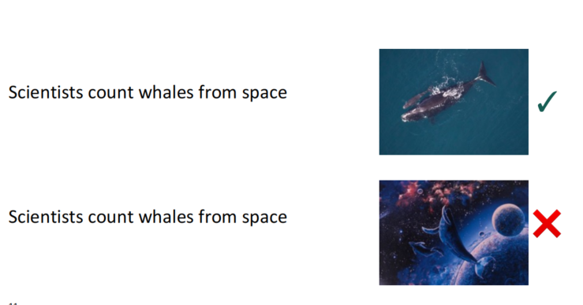
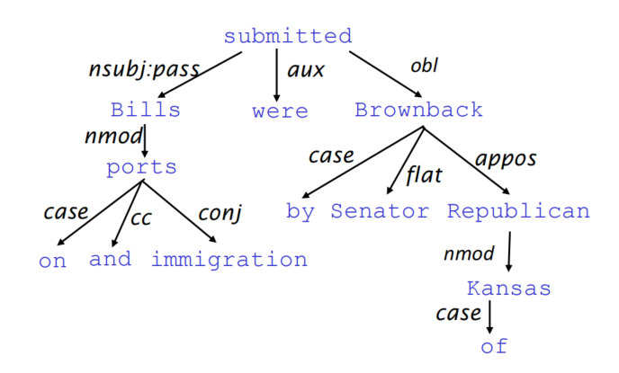

# Chapter 4: Dependency Parsing

## Dependency structure
 
Dependency structure shows which words depend on (modify, attach to, or are arguments of) which other words. It is necessary for communication. We need the dependency structure to understand the meaning of a sentence.

Sometimes maybe one sentence has multiple meanings.

The image above shows a news called **"Scientists count whales from space"**. It has two different meanings. Like the image below:

The situation we call **PP attachment ambiguity**. Another example is "The man saw the girl with a telescope." The sentence has two different meanings, one is the man used a telescope to see a girl, and the other is the man see a girl who has a telescope. It is because the prepositional phrase can attach to different words and then lead to different meanings.

Consider another ambiguity called "Coordination Scope Ambiguity." The example is "Shuttle veteran and longtime NASA executive Fred Gregory appointed to board." There are two meaning, one is Fred Gregory is a shuttle veteran who is appointed to the board, and the other is a shuttle veteran and a longtime NASA executive and Fred Gregory are appointed to the board. The ambiguity is caused by the coordination structure.

Adverbial Modifier Ambiguity is another ambiguity. The example is "tudents get first hand job experience". It can be seen both as Students get [first hand job experience] and Students get [first hand job] experience. The ambiguity is caused by the adverbial modifier, we don't know which word the adverbial modifier modifies.
 

The image above shows the dependency structure of "Bills on ports and immigration were submitted by Republican Senator Brownback of Kansas."
