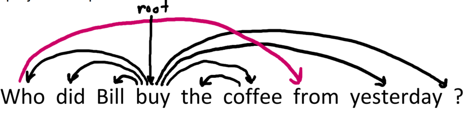
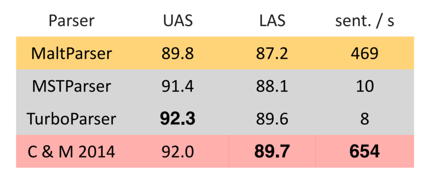
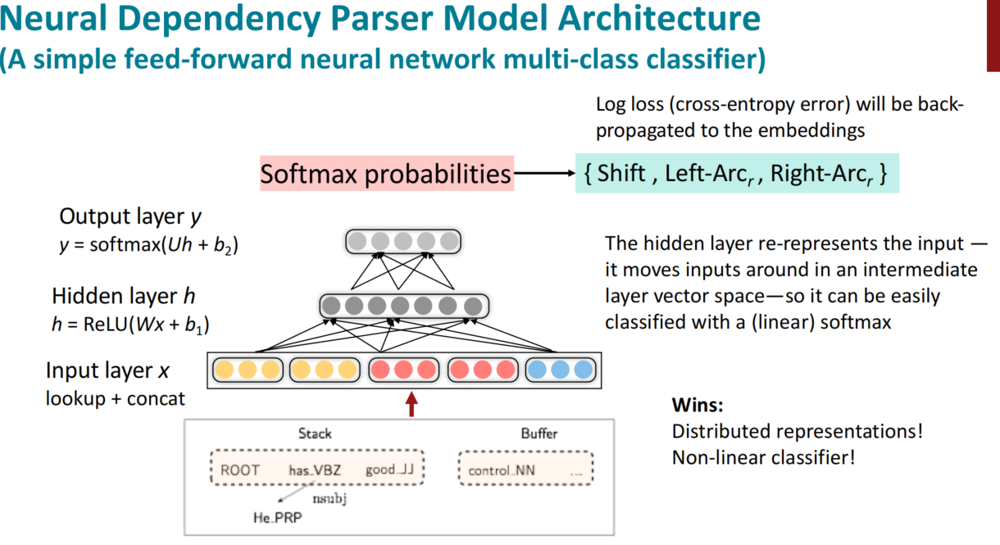

# Chapter 4: Dependency Parsing

## Dependency structure
 
Dependency structure shows which words depend on (modify, attach to, or are arguments of) which other words. It is necessary for communication. We need the dependency structure to understand the meaning of a sentence.

Sometimes maybe one sentence has multiple meanings.

The image above shows a news called **"Scientists count whales from space"**. It has two different meanings. Like the image below:

The situation we call **PP attachment ambiguity**. Another example is "The man saw the girl with a telescope." The sentence has two different meanings, one is the man used a telescope to see a girl, and the other is the man see a girl who has a telescope. It is because the prepositional phrase can attach to different words and then lead to different meanings.

Consider another ambiguity called "Coordination Scope Ambiguity." The example is "Shuttle veteran and longtime NASA executive Fred Gregory appointed to board." There are two meaning, one is Fred Gregory is a shuttle veteran who is appointed to the board, and the other is a shuttle veteran and a longtime NASA executive and Fred Gregory are appointed to the board. The ambiguity is caused by the coordination structure.

Adverbial Modifier Ambiguity is another ambiguity. The example is "tudents get first hand job experience". It can be seen both as Students get [first hand job experience] and Students get [first hand job] experience. The ambiguity is caused by the adverbial modifier, we don't know which word the adverbial modifier modifies.
 

The image above shows the dependency structure of "Bills on ports and immigration were submitted by Republican Senator Brownback of Kansas."

## Dependency Parsing

We use dependency parsing to parse the whole sentence. We have some constraints for the dependency parsing:

1. **Projectivity**: The dependency parsing tree should be projective. It means that the edges in the tree should not cross each other. The image below shows a non-projective tree.

2. **Single-Headedness**: Each word has only one head. It means that each word has only one parent in the tree.

3. **Single-dependency**: Each word has only one dependency. It means that each word has only one edge to its parent.

And let's c onsider projective parse. Projective parse means that there are no crossing dependency arcs when the words are laid out in their linear order. Most of the dependency structures are projective while there are still some non-projective structures.

Dependency parsing's input is a sentence, and the output is a dependency tree. There are four methods to do so.

### Dynamic Programming

Eisner's algorithm is a dynamic programming algorithm. It is a bottom-up algorithm which deviding the whole problem into subproblems and then combine the sub-answer to get the final answer. The algorithm is based on the following two rules:

1. **Arc Factoring**: The probability of a tree is the product of the probabilities of the individual arcs in the tree.
2. **Inside-outside**: The probability of a tree is the product of the probabilities of the subtrees rooted at each word.

The time complexity of Eisner's algorithm is $O(n^3)$.

### Graph-based Algorithm

MSTParser is a graph-based algorithm. It is a top-down algorithm which starts from the root and then build the tree. The algorithm is based on the following two rules:

1. **Score Function**: The score of a tree is the sum of the scores of the individual arcs in the tree.
2. **Maximization**: The tree with the highest score is the best tree.

The time complexity of MSTParser is $O(n^2)$.

### Constaint Satisfaction

Karlsson's algorithm is a constraint satisfaction algorithm. It will parse the sentence by erase the edges which are not satisfied the constraints.

### Transition-based Parsing

It will choose the attachment by a well-trained classifier. The classifier will predict the attachment of the next word based on the current state of the tree.

## Neural Dependency Parsing

Consider previous parser, we need to design the feature function by ourselves. But in the neural dependency parsing, we can use the neural network to learn the feature function. The neural network can learn the feature function from the data.

The image above shows the performance of different parsers. We can see that the ueural network parser has the best performance.

The UAS metric is the Unlabeled Attachment Score. It is the percentage of words that are correctly attached to the head. 

The LAS metric is the Labeled Attachment Score. It is the percentage of words that are correctly attached to the head and have the correct dependency label.

The advantage of the neural network parser is below:

- Distributed Representation: All of the words are represented by the vectors and if the words have similar meanings, they will have similar vectors. So if we use word vectors to represent the words, we can extract the semantic information and use it to parse the sentence. 

- Non-linearity: The neural network can learn the non-linear function. The deep learning classifier is a non-linear classifier. It can learn the complex function from the data.

The image above shows the process of Neural Dependency Parsing. Firstly, we need to train a neural network classifier which will use to predict the dependency label by using supervised learning. Then, we will have two space, one is the stack and the other is the buffer. The stack stores the words thart we have already processed and the buffer stores the words that we haven't processed. Then, we will pick up the words from the buffer and extract the features of the words, representing them by the vectors. Then, we will concatenate the feature vectors and the word vector, putting them into a neural network to predict the next parsing action until the buffer is empty. Finally, we will get the dependency tree.