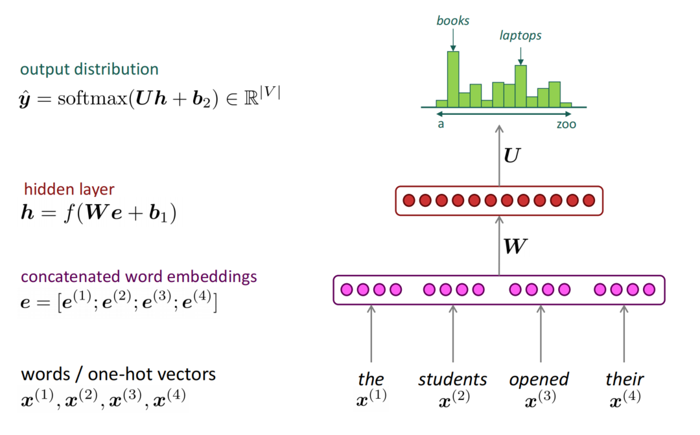

# Chapter 5: Language Models and Recurrent Neural Networks

Firstly, consider what is language modeling. It is a task of predicting what word comes next.

We will give the formal definition of language modeling. Given a sequence of words $w_1, w_2, ..., w_T$, we want to compute the probability of the sequence, which is the product of the probability of each word given the history:

$$P(w_1, w_2, ..., w_T) = \prod_{t=1}^{T} P(w_t | w_1, ..., w_{t-1})$$

The goal of language modeling is to learn the probability of a sequence of words. We can use this probability to generate text, evaluate the likelihood of a sentence, or learn the probability of a word given the history. And a system that does this is called a language model. We can consider a language model is a system that assigns a probability to a sequence of words.

If we consider the generation of $t$-th token has Markov property, which means the probability of the $t$-th token only depends on the previous $t-1$ tokens. We can use the n-gram model to approximate the probability of a word given the history. The n-gram model is a language model that predicts the probability of the $t$-th word given the previous $n-1$ words. The n-gram model is a simplification of the full language model, but it is still widely used in practice.   

The probability of a word given the history can be computed as follows:

$$P(w_t | w_1, ..., w_{t-1}) \approx P(w_t | w_{t-1}, ..., w_{t-n+1})$$

And the question is that how do we get the probability? The answer is counting them in a large corpus:

$$P(w_t | w_{t-1}, ..., w_{t-n+1}) = \frac{C(w_{t-n+1}, ..., w_t)}{C(w_{t-n+1}, ..., w_{t-1})}$$

where $C(w_{t-n+1}, ..., w_t)$ is the count of the sequence of words $w_{t-n+1}, ..., w_t$ in the corpus, and $C(w_{t-n+1}, ..., w_{t-1})$ is the count of the sequence of words $w_{t-n+1}, ..., w_{t-1}$ in the corpus.

If we use n-gram language models, we need to consider two problem. As we know that we use the count of the sequence of words to compute the probability, but the count of the sequence of words is sparse. 

What if we never see the sequence of words in the training data(top of the fraction is 0)? We can use smoothing techniques to solve this problem. One of the most popular smoothing techniques is Laplace smoothing. We add a small constant $\epsilon$ to the count of each word:

$$P(w_t | w_{t-1}, ..., w_{t-n+1}) = \frac{C(w_{t-n+1}, ..., w_t) + \epsilon}{C(w_{t-n+1}, ..., w_{t-1}) + V \epsilon}$$

where $V$ is the size of the vocabulary.

Another problem is what if the sequence of words we never see in the training data(bottom of the fraction is 0)? We can use backoff techniques to solve this problem. If we never see the sequence of words $w_{t-n+1}, ..., w_{t-1}$ in the training data, we can backoff to the sequence of words $w_{t-n+2}, ..., w_{t-1}$:

$$P(w_t | w_{t-1}, ..., w_{t-n+1}) = \frac{C(w_{t-n+1}, ..., w_t) + \epsilon}{C(w_{t-n+1}, ..., w_{t-1}) + V \epsilon}$$

$$P(w_t | w_{t-1}, ..., w_{t-n+1}) = P(w_t | w_{t-1}, ..., w_{t-n+2})$$

So, in practice, we usually set $n=3$ or $n=4$.

Another concern is the storage problem. We need to store all n-gram we saw in the corpus. If we set $n=4$ and the vocabulary size is 10000, we need to store $10000^4$ n-grams. It is a huge number. We can use the hash table to store the n-grams, but it is still a problem. So we need to use a neural language model to solve this problem.

The image shows how a fixed-window neural language model works. The input to the model is a sequence of words, and the output is the probability of the next word. The model uses a fixed-size window to predict the next word. The window slides over the input sequence, and at each position, the model predicts the next word. The model is trained to maximize the probability of the next word given the input sequence.

This method has not sparsity oroblem and we don't need to store all of the n-grams. But it still has some problems.

- Fixed window is small and can't capture long-range dependencies.
- Enalrging window enlarges $W$ and $b$.
- Window can never be large enough due to the computational cost.
- No symmetry between input and output.

So we need a neural architecture that can process any length input.

The core idaea of RNN is applying the same weights $W$ repeatedly. The image above shows RNN architecture. And the RNN has several features:

- The hidden weights are shared across time. Although previous neural language model is also shared weights, but it need to concatenate the input so the size of $W$ is big and up to the window size. But RNN doesn't need to concatenate the input so the size of $W$ is small.

- The hidden layer will receive both the input and the previous step state and use both to generate the output and the next state.

- Using the shared weights, RNN can process any length input because there is no more $W$ to enlarge. And due to the current stage will also consider the previous stage, the RNN can capture the long-range dependencies.

The image above shows how RNN works. Although it solves the problem of previous neural language model, it still has some problems. First is the computational cost is expensive so the speed is slow. Another problem is it is difficult to access information from many steps back, which is called vanishing gradient problem. The gradient of the loss function decays exponentially with the number of steps back. 

Let's consider how to train an RNN model. Firstly,we will get a large corpus. Then we will feed into RNN, computing the output distribution $y_t$ for every time step $t$. We consider it as a multi-class classification problem, so we will use the cross-entropy loss function to compute the loss. The aim of training is to minimize the loss, in other words, we want to maximize the probability of the next word given the input sequence.

$$L(\theta) = - \frac{1}{T} \sum_{t=1}^{T} \log P(w_t | w_1, ..., w_{t-1}; \theta)$$

where $\theta$ is the parameters of the RNN model. And if we use the whole corpus to compute loss, it is too expensive. So we can use the mini-batch to compute the loss. We will use the backpropagation algorithm to compute the gradient of the loss function with respect to the parameters. And then we will use the gradient descent algorithm to update the parameters.

Next, let's consider how to evaluate the Language Model. The standard metric for evaluating is perplexity which is given by:

$$PP(W) = P(w_1, w_2, ..., w_T)^{-\frac{1}{T}} = \sqrt[T]{\frac{1}{P(w_1, w_2, ..., w_T)}} = \sqrt[T]{\prod_{t=1}^{T} \frac{1}{P(w_t | w_1, ..., w_{t-1})}}$$

The perplexity is the geometric mean of the inverse probability of the test set, normalized by the number of words. The lower the perplexity, the better the language model. And the perplexity is the exponentiation of the cross-entropy loss.

$$PP(W) = \exp(L(\theta))$$

Review the main problem of RNN, which is vanishing gradient problem as shown below:

We can prove the vanishing gradient problem. For conivenience, we only consider the linear case. We know that $h_t = \sigma(W_h h_{t-1} + W_x x_t + b_1)$, what if $\sigma(x) = x$ ?

$$
\frac{\partial h_t}{\partial h_{t-1}} = diag(\sigma'(W_h h_{t-1} + W_x x_t + b_1) W_h) = diag(W_h) = W_h
$$

Consider the loss $J_i(\theta)$ on step $i$ with respect to the hidden state $h_i$:

$$
\frac{\partial J_i(\theta)}{\partial h_i} = \frac{\partial J_i(\theta)}{\partial h_{i+1}} \frac{\partial h_{i+1}}{\partial h_i} = \frac{\partial J_i(\theta)}{\partial h_{i+1}} W_h
$$

For previous step $j$, let $l = i-j$:

$$
\frac{\partial J_i(\theta)}{\partial h_i} = \frac{\partial J_i(\theta)}{\partial h_{i+1}} W_h = \frac{\partial J_i(\theta)}{\partial h_{i+1}} W_h = ... = \frac{\partial J_i(\theta)}{\partial h_{i+1}} W_h^l
$$

Consider if the eigenvalues of $W_h$ are less than 1, the gradient will vanish. And if the eigenvalues of $W_h$ are greater than 1, the gradient will explode. So we need to solve the vanishing gradient problem, or it will lose the long-term information.

The next problem of RNN is exploding gradient problem. The exploding gradient problem is that the gradient of the loss function grows exponentially with the number of steps back. In the worst case, this will result in INF or NaN values. We can use gradient clipping to solve this problem. We can clip the gradient to a maximum value to prevent it from exploding. The gradient clipping algorithm is as follows:

$$
\text{if} \lVert \nabla \theta \rVert > \text{threshold}:
\begin{cases}
    \nabla \theta = \frac{\text{threshold}}{\lVert \nabla \theta \rVert} \nabla \theta
\end{cases}
$$

