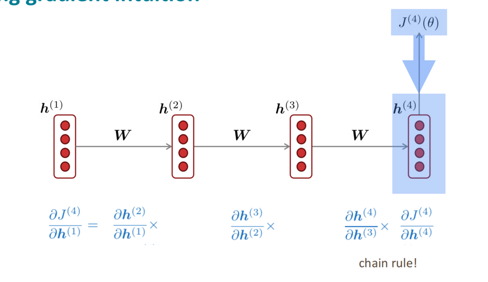
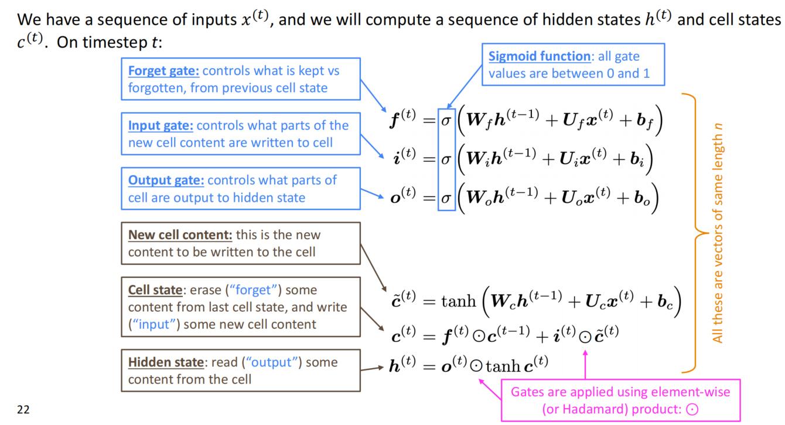
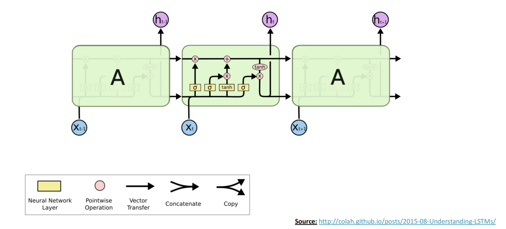
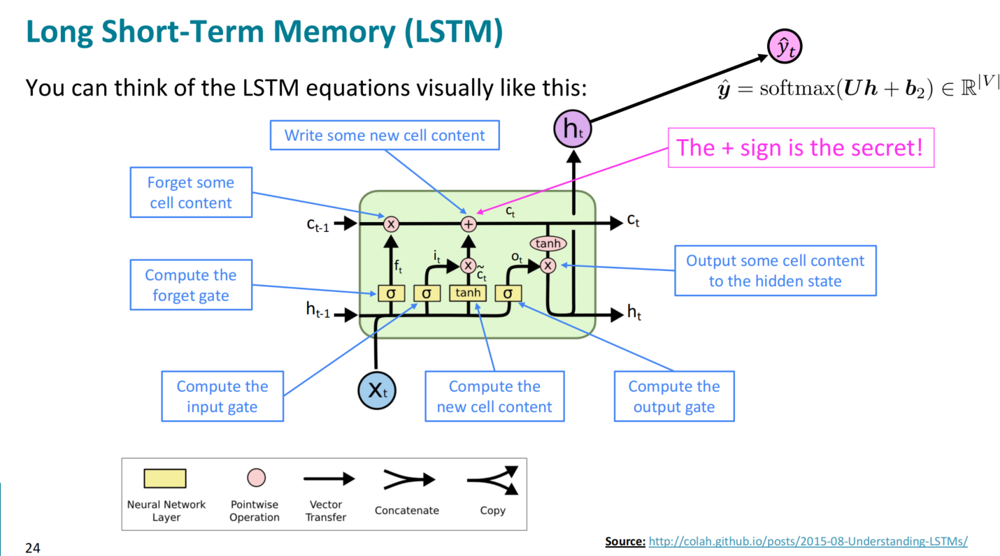
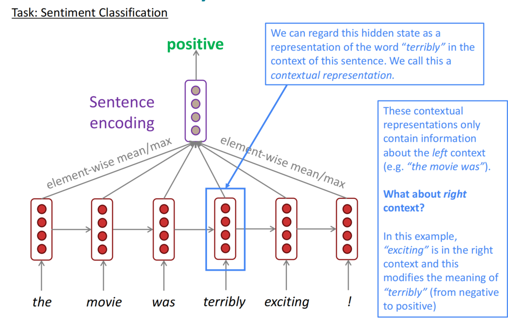
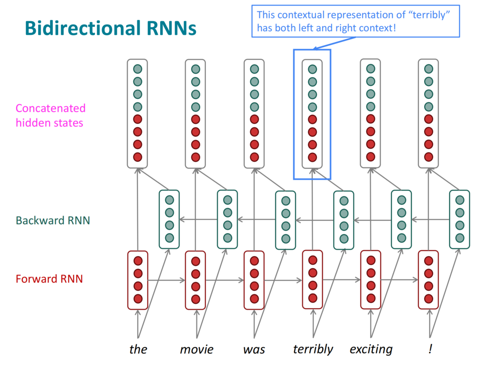
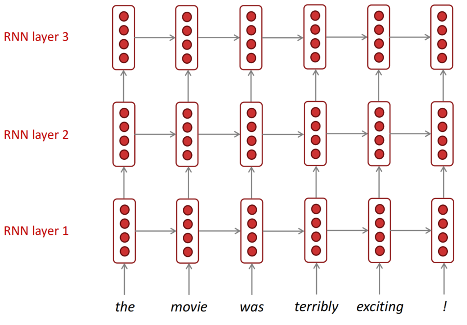
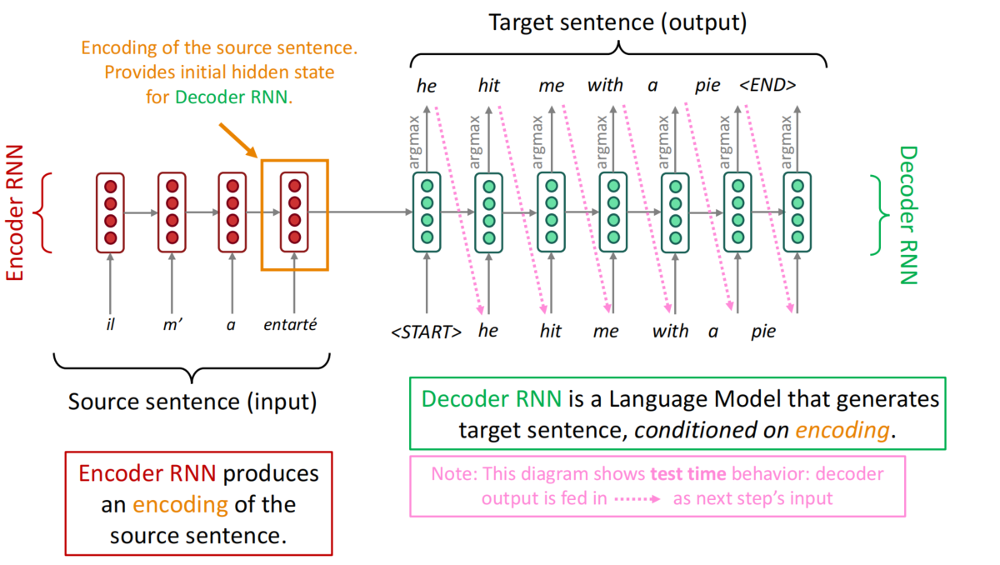
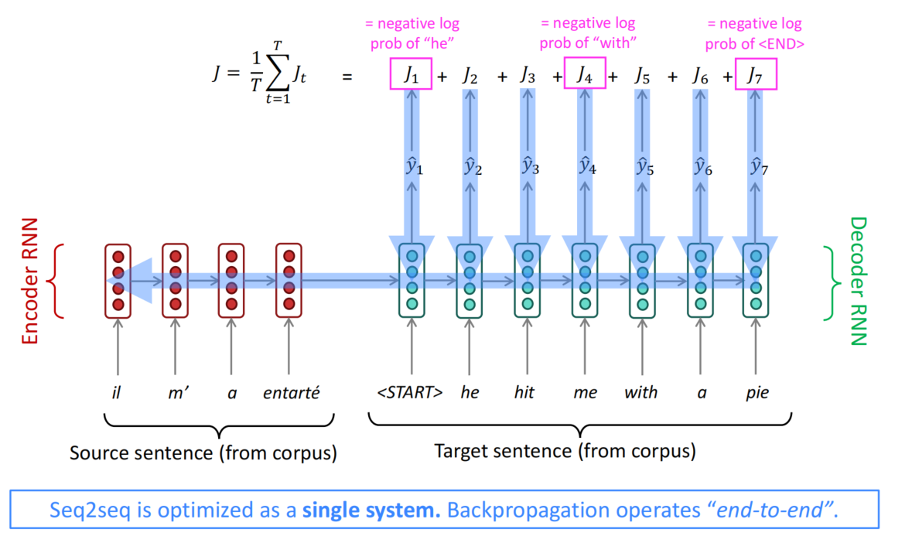

# Chapter 6: LSTM, RNNs And Neural Machine Translation

In chapter 5, we discussed the RNN. RNN is a type of neural network that is designed to handle the sequential data. And we use RNN to build a language model instead of n-gram model. RNN solve the n-gram problem that cannot handle the long-term dependency. 

But RNN has some problem too. The first is the vanishing gradient problem. The second is the exploding gradient problem. We can use the gradient clipping to solve the exploding gradient problem. But the vanishing gradient problem is still a problem.

Vanishing gradient problem is that it is too difficult for the RNN to learn to preserve information over many timesteps. The hidden state can be written as:

$$
h_t = \sigma(W_{hh}h_{t-1} + W_{xh}x_t + \mathbf{b})
$$

Could we design an RNN with separate memory which is added to? So that we can choose to remember or forget the information. This is the idea of LSTM.

On each timestep $t$, the LSTM has a hidden state $h_t$ and a cell state $c_t$. Both of them are a vector that length of $n$. And the cell stores long-term information. The LSTM can read, erase and write the information from the cell. So we can conceptually think the cell as a memory or RAM in the computer.

And how to choose to read, erase and write the information from the cell? We use the gates which is also a $n$-length vector. The gates are a neural network layer that is designed to dynamicly output a number between 0(closed) and 1(open). The number is the probability of the event. The gates are designed to learn to read, erase and write the information from the cell.

The gate has three types: forget gate, input gate, and output gate. The forget gate is used to decide what information to forget from the cell. The input gate is used to decide what information to write to the cell. The output gate is used to decide what information to output from the cell. The role and the computation method of gate, cell, hidden state is shown in the following figure.

Or a more abstract view of LSTM is shown in the following figure.

The gate output is a number between 0 and 1, the forget gate number will control how much the old information will be forgotten, if the number is 0, the old information will be forgotten completely. The input gate number will control how much the new information will be written to the cell, if the number is 0, the new information will not be written to the cell. The output gate number will control how much the information will be output from the cell, if the number is 0, the information will not be output from the cell.

Besides the language modeling, RNN can do something else like sequence tagging, named entity recognition, and sentence encoder model. 

Then, let's consider the bi-RNN and multi-layers RNN. The image below shows the sentiment classification task. We need to consider the sentence "The movie was terribly exciting!" We know that the word "terribly" is negative but the whole sentence is positive because the right word "exciting" modifies the meaning of it. While the single layer RNN can not extract the information from the right word so it may classify the sentence as negative. But the bi-RNN can extract the information from both sides so it can classify the sentence correctly.

The image above shows the bi-RNN model overview. The bi-RNN has two RNNs, one is forward RNN and the other is backward RNN. The forward RNN reads the sentence from left to right and the backward RNN reads the sentence from right to left. The hidden state of the forward RNN and the backward RNN are concatenated to form the final hidden state. The final hidden state is used to classify the sentence.

And let's consider the multi-layers RNN. The image below shows the multi-layers RNN model overview. The multi-layers RNN has multiple RNNs. The output of the previous RNN is the input of the next RNN. The final hidden state of the last RNN is used to classify the sentence.

Machine Translation(MT) is a traditional task for NLP, the first development stage of it is between 1990 and 2010 which is called statistical machine translation(SMT). The core idea if SMT is to learn a probabilistic model from data. Suppose we are translating French to English. We want to find the best English sentence $y$  given the French sentence $x$. We can use the Bayes rule to find the best English sentence $y$.

$$
y^* = \arg\max_y P(y|x) = \arg\max_y \frac{P(x|y)P(y)}{P(x)} = \arg\max_y P(x|y)P(y)

$$

The $P(x|y)$ is the translation model, it is used to model the probability of the French sentence $x$ given the English sentence $y$. The $P(y)$ is the language model, it is used to model the probability of the English sentence $y$. The $P(x)$ is the normalization term, it is used to normalize the probability.

After the 2014, the Neural Machine Translation(NMT) became popular. It used a single end-to-end neural network to do machine translation and the architecture of it is called a sequence-to-sequence model and it involves two RNNs.

The seq2seq model has two RNNs, one is called the encoder and the other is called the decoder. The encoder reads the input sequence and encodes it into a fixed-size context vector. The decoder reads the context vector and decodes it into the output sequence. The context vector is used to store the information of the input sequence. The context vector is the final hidden state of the encoder.

The seq2seq model is an example of a conditional language model because the predictions are also conditioned on the source sentence $x$. The NMT directly calculates the probability of the target sentence given the source sentence:

$$
p(y|X) = p(y_1|x) \cdot p(y_2|y_1, x) \cdot p(y_3|y_1, y_2, x) \cdots p(y_T|y_1, y_2, \cdots, y_{T-1}, x)
$$

Then, let's consider how to train the NMT. The NMT is trained by maximizing the log-likelihood of the target sentence given the source sentence. The log-likelihood is the sum of the log-probabilities of the target sentence given the source sentence. The log-likelihood is shown as follows:

$$
\log p(y|X) = \sum_{t=1}^{T} \log p(y_t|y_1, y_2, \cdots, y_{t-1}, x)
$$

