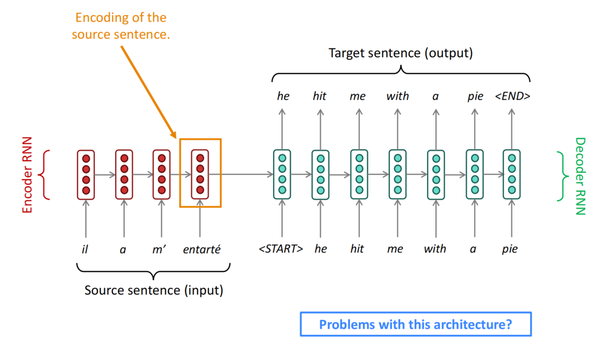
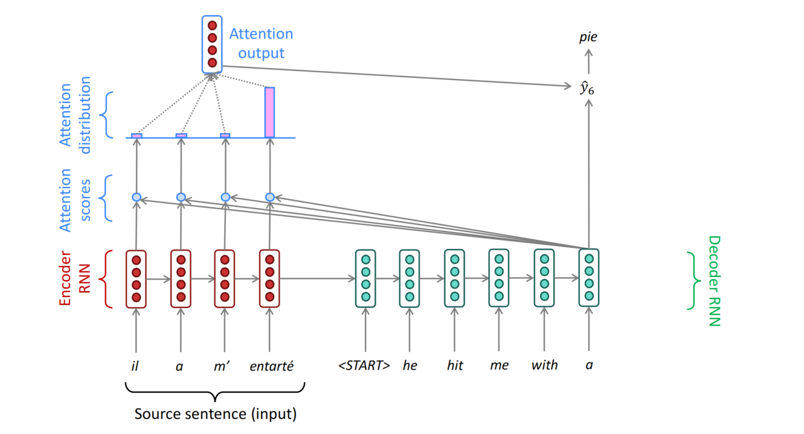

# Chapter 7: Attention

Previous we discussed about the machine translation. Now let's consider how to evaluate the quality of the translation. We will use BLEU(Bilingual Evaluation Understudy) score to do so.

BLEU compares the machine translation with the one or several human written translation and computes a similarity score based on the getmetric mean of n-gram precision and the brevity penalty. The n-gram precision is the fraction of n-grams in the machine translation that appear in the reference translation. The brevity penalty is a penalty term that penalizes the machine translation for being too short compared to the reference translation.

The n-gram precision is computed as follows:

$$
P_n = \frac{\sum_{\text{clipped n-gram count}}}{\sum_{\text{n-gram count}}}
$$

where the clipped n-gram count is the number of n-grams in the machine translation that appear in the reference translation, and the n-gram count is the total number of n-grams in the machine translation.

The brevity penalty is computed as follows:

$$
\text{BP} = \begin{cases}
1 & \text{if } c > r \\
e^{(1 - r/c)} & \text{if } c \leq r
\end{cases}

$$

where $c$ is the length of the machine translation and $r$ is the length of the reference translation.

The BLEU score is computed as follows:

$$
\text{BLEU} = \text{BP} \times \exp\left(\sum_{n=1}^N w_n \log P_n\right)
$$

where $w_n$ is the weight for the n-gram precision. The BLEU score ranges from 0 to 1, with 1 being the best possible score.

Now consider the following architecture for machine translation:

What's wrong with this architecture? Now we know that the last layers of the encoder is to encode the wholw input sentence into a fixed length vector, so it needs to capture all of the information about the source sentence. However, if the sentence is too long, the encoder may not be able to capture all of the information. This is known as the bottleneck problem.

In order to address the bottleneck problem, we can use the attention mechanism. The core idea of the attention is that on each step of the decoder, we can use direct connection to the encoder to focus on a particular part of the source sequence. The attention mechanism allows the decoder to focus on different parts of the source sequence at different steps of the decoding process.

Like the image above, at each step of the decoder, we calculate all of the attention weights for the source sequence, then we take softmax to turn the scores into a probability distribution and we construct a weighted sum of the encoder hidden states to get the context vector. Finally, we concatenate the context vector with the decoder hidden state and pass it through a linear layer to get the output.

Let's consider the equation of the attention. Firstly, we have some encoder states $h_1, h_2, \ldots, h_n$ and a decoder state $s_t$. We can calculate the attention scores as follows:

$$
e_i = v_a^T \tanh(W_a s_t + U_a h_i)
$$

where $W_a$ and $U_a$ are the weight matrices and $v_a$ is the weight vector. We can then take the softmax of the attention scores to get the attention weights:

$$
\alpha_i = \frac{\exp(e_i)}{\sum_{j=1}^n \exp(e_j)}
$$

Finally, we can calculate the context vector as the weighted sum of the encoder states:

$$
c_t = \sum_{i=1}^n \alpha_i h_i
$$

