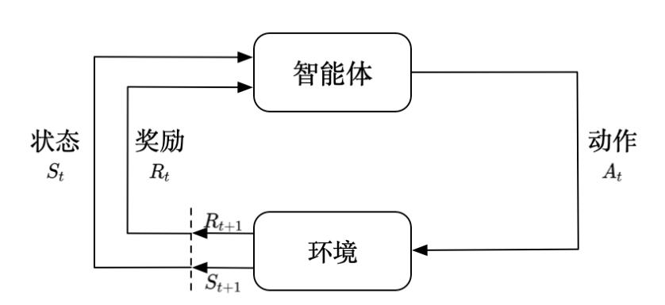

# EasyRL Chapter 1: Foundamental of Reinforcement Learning

## 1.1 Introduction

Reinforcement Learning is a type of machine learning algorithms that allows an agent to learn in an interactive environment by trial and error using feedback from its own actions and experiences. The agent learns to achieve a goal in an uncertain, potentially complex environment. In reinforcement learning, an agent interacts with its environment by taking actions, and in return, it receives rewards. Its objective is to learn to act in a way that will maximize its expected long-term rewards. The agent must discover which actions yield the most reward by trying them out, and the agent must also learn the long-term consequences of its actions.

The image above shows the basic components of a reinforcement learning system. 

- The agent is the learner or decision-maker that interacts with its environment. 
- The environment is the external system with which the agent interacts. The agent and the environment interact at each of a sequence of discrete time steps. 
- At each time step, the agent receives the environment's state, and on that basis, it selects an action to send back to the environment. The environment then transitions to a new state, and also sends a reward signal to the agent, which the agent uses to learn.

Unlike supervised learning and unsupervised learning, reinforcement learning is not dataset-driven. Instead, the agent learns from its own experiences. The agent learns by trial and error, and its objective is to maximize the total reward it receives over the long run. And reinforcement learning is the only one who can train and test the agent in the same environment.

In supervised learning, we have two assumptions:

- The training data is independent and identically distributed (i.i.d).

- We need told the model the ground truth(label) of each data point.

In RL, two assumptions are not satisfied. For the first aspect, the agent's must explore the environment to collect data, we get the observation is not i.i.d, instead it is a time series data. For the second aspect, the agent does not know the ground truth of each state, it can only assess to the reward that environment gives. The ground truth is unknown that we wish agent can learn from the environment. So the since agent can not get the in-time feedback, it is the difficulty of RL.

We say $\tau = (s_0,a_0,\dots,s_n)$ is a trajectory, which is a sequence of states and actions. The trajectory is generated by the agent interacting with the environment. The agent's goal is to maximize the expected sum of rewards over the trajectory. The expected sum of rewards is called the return, denoted by $R(\tau)$. 

In the same trajectory, the near-term state-action pairs is time series data, we want to model to learn the real value but not the time series, so in training process, we may use some techniques to decorrelate the data, such as experience replay, target network, etc.

## 1.2 Sequential Decision Making

In reinforcement learning, the agent should make a sequence of decisions. The agent considers the long-term consequences of its actions. 

And the question is the difference between state and observation. We can say that observation is a subset of state. And the state is the full information of the environment. So observation may loss some information of the environment.

Usually, if the environment is fully observable, the observation is equal to the state, we will formulate the problem as a Markov Decision Process (MDP: $\mathbb{M} = (\mathcal{S},\mathcal{A}, \mathcal{P}, \mathcal{R}, \gamma)$, where $\mathcal{S}$ is the state space, $\mathcal{A}$ is the action space, $\mathcal{P}$ is the transition probability, $\mathcal{R}$ is the reward function, and $\gamma$ is the discount factor. And if the environment is partially observable, we will formulate the problem as a Partially Observable Markov Decision Process (POMDP: $\mathbb{M} = (\mathcal{S},\mathcal{A}, \mathcal{P}, \mathcal{R}, \mathcal{O}, \gamma))$, where $\mathcal{O}$ is the observation space.

## 1.3 State Space and Action Space

The state space is the set of all possible states that the environment can be in. The action space is the set of all possible actions that the agent can take. The state space and action space can be discrete or continuous.

## 1.4 Components of Reinforcement Learning

- Value Function: The value function is a prediction of the expected return. The value function is a function of the state or state-action pair. The value function is used to evaluate the goodness of a state or state-action pair. The value function can be used to select actions, by selecting the action that maximizes the value function.

$$ V(s) = \mathbb{E}[R(\tau)|s_0 = s] = \mathbb{E}[\sum_{t=0}^{\infty} \gamma^t r_t|s_0 = s] $$

- Q-function: The Q-function is a prediction of the expected return, given that the agent takes an action in a state. The Q-function is a function of the state and action. The Q-function is used to evaluate the goodness of a state-action pair. The Q-function can be used to select actions, by selecting the action that maximizes the Q-function.

$$ Q(s,a) = \mathbb{E}[R(\tau)|s_0 = s, a_0 = a] = \mathbb{E}[\sum_{t=0}^{\infty} \gamma^t r_t|s_0 = s, a_0 = a] $$

If we know the value function or Q-function, we can use them to select actions. The agent can select the action that maximizes the value function or Q-function. The value function and Q-function are used to evaluate the goodness of a state or state-action pair. The policy we select is :

$$ \pi(s) = \arg\max_a Q(s,a) $$

$\pi(s)$ means the action that the agent will take in state $s$.

- Policy: The policy is a mapping from states to actions. The policy is used to select actions. The policy can be deterministic or stochastic. The policy can be represented by a neural network, a decision tree, a lookup table, etc.

- Policy-Based Methods: Policy-based methods directly parameterize the policy. The policy is a function of the state or state-action pair which is represented by a neural network(or a table), and the parameters of the neural network are updated to maximize the expected return. It contains two stage: policy evaluation and policy improvement.

- Value-Based Methods: Value-based methods parameterize the value function or Q-function. The value function or Q-function is a function of the state or state-action pair. The value function or Q-function is represented by a neural network, and the parameters of the neural network are updated to minimize the mean squared error between the predicted return and the actual return.

- Model Based Methods: Model-based methods learn a model of the environment. The model is a prediction of the next state and reward, given the current state and action. The model is represented by a neural network, and the parameters of the neural network are updated to minimize the mean squared error between the predicted next state and reward and the actual next state and reward.

- Model-Free Methods: Model-free methods do not learn a model of the environment. It will directly learn the value function or Q-function, or the policy which not requires a model of the environment.

## 1.5 Exploration and Exploitation

We should know that the agent should explore the environment to collect data, so the way to balance exploration and exploitation is important. It is like the MCTS algorithms, should ajust the hyperparameters $c$ to balance the exploration and exploitation. In RL, we have some algorithms to balance the exploration and exploitation too, such as $\epsilon$-greedy, UCB, Thompson Sampling, etc.

## 1.6 Evaluation and Environment

We usually use Safety Gym, OpenAI Gym, etc to evaluate the performance of the agent. And we can use the environment to train the agent too. There are multiple tasks in the environment, and the agent should learn to solve the tasks such as CarRun, CarCircle, etc.