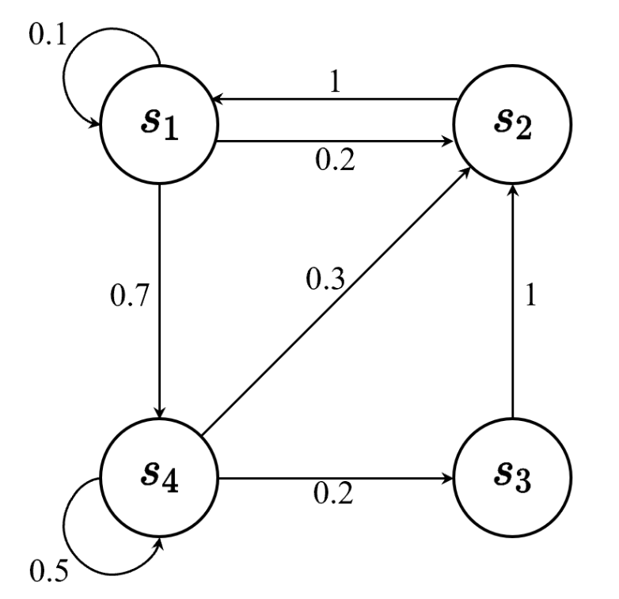
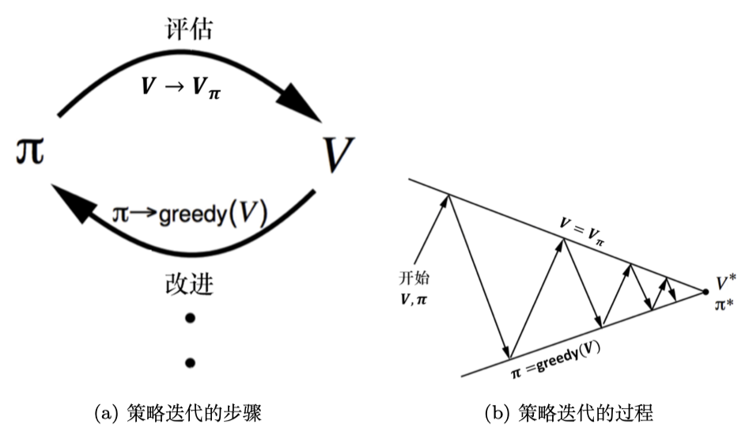

# EasyRL Chapter 2: MDP

## 2.1 Markov Property

Markov property is a key concept in Markov Decision Process (MDP). It states that the future state only depends on the current state and action, not the past states and actions. In other words, the future is independent of the past given the present. The Markov property is formulated as follows:

$$
P(s_{t+1} | s_t, a_t, s_{t-1}, a_{t-1}, \cdots) = P(s_{t+1} | s_t, a_t)
$$

Which can also desribe as given current state $s_t$ and action $a_t$, the probability of the next state $s_{t+1}$ is only dependent on the current state and action.

The image above shows the markov chain. The DAG shows the relationship between the states, including the possibility of transitioning from one state to another.

And we can also use state transition matrix ($\mathbb{P}$) to represent the Markov property. The state transition matrix is a matrix that describes the probability of transitioning from one state to another. The state transition matrix is defined as follows:

$$
\mathbb{P} = \begin{bmatrix}
P(s_1|s_2, a) & P(s_2|s_2, a) & \cdots & P(s_n|s_2, a) \\
\vdots & \vdots & \ddots & \vdots \\
P(s_1|s_n, a) & P(s_2|s_n, a) & \cdots & P(s_n|s_n, a) \\
\end{bmatrix}
$$

This is a two dimension matrix, $p[i][j]$ means the probability of transitioning from state $i$ to state $j$.

## 2.2 MRP---Markov Reward Process 

We need to define what is the return. Return is the total discounted reward from time step $t$. The return is defined as follows:

$$
G_t = R_{t+1} + \gamma R_{t+2} + \gamma^2 R_{t+3} + \cdots = \sum_{k=0}^{\infty} \gamma^k R_{t+k+1}
$$

Where $\gamma$ is the discount factor, $0 \leq \gamma \leq 1$. The discount factor is used to balance the importance of the immediate reward and the future reward. The discount factor is used to make the return finite. If $\gamma = 0$, the agent only cares about the immediate reward. If $\gamma = 1$, the agent cares about the future reward as much as the immediate reward.

We add a term $\mathbb{R}$ to the markov chain, which is the reward function. The reward function is a function that maps the state to the reward. The reward function is defined as follows:

$$
\mathbb{R} = \begin{bmatrix}
R(s_1) \\
R(s_2) \\
\vdots \\
R(s_n) \\
\end{bmatrix}
$$

It is a one dimension matrix, $R[i]$ means the reward of state $i$.

And we can also define the state value function. The state value function is a function that maps the state to the expected return. The state value function is defined as follows:

$$
V(s) = \mathbb{E}[G_t | S_t = s] = \mathbb{E}[R_{t+1} + \gamma R_{t+2} + \gamma^2 R_{t+3} + \cdots | S_t = s]
$$

## 2.3 Bellman Equation

Previous, we define the state value function. The state value function can be decomposed into two parts: immediate reward and future reward. The Bellman equation is:

$$
V(s) = \mathbb{E}[R_{t+1} + \gamma V(S_{t+1}) | S_t = s] = R(s) + \gamma \sum_{s'} P(s'|s, a) V(s')
$$

Which means we decompose the state value function into two parts: immediate reward and future reward. The immediate reward is $R(s)$, and the future reward is $\gamma \sum_{s'} P(s'|s, a) V(s')$. The future reward is the sum of the probability of transitioning from state $s$ to state $s'$ and the value of state $s'$.

$$\begin{aligned}
V(s)& =\mathbb{E}\left[G_t\mid s_t=s\right]  \\
&=\mathbb{E}\left[r_{t+1}+\gamma r_{t+2}+\gamma^2r_{t+3}+\ldots\mid s_t=s\right] \\
&=\mathbb{E}\left[r_{t+1}|s_t=s\right]+\gamma\mathbb{E}\left[r_{t+2}+\gamma r_{t+3}+\gamma^2r_{t+4}+\ldots\mid s_t=s\right] \\
&=R(s)+\gamma\mathbb{E}[G_{t+1}|s_t=s] \\
&=R(s)+\gamma\mathbb{E}[V(s_{t+1})|s_t=s] \\
&=R(s)+\gamma\sum_{s^{\prime}\in S}p\left(s^{\prime}\mid s\right)V\left(s^{\prime}\right)
\end{aligned}$$

Obviously, for some small MDP, we can use the Bellman equation to calculate the state value function. If we write the funcion into matrix:

$$\begin{aligned}
\text{V}& =R+\gamma PV  \\
\boldsymbol{IV}& =R+\gamma PV  \\
(\boldsymbol{I}-\gamma\boldsymbol{P})\boldsymbol{V}& =R  \\
\text{V}& =(I-\gamma\boldsymbol{P})^{-1}\boldsymbol{R} 
\end{aligned}$$

We can get the closed form solution of the state value function:

$$
V = (I - \gamma P)^{-1} R
$$

Where $V$ is the state value function, $I$ is the identity matrix, $P$ is the state transition matrix, and $R$ is the reward function.

## 2.4 TD Learning

DP use bootstrapping to estimate the state value function. The DP is defined as follows:

$$
V(S_t) = V(S_t) + \alpha (R_{t+1} + \gamma V(S_{t+1}) - V(S_t))
$$

Where $\alpha$ is the learning rate, $0 \leq \alpha \leq 1$. The learning rate is used to balance the importance of the new sample and the old sample. If $\alpha = 0$, the agent only cares about the old sample. If $\alpha = 1$, the agent only cares about the new sample.

It will generate a lot of trajectories and each trajectory will obtain a reward. We can use the average of the reward to estimate the state value function. The state value function is defined as follows:

$$
V(s) = \frac{1}{N} \sum_{i=1}^{N} G_i
$$

Where $N$ is the number of trajectories, $G_i$ is the return of the $i$-th trajectory.

## 2.5 MDP---Markov Decision Process

We will add the decision making process to the MRP. We add a term $\mathbb{A}$ to the MRP, which is the action space. The action space is a set of actions that the agent can take. The action space is defined as follows:

$$
\mathbb{A} = \{a_1, a_2, \cdots, a_n\}
$$

It is a set, $a_i$ means the $i$-th action. As we know the value function, we next can define the policy. The policy is a function that maps the state to the action. The policy is defined as follows:

$$
\pi(a|s) = p(a_t = a | s_t = s)
$$

And if we input a state $s$, the policy will output a vector of possibility $A = {a_1,a_2,...,a_n}$ and each item represents the possibility that agent will take actions. So as we define the policy $\pi$, we can define the state transition matrix:

$$P_\pi\left(s'\mid s\right)=\sum_{a\in A}\pi(a\mid s)p\left(s'\mid s,a\right)$$

## 2.6 Q-Function 

We have defined the $V(s)$ as the state value function. Next we will decompose the state value function to each action. We define $Q(s,a)$ means how much reward we will get when we in state $s$ and take action $a$ which is :

$$Q_\pi(s,a)=\mathbb{E}_\pi\left[G_t\mid s_t=s,a_t=a\right]$$

And state value function can be written as:

$$V_\pi(s)=\sum_{a\in A}\pi(a\mid s)Q_\pi(s,a)$$

Similarly, we can use Bellman Equation to rewrite it:

$$\begin{aligned}
Q(s,a)& =\mathbb{E}\left[G_t\mid s_t=s,a_t=a\right]  \\
&=\mathbb{E}\left[r_{t+1}+\gamma r_{t+2}+\gamma^2r_{t+3}+\ldots\mid s_t=s,a_t=a\right] \\
&=\mathbb{E}\left[r_{t+1}|s_t=s,a_t=a\right]+\gamma\mathbb{E}\left[r_{t+2}+\gamma r_{t+3}+\gamma^2r_{t+4}+\ldots\mid s_t=s,a_t=a\right] \\
&=R(s,a)+\gamma\mathbb{E}[V(s_{t+1})|s_t=s,a_t=a] \\
&=R(s,a)+\gamma\sum_{s^{\prime}\in S}p\left(s^{\prime}\mid s,a\right)V\left(s^{\prime}\right)
\end{aligned}$$

## 2.7 Expectation

Obviously, no matter the transition matrix $\mathbb{P}$ or the policy $\pi(s,a)$ is stood for the possibility. So all of the sum and possibility can be seen as expectation:

$$V_\pi(s)=\mathbb{E}_\pi\left[r_{t+1}+\gamma V_\pi\left(s_{t+1}\right)\mid s_t=s\right]$$

$$Q_\pi(s,a)=\mathbb{E}_\pi\left[r_{t+1}+\gamma Q_\pi\left(s_{t+1},a_{t+1}\right)\mid s_t=s,a_t=a\right]$$

We already have:

$$V_\pi(s)=\sum_{a\in A}\pi(a\mid s)Q_\pi(s,a)$$

And 

$$Q_\pi(s,a)=R(s,a)+\gamma\sum_{s'\in S}p\left(s'\mid s,a\right)V_\pi\left(s'\right)$$

We can put is into each other:

$$V_\pi(s)=\sum_{a\in A}\pi(a\mid s)\left(R(s,a)+\gamma\sum_{s^{\prime}\in S}p\left(s^{\prime}\mid s,a\right)V_\pi\left(s^{\prime}\right)\right)$$

$$Q_\pi(s,a)=R(s,a)+\gamma\sum_{s'\in S}p\left(s'\mid s,a\right)\sum_{a'\in A}\pi\left(a'\mid s'\right)Q_\pi\left(s',a'\right)$$

These two equations only contain $Q$ and $V$. So we can use DP to estimate them.

## 2.8 Policy Evaluation

We can use the Bellman Equation to estimate the state value function. The Bellman Equation is defined as follows:

$$
V^k(s) = R(s) + \gamma \sum_{s'} P(s'|s, a) V^{k-1}(s')
$$

Where $V^k(s)$ is the state value function at the $k$-th iteration, $R(s)$ is the reward of state $s$, $P(s'|s, a)$ is the probability of transitioning from state $s$ to state $s'$, and $V^{k-1}(s')$ is the state value function at the $(k-1)$-th iteration. And end up, the state value function will converge to the true value function. We will use it to evaluate the policy.

## 2.9 Policy Improvement

We can use the policy improvement to improve the policy. The policy improvement is defined as follows:

$$
\pi'(s) = \arg \max_{a \in A} Q(s, a)
$$

Where $\pi'(s)$ is the new policy, $Q(s, a)$ is the state-action value function. We will use the policy improvement to improve the policy.

This is the policy iteration. We will use the policy evaluation to evaluate the policy, and use the policy improvement to improve the policy. We will repeat the process until the policy converges.

## 2.10 Value Iteration

Unlike the policy iteration, the value iteration will not separate the policy evaluation and policy improvement. The value iteration is defined as follows:

$$
V(s) = \max_{a \in A} R(s, a) + \gamma \sum_{s'} P(s'|s, a) V(s')
$$

Where $V(s)$ is the state value function, $R(s, a)$ is the reward of state $s$ and action $a$, $P(s'|s, a)$ is the probability of transitioning from state $s$ to state $s'$, and $V(s')$ is the state value function of state $s'$. The value iteration will repeat the process until the state value function converges.

And then, we can use the state value function to get the policy:

$$
\pi(s) = \arg \max_{a \in A} R(s, a) + \gamma \sum_{s'} P(s'|s, a) V(s')
$$