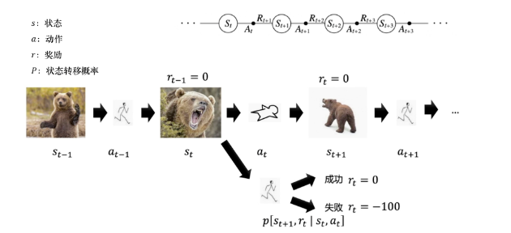
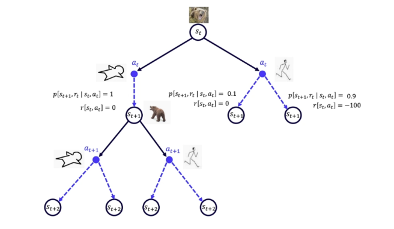
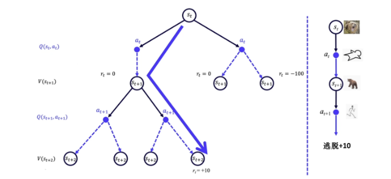
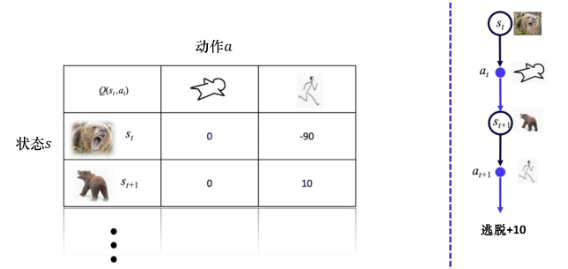
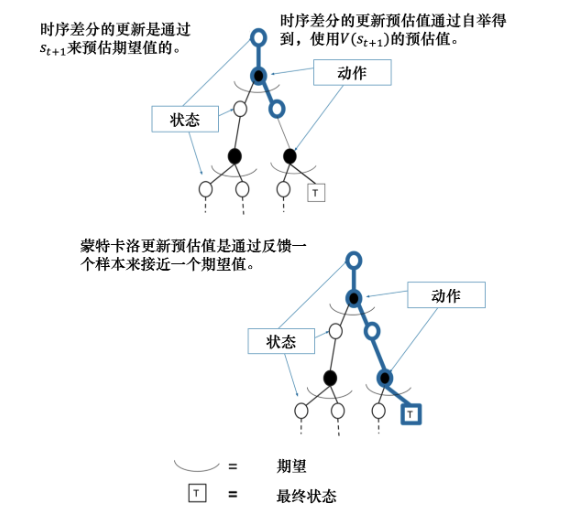

# EasyRL Chapter 3: Tabular Methods

Tabular methods are a class of reinforcement learning algorithms that store the value of each state of state-action pair into a table. And the policy will be derived from the value table.

## 3.1 Model based and model free methods

As the image above shows, we meet a bear in the time step $t$ and now we will have two actions: we can try to run away(below) or tend to death(above). The next state we will be only depends on the current state and the action we choose. This is the Markov Decision Process(MDP).

If we draw all of the possible actions and states, we will get a graph like this:

It will be a tree. When we interact with the environment, we can only choose one path in the tree without returning. We will use probability function $\mathbb{P}$ and reward function $R$ to describe the environment. Probabilty function is the probability of the next state given the current state and action which will reflect the randomness of the environment. 

If we know the probability function and reward function, then the MDP is known, then we can use policy iteration or value iteration to solve the MDP. This is the model-based method.

We also use the same example. In fact, when people first meet bears, they can not know whether we can run away or not. In other words, the probability function and reward function are unknown. In this case, we can use the model-free method to solve the MDP.

In fact, if we know the probability function and reward function, there is no need for us to interact with the environment, we just need to calculate the value of each state and action. Consider the model-free methods, we need to interact with the environment and collect the data, using the data to estimate the value of each state and action.

## 3.2 Q-Learning

When we interact with the bear several times, we can judge the probability of run away. We will record all of the data into a table. The table will be like this:

The table will store the value of each state-action pair. The value of each state-action pair will be updated by the following formula:

$$Q(s_t, a_t) = Q(s_t, a_t) + \alpha \cdot (R_{t+1} + \gamma \cdot \max_{a} Q(s_{t+1}, a) - Q(s_t, a_t))$$

The updating methods is similar to Robbins-Monro algorithm, we have discussed the algorithm in [PRML](https://github.com/mingxuZhang2/PhD-Basic-Knowledge/tree/main/PRML/Chapter%202%20Probability%20Distributions). 

## 3.3 Model-free prediction

We can not access to the whole environment, so we can not calculate the value of each state-action pair correctly. We can using two methods to estimate them: Monte Carlo and Temporal Difference(TD).

### 3.3.1 Monte Carlo

Monte Carlo is a sampling base methods, we will sample the data from the environment using the policy $\pi$. And we calculate the average of the trajectory when the current state is $s$, which is given by:

$$
G_t = R_{t+1} + \gamma R_{t+2} + \gamma^2 R_{t+3} + \cdots + \gamma^{T-t-1} R_T \\
V_{\pi} (s) = \mathbb{E}_{\pi} [G_t | S_t = s]
$$

Similar to Robbins-Monro algorithm, we can update the value of each state by the following formula:

$$
V(s_t) = V(s_t) + \alpha \cdot (G_t - V(s_t))
$$

### 3.3.2 Temporal Difference

TD is a online updating method, we will update the value of each state-action pair when we interact with the environment. The updating formula is given by:

$$
V(s_t) = V(s_t) + \alpha \cdot (R_{t+1} + \gamma V(s_{t+1}) - V(s_t))
$$

The image above shows the difference between Monte Carlo and TD. Monte Carlo will update the value of each state after the whole trajectory, while TD will update the value of each state after each step.

TD can be seen as a special case of Monte Carlo, when the trajectory is only one step. And we can change the how many steps we update the value of each state, we will get the TD($\lambda$) algorithm. The TD can be seen as TD(0) and the Monte Carlo can be seen as TD($\infty$).