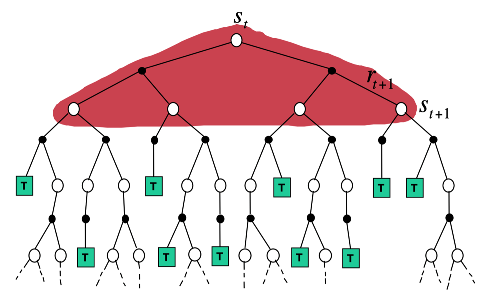
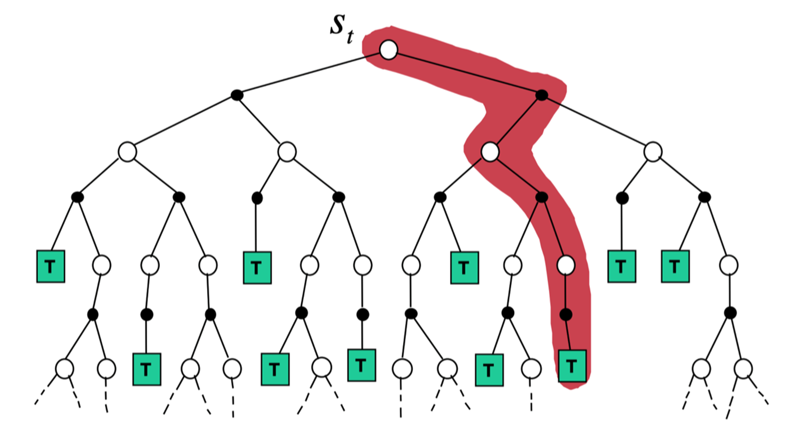
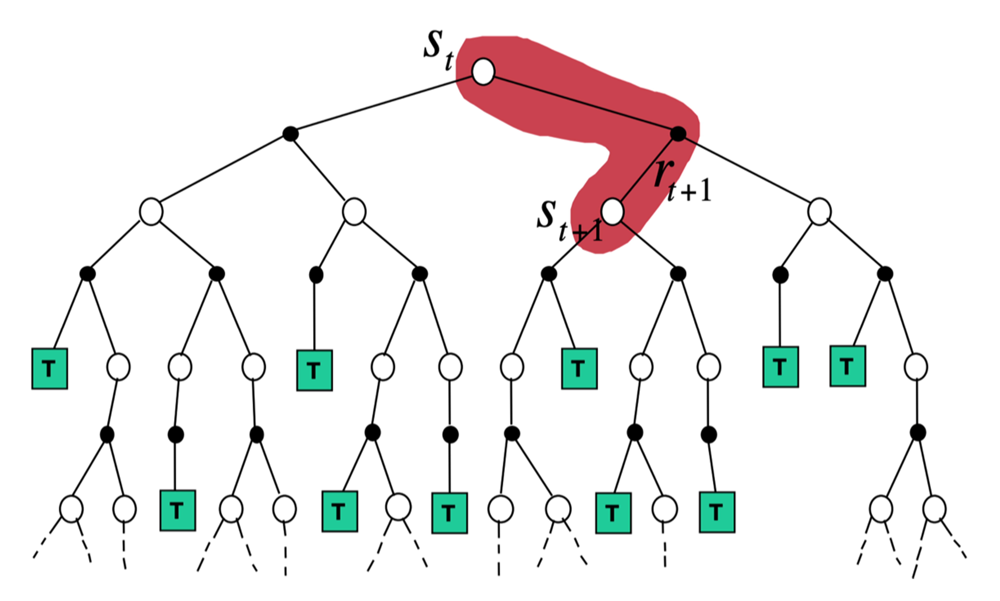
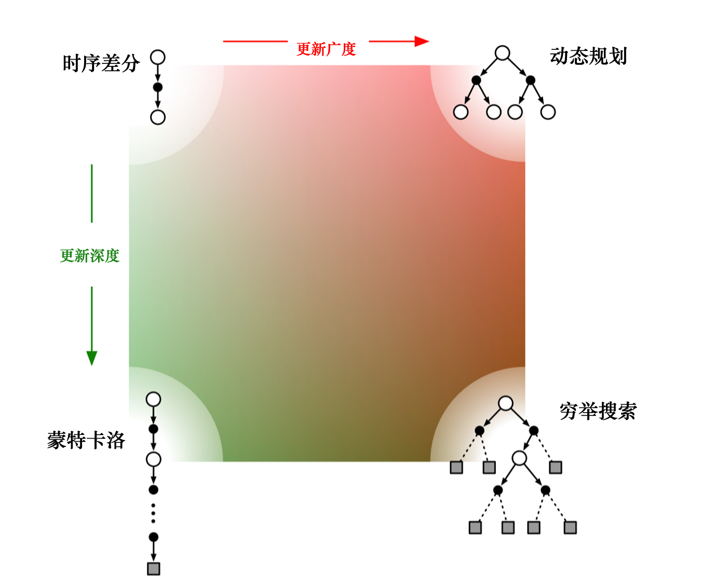
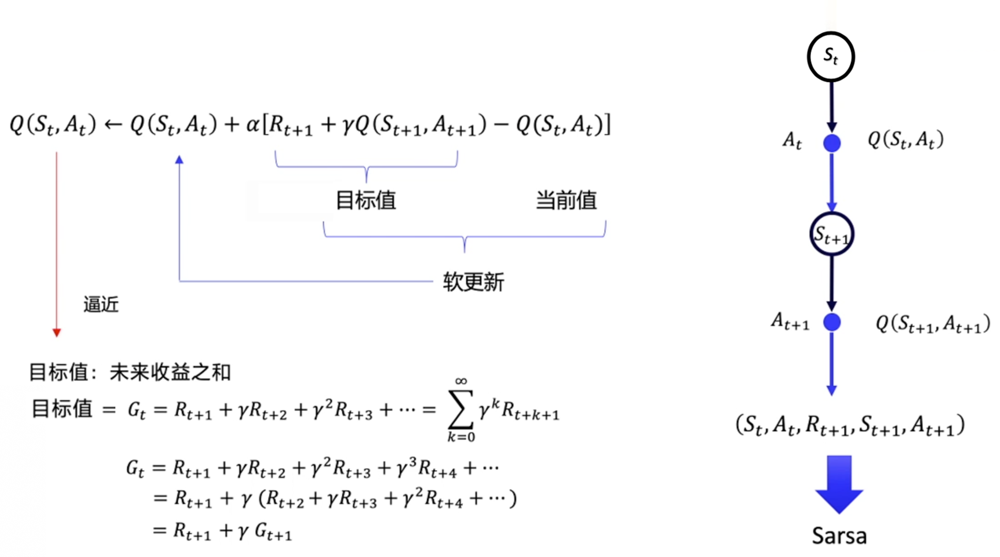

# EasyRL Chapter 3: Tabular Methods

Tabular methods are a class of reinforcement learning algorithms that store the value of each state of state-action pair into a table. And the policy will be derived from the value table.

## 3.1 Model based and model free methods

As the image above shows, we meet a bear in the time step $t$ and now we will have two actions: we can try to run away(below) or tend to death(above). The next state we will be only depends on the current state and the action we choose. This is the Markov Decision Process(MDP).

If we draw all of the possible actions and states, we will get a graph like this:

It will be a tree. When we interact with the environment, we can only choose one path in the tree without returning. We will use probability function $\mathbb{P}$ and reward function $R$ to describe the environment. Probabilty function is the probability of the next state given the current state and action which will reflect the randomness of the environment. 

If we know the probability function and reward function, then the MDP is known, then we can use policy iteration or value iteration to solve the MDP. This is the model-based method.

We also use the same example. In fact, when people first meet bears, they can not know whether we can run away or not. In other words, the probability function and reward function are unknown. In this case, we can use the model-free method to solve the MDP.

In fact, if we know the probability function and reward function, there is no need for us to interact with the environment, we just need to calculate the value of each state and action. Consider the model-free methods, we need to interact with the environment and collect the data, using the data to estimate the value of each state and action.

## 3.2 Q-Learning

When we interact with the bear several times, we can judge the probability of run away. We will record all of the data into a table. The table will be like this:

The table will store the value of each state-action pair. The value of each state-action pair will be updated by the following formula:

$$Q(s_t, a_t) = Q(s_t, a_t) + \alpha \cdot (R_{t+1} + \gamma \cdot \max_{a} Q(s_{t+1}, a) - Q(s_t, a_t))$$

The updating methods is similar to Robbins-Monro algorithm, we have discussed the algorithm in [PRML](https://github.com/mingxuZhang2/PhD-Basic-Knowledge/tree/main/PRML/Chapter%202%20Probability%20Distributions). 

## 3.3 Model-free prediction

We can not access to the whole environment, so we can not calculate the value of each state-action pair correctly. We can using two methods to estimate them: Monte Carlo and Temporal Difference(TD).

### 3.3.1 Monte Carlo

Monte Carlo is a sampling base methods, we will sample the data from the environment using the policy $\pi$. And we calculate the average of the trajectory when the current state is $s$, which is given by:

$$
G_t = R_{t+1} + \gamma R_{t+2} + \gamma^2 R_{t+3} + \cdots + \gamma^{T-t-1} R_T \\
V_{\pi} (s) = \mathbb{E}_{\pi} [G_t | S_t = s]
$$

Similar to Robbins-Monro algorithm, we can update the value of each state by the following formula:

$$
V(s_t) = V(s_t) + \alpha \cdot (G_t - V(s_t))
$$

### 3.3.2 Temporal Difference

TD is a online updating method, we will update the value of each state-action pair when we interact with the environment. The updating formula is given by:

$$
V(s_t) = V(s_t) + \alpha \cdot (R_{t+1} + \gamma V(s_{t+1}) - V(s_t))
$$

The image above shows the difference between Monte Carlo and TD. Monte Carlo will update the value of each state after the whole trajectory, while TD will update the value of each state after each step.

TD can be seen as a special case of Monte Carlo, when the trajectory is only one step. And we can change the how many steps we update the value of each state, we will get the $TD(\lambda)$ algorithm. The TD can be seen as TD(0) and the Monte Carlo can be seen as $TD(\infty)$.

### 3.3.3 Unified view of Monte Carlo, TD and DP

MC, TD and DP can all used to updating the Q-function. DP is a estimation based method, it will estimate the value of each state-action pair and use bellman equation to update the value which is given by:

$$
Q(s_t, a_t) = \mathbb{E}[R_{t+1} + \gamma \cdot Q(s_{t+1}, a_{t+1}) | s_t, a_t]
$$

We estimate the next state-action pair by the current state-action pair. And the image below shows the backup diagram of DP:

It will consider all of the relevant state and calculate the expectation directly using estimation. 

MC is a sampling based method, it will sample some trajectory and calculate the average of the state-action pair. The image below shows the backup diagram of MC:

We can see that it will consider a path of the tree. It will update the whole state in the path.

If we consider general $TD(n)$, it combine DP and MC methods, using both estimation and sampling. The image below shows the backup diagram of $TD(n)$:

We will use the exact reward of the next state and the estimated long-term value of the next state to update the value of the current state.

The image below shows the relationship between MC, TD and DP:

## 3.4 Model-free control

Previously, we have discussed how to update the value function. Now let's consider how to update the policy when the probability matrix and the reward function is unknown. We can use the policy iteration to update the policy. The policy iteration is given by:

$$
\pi_{k+1} = \arg \max_{\pi} Q^{\pi_k} (s, a)
$$

Then, we can use the Q-learning to update the value of each state-action pair. The Q-learning is given by:

$$
Q(s_t, a_t) = Q(s_t, a_t) + \gamma \cdot \Sigma_{s'} \mathbb{P}(s' | s_t, a_t) \cdot V_{\pi} (s')
$$

But the question is we can not access to the probability matrix and the reward function. We can use MC methods to estimate the Q function. The Q function is given by:

$$
Q(s_t, a_t) = Q(s_t, a_t) + \alpha \cdot (G_t - Q(s_t, a_t))
$$

And in order to ensure the exploration, we can use the $\epsilon$-greedy policy. Each step we will choose the action with the highest Q value with probability $1-\epsilon$ and choose the random action with probability $\epsilon$.

We can ensure that the Q function is increasing, for any $\epsilon$-greedy policy $\pi$, the updated policy $\pi'$ will be better than $\pi$, which means $V_\pi(s) \leq V_{\pi'}(s)$:

$$
\begin{aligned}
Q_\pi' (s,\pi'(s)) &= \Sigma_{a} \pi'(a|s) \cdot Q_\pi (s,a) \\
&= \frac{\epsilon}{|A|} \cdot \Sigma_{a \in A} Q_\pi(s,a) + (1-\epsilon) max_{a} Q_\pi(s,a) \\
&\geq \frac{\epsilon}{|A|} \cdot \Sigma_{a \in A} Q_\pi(s,a) + (1-\epsilon) \Sigma_{a} \frac{\pi(a|s) - \epsilon/|A|}{1-\epsilon} \cdot Q_\pi(s,a) \\
&= \Sigma_{a} \pi(a|s) \cdot Q_\pi(s,a) \\
&= Q_\pi(s,\pi(s))
\end{aligned}
$$

The third line we use the Jensen's inequality, we maximun of the Q function value must be greater than the average of the Q function. Hence, we prove that the Q function is increasing.

### 3.4.1 Sarsa

Previous we consider using MC and Q-learning to estimate the Q function. Now we will consider another method: Sarsa which used TD method to estimate the Q function. The updating formula is given by:

$$
Q(s_t, a_t) = Q(s_t, a_t) + \alpha \cdot (R_{t+1} + \gamma \cdot Q(s_{t+1}, a_{t+1}) - Q(s_t, a_t))
$$

The image above shows the Sarsa algorithm. We will update the value of each state-action pair after each step. And the policy will be updated by the Q function.

### 3.4.2 Q-learning

Sarsa is a on-policy algorithm which means we will optimize the policy we are using. Now we will consider the Q-learning which is a off-policy algorithm. 

There are two policy in Q-learning: the target policy $\pi$ and the behavior policy $\mu$. The target policy is the policy we want to optimize and the behavior policy is the policy we are using. The behavior policy will explore the environment and give the training data to the target policy. 

The image above shows the role of the behavior policy and the target policy. Due to we only need to learn the value of each state, so the training data is no need to provide $a_{t+1}$ while sarsa need to provide it. 

Off-policy algorithm is very useful in practice, the behavior policy's training is offline so it can make good use of each data. 

We can optimize the target policy by the following formula:

$$
\pi(s) = \arg \max_{a} Q(s,a)
$$

And the behavior policy can be random or $\epsilon$-greedy policy. And we can use the following equation to update the Q function:

$$
Q(s_t, a_t) = Q(s_t, a_t) + \alpha \cdot (R_{t+1} + \gamma \cdot \max_{a} Q(s_{t+1}, a) - Q(s_t, a_t))
$$
