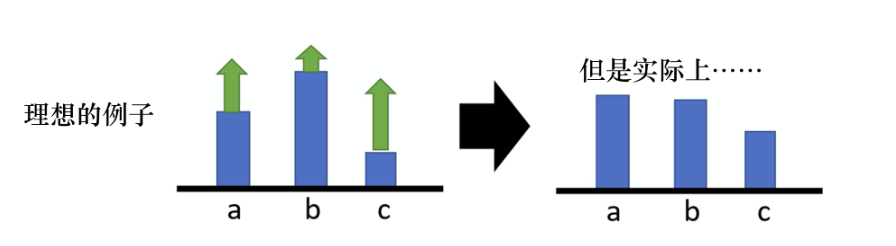
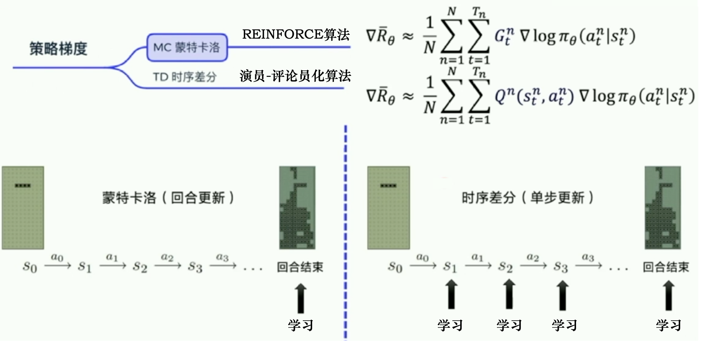

# EasyRL Chapter 4: Policy Gradient

In reinforcement learning, there are three components: agent or called actor, environment and reward function. In different scenarios, the reward function and the environment is different but the core of RL is maximizing the long-term reward. Assuming we are playing a game, from the start to the end, we called it is a episode. And it will has a lot of state and action, we denoted $\tau = (s_0,a_0,s_1,s_1,\dots,a_{n-1},s_n)$ as a trajectory. We can calculate the probability of a trajectory by the following formula:

$$
P(\tau|\theta) = p(s_0)\prod_{t=0}^{n-1}\pi_{\theta}(a_t|s_t)p(s_{t+1}|s_t,a_t)
$$

where $\pi_{\theta}(a_t|s_t)$ is the policy function, which is a probability distribution of action given state and the $p$ is depends on the environment. We can calculate the reward of a trajectory by the following formula:

$$
R(\tau) = \sum_{t=0}^{n-1}r(s_t,a_t)
$$

For $R$, it is a random variable that depends on different $\tau$, we can calculate the expectation of $R$ by the following formula:

$$
J(\theta) = E_{\tau\sim p(\tau|\theta)}[R(\tau)] = \int p(\tau|\theta)R(\tau)d\tau
$$

So the goal is maximize the object function $J$, similar to the supervised learning, we can use the gradient to optimize the objective function. SGD is a common method to find a local minimum of the objective function and similar to SGD, we can also use gradient to maximize the function which is called gradient ascent. We know that $R(\theta)$ is given by:

$$
R(\theta) = \sum_{\tau} p_{\theta}(\tau)R(\tau)d\tau
$$

And $R(\tau)$ is not related to $\theta$, so we can take derivative of $R(\theta)$ with respect to $\theta$:

$$\nabla{R}_\theta=\sum_\tau R(\tau)\nabla p_\theta(\tau)$$

And we know that:

$$
\nabla p_\theta(\tau) = p_{\theta}(\tau)\nabla \log p_\theta(\tau)
$$

So we have:
$$
\frac{\nabla p_\theta(\tau)}{p_\theta(\tau)} = \nabla \log p_\theta(\tau)
$$

And consider the previous formula, we have:

$$
\begin{aligned}
\nabla{R}_\theta&=\sum_\tau R(\tau)\nabla p_\theta(\tau)\\
&=\sum_\tau R(\tau)p_{\theta}(\tau)\nabla \log p_\theta(\tau)\\
&=E_{\tau\sim p_{\theta}(\theta)}[R(\tau)\nabla \log p_\theta(\tau)]
\end{aligned}
$$

But we meet a question is that the expectation is hard to calculate, so we can use the Monte Carlo method to estimate the expectation. We can sample a lot of $\tau$ and calculate the expectation by the following formula:

$$
\begin{aligned}
\nabla{R}_\theta &=E_{\tau\sim p_{\theta}(\theta)}[R(\tau)\nabla \log p_\theta(\tau)]\\
&\approx\frac{1}{N}\sum_{i=1}^{N}R(\tau^{(i)})\nabla \log p_\theta(\tau^{(i)})\\
&=\frac{1}{N}\sum_{i=1}^{N}R(\tau^{(i)})\nabla\left\{  \log(s_1) + \sum_{t=1}^T \log p_\theta(a_t|s_t) + \sum_{t=1}^T \log p(s_{t+1},|s_t,a_t) \right\}\\
&=\frac{1}{N}\sum_{i=1}^{N}R(\tau^{(i)})\sum_{t=1}^{T}\nabla \log p_{\theta}(a_t^{(i)}|s_t^{(i)})
\end{aligned}
$$

So if we consider the equation above with a high level viewpoint, the gradient is about the reward function and the change of probability of the given state-action pair. So if the $R(\tau)$ is positive, we will increase the probability, otherwise we will decrease it. So the update rule is:

$$
\theta = \theta + \alpha \nabla{R}_\theta
$$

The image above shows the process of policy gradient. We can see that the policy gradient is a model-free method, which means we don't need to know the environment and the reward function. We can directly optimize the policy function by the gradient of the reward function. 

### Summary

Previous, we discussed the value-iteration and policy-iteration, which can be seen as the value-based algorithm, it needs to calculated the value function and then get the policy. While in this scope, we discussed a policy-based algorithm, which will directly optimize the policy function and no need to calculate the value function.

## Tricks on Policy Gradient

### Baseline

We know that the gradient is given by:

$$
\begin{aligned}
\nabla{R}_\theta &=E_{\tau\sim p_{\theta}(\theta)}[R(\tau)\nabla \log p_\theta(\tau)]\\
&\approx\frac{1}{N}\sum_{i=1}^{N}R(\tau^{(i)})\nabla \log p_\theta(\tau^{(i)})\\
&=\frac{1}{N}\sum_{i=1}^{N}R(\tau^{(i)})\nabla\left\{  \log(s_1) + \sum_{t=1}^T \log p_\theta(a_t|s_t) + \sum_{t=1}^T \log p(s_{t+1},|s_t,a_t) \right\}\\
&=\frac{1}{N}\sum_{i=1}^{N}R(\tau^{(i)})\sum_{t=1}^{T}\nabla \log p_{\theta}(a_t^{(i)}|s_t^{(i)})
\end{aligned}
$$

And if the reward function is positive, we will increase the probability. But in some scenarios, the reward fuction is always positive or always negative. Assume the reward is always positive, without loss the generality, if we directly use the equation above, it will tell model to increase all of the action probability. But in fact, we don't need to increase all of the action probability, we just need to increase the probability of the good action and decrease the probability of the bad action. 

Like the image above, we increase all of the action probability, and we normalize the it in the right. We can see that we want the action b increase the most because it has the maximum of the reward. But the equation is sampling based algorithm, so if there are some actions that we never sampled, the action will decrease. 

So in order to solve the problem, we can rewrite the formula:

$$
\nabla{R}_\theta \approx \frac{1}{N}\sum_{i=1}^{N} \left \{ R(\tau^{(i)}) - b \right \}\sum_{t=1}^{T}\nabla \log p_{\theta}(a_t^{(i)}|s_t^{(i)})
$$

We call $b$ is the baseline. By introducing the baseline, we can let the weight term both have positive and negative. So if we sample a bad action, the probability will decrease and if we sample a good action, the probablity will increase. One of a good choice is, we can let $b \approx E[R(\tau)]$. It will record during the training process.

### Assign appropiate Score

$$
\nabla{R}_\theta \approx \frac{1}{N}\sum_{i=1}^{N} \left \{ R(\tau^{(i)}) - b \right \}\sum_{t=1}^{T}\nabla \log p_{\theta}(a_t^{(i)}|s_t^{(i)})
$$

If we use this formula to optimize the reward, it will only maximize the $\tau$, but we know that a $\tau$ is bad not represents all of the action in the trajectory is bad. 

Considering this problem, we can assign a score to each action in the trajectory. We can use the following formula to calculate the score:

$$\nabla{R}_\theta\approx\frac1N\sum_{n=1}^N\sum_{t=1}^{T_n}\left(\sum_{t^{\prime}=t}^{T_n}r_{t^{\prime}}^n-b\right)\nabla\log p_\theta\left(a_t^n\mid s_t^n\right)$$

Previous equation consider the whole trajectory, in this equation, we consider the long term reward from the currenct action to the end of the trajectory. So if the action is good, the score will increase and if the action is bad, the score will decrease.

Moreover, we can add a discount factor to the reward, so the formula will be:

$$\nabla{R}_\theta\approx\frac1N\sum_{n=1}^N\sum_{t=1}^{T_n}\left(\sum_{t^{\prime}=t}^{T_n}\gamma^{t^{\prime}-t}r_{t^{\prime}}^n-b\right)\nabla\log p_\theta\left(a_t^n\mid s_t^n\right)$$

And then, we can introduce a new function called advantage function:

$$
A(s_t^n,a_t^n)=\sum_{t^{\prime}=t}^{T_n}\gamma^{t^{\prime}-t}r_{t^{\prime}}^n-b
$$

where $b$ is the expected reward of the trajectory. So the final formula will be:

$$\nabla{R}_\theta\approx\frac1N\sum_{n=1}^N\sum_{t=1}^{T_n}A(s_t^n,a_t^n)\nabla\log p_\theta\left(a_t^n\mid s_t^n\right)$$

The advantage function is a metric to measure how good the action is compared to the expected reward.

### Reinforce

The image above shows the difference between Reinforce and Actor-Critic. The main difference is using the whole trajectory to calculate the gradient or using the current action value to calculate the gradient. 

