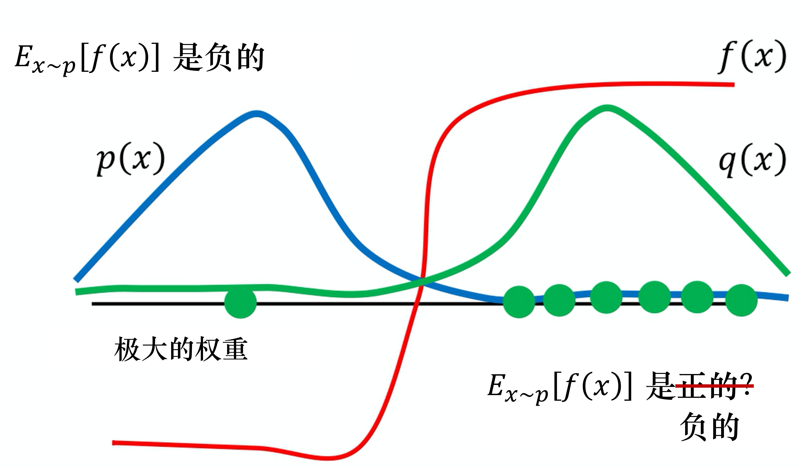
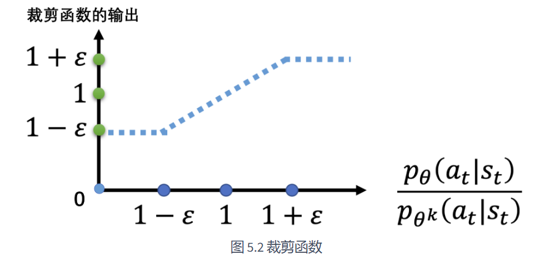

# EasyRL Chapter 5: Proximal Policy Optimization (PPO)

Review the policy gradient method, we use a actor to interact with the environment and get a lot of trajectories and then we use the trajectories to update the policy. The actor's policy is similar to the policy gradient so the policy gradient is a on-policy method. The update equation is:

$$
\nabla R(\theta) = \mathbb{E}_{\tau \sim \pi_{\theta}} \left[ R(\tau) \nabla p_\theta(\tau)\right]
$$

And when we update the policy, the $\theta$ will turn to $\theta'$, so the policy gradient is:

$$
\theta' = \theta + \alpha \nabla R(\theta)
$$

And the probability $p_{\theta}(\tau)$ can not use any more, previous sample trajectories can not be used to update the policy. So the policy gradient will spend a lot of time in sampling trajectories. 

We want to get a off-policy methods which means we want to use a fixed policy $\pi_{\theta'}$, using $\pi_{\theta'}$ to interact with the environment and get the trajectories to train $\pi_{\theta}$. Assume we can let $\theta$ to learn the data which is sampled from $\theta'$, once we finish sampling the data, we can use multiple tradient descent to update the policy without sampling the data again. And now the question is how to achieve that?

We introduce **Importance Sampling** to solve the problem. The importance sampling is a method to estimate the expectation of a function under one distribution using samples from another distribution. 

We know that if we want to calculate the expectation of $f(x)$ under the distribution $p(x)$, we can use the following equation:

$$
\mathbb{E}_{x \sim p(x)}[f(x)] = \int p(x) f(x) dx \approx \frac{1}{N} \sum_{i=1}^{N} f(x_i)
$$

where we sample $x_i$ from the distribution $p(x)$. But what if we can not sample data from distribution $p$ but only can sample data from distribution $q$? We can make a correction to the expectation:

$$
\mathbb{E}_{x \sim p(x)}[f(x)] = \int p(x) f(x) dx = \int q(x) \frac{p(x)}{q(x)} f(x) dx = \mathbb{E}_{x \sim q(x)}\left[ \frac{p(x)}{q(x)} f(x) \right]

\approx \frac{1}{N} \sum_{i=1}^{N} \frac{p(x_i)}{q(x_i)} f(x_i)
$$

where we sample $x_i$ from the distribution $q(x)$. The importance sampling is a method to estimate the expectation of a function under one distribution using samples from another distribution.

In theory, we can use any $q(x)$ to estimate the expectation of $f(x)$ under the distribution $p(x)$. But in practice, the difference between $p(x)$ and $q(x)$ will affect the variance of the estimation. So we need to choose a $q(x)$ which is close to $p(x)$ to reduce the variance. Let's see the variance of the importance sampling:

$$
\text{Var}_{x \sim p} \left[ f(x) \right] = \mathbb{E}_{x \sim p} \left[ f(x)^2 \right] - \left( \mathbb{E}_{x \sim p} \left[ f(x) \right] \right)^2
$$

$$
\text{Var}_{x \sim q} \left[ \frac{p(x)}{q(x)} f(x) \right] = \mathbb{E}_{x \sim q} \left[ \left( \frac{p(x)}{q(x)} f(x) \right)^2 \right] - \left( \mathbb{E}_{x \sim q} \left[ \frac{p(x)}{q(x)} f(x) \right] \right)^2
$$

$$
\text{Var}_{x \sim q} \left[ \frac{p(x)}{q(x)} f(x) \right] = \mathbb{E}_{x \sim p} \left[ f(x)^2 \frac{p(x)}{q(x)}\right] - \left( \mathbb{E}_{x \sim p} \left[ f(x) \right] \right)^2
$$

Compared with the variance of $p(x)$, the variance first term is different. The difference is the term $\frac{p(x)}{q(x)}$. If $q(x)$ is close to $p(x)$, the term $\frac{p(x)}{q(x)}$ will be close to 1, so the variance of the importance sampling will be close to the variance of the original distribution.

So in fact, the importance sampling is a unbiased estimator of the expectation of $f(x)$ under the distribution $p(x)$, but the variance of the importance sampling is high. We need to choose a $q(x)$ which is close to $p(x)$ to reduce the variance.

The image above shows the problem of importance sampling. The blue line is the distribution $p(x)$ and the red line is the distribution $f(x)$, the green line is the distribution $q(x)$. If we want to calculate the expectation of $f(x)$ under the distribution $p(x)$, obviously, it is negative. And then if we use the distribution $q(x)$ to sample the data, if the sampled data is small, it is possible that we only sample the items in the right side which all of it is positive. So the importance sampling is work only when we sample enough data to cover the whole distribution.

Then, we consider how to use importance samping to solve the problem of policy gradient. Previous derivation is that:

$$
\nabla R(\theta) = \mathbb{E}_{\tau \sim \pi_{\theta}} \left[ R(\tau) \nabla p_\theta(\tau)\right]
$$

And we want to use the fixed policy $\pi_{\theta'}$ to sample the data, so we can use the importance sampling to estimate the expectation of the policy gradient:

$$
\nabla R(\theta) = \mathbb{E}_{\tau \sim \pi_{\theta'}} \left[ R(\tau) \nabla p_\theta(\tau) \frac{p_{\theta'}(\tau)}{p_{\theta'}(\tau)} \right]
$$

Additionly, in practice, we can use the tricks we discussed before, using advantage function:

$$
\nabla R(\theta) = \mathbb{E}_{\tau \sim \pi_{\theta'}} \left[ A(\tau) \nabla \log p_\theta(\tau) \frac{p_{\theta'}(\tau)}{p_{\theta'}(\tau)} \right]
$$

And consider each state-action pair in the trajectory, we can re-write the equation:

$$
\nabla R(\theta) = \mathbb{E}_{\tau \sim \pi_{\theta'}} \left[ \sum_{t=0}^{T} A(s_t, a_t) \nabla \log p_\theta(s_t, a_t) \frac{p_{\theta'}(s_t, a_t)}{p_{\theta'}(s_t, a_t)} \right]
$$

If we consider the state-action pair is sampled from the $\pi_{\theta'}$:

$$
\nabla R(\theta) = \mathbb{E}_{s_t, a_t \sim \pi_{\theta'}} \left[ A(s_t, a_t) \nabla \log p_\theta(s_t, a_t) \frac{p_{\theta'}(s_t, a_t)}{p_{\theta'}(s_t, a_t)} \right]
$$

And we divide the $p_{\theta'}(s_t, a_t)$ in the equation:

$$
p_{\theta}(s_t,a_t) = p_{\theta}(a_t|s_t)
$$

We have:

$$
\nabla R(\theta) = \mathbb{E}_{(s_t,a_t)\sim\pi_{\theta'}}\left[\frac{p_\theta\left(a_t|s_t\right)}{p_{\theta'}\left(a_t|s_t\right)}\frac{p_\theta\left(s_t\right)}{p_{\theta'}\left(s_t\right)}A^{\theta'}\left(s_t,a_t\right)\nabla\log p_\theta\left(a_t^n|s_t^n\right)\right]
$$

And consider $p_\theta(s)$ is the state distribution of the policy $\pi_{\theta}$, and it is difficult to calculate the state distribution, so we can approximatly consider $p_\theta(s) = p_{\theta'}(s)$, so we have:

$$
\nabla R(\theta) = \mathbb{E}_{(s_t,a_t)\sim\pi_{\theta'}}\left[\frac{p_\theta\left(a_t|s_t\right)}{p_{\theta'}\left(a_t|s_t\right)}A^{\theta'}\left(s_t,a_t\right)\nabla\log p_\theta\left(a_t^n|s_t^n\right)\right]
$$

And in previous discussion, we use importance sampling to solve the data can not recycle. But what if the two distribution $p(x)$ and $q(x)$ are very different? If so, the variance of the importance sampling will be very high. PPO will solve this problem.

Firstly, let's consider a previous works which is called TRPO. TRPO is trust region policy optimization. The idea of TRPO is to limit the change of the policy in each iteration. The policy gradient is:

$$
\nabla R(\theta) = \mathbb{E}_{(s_t,a_t)\sim\pi_{\theta'}}\left[\frac{p_\theta\left(a_t|s_t\right)}{p_{\theta'}\left(a_t|s_t\right)}A^{\theta'}\left(s_t,a_t\right)\nabla\log p_\theta\left(a_t^n|s_t^n\right)\right]
$$

And we want to limit the change of the policy, so we add a constraint to the policy gradient:

$$
KL\left(\pi_{\theta'}||\pi_{\theta}\right) < \delta
$$

The constraint force the policy $\pi_{\theta}$ to be close to the policy $\pi_{\theta'}$, so the variance of the importance sampling will be low. But it add the constraint to the optimization problem, so it is hard to solve. PPO will solve this problem.

PPO is proximal policy optimization. The idea of PPO is to add a penalty to the policy gradient to limit the change of the policy. The policy gradient is:

$$
\nabla R(\theta) = \mathbb{E}_{(s_t,a_t)\sim\pi_{\theta'}}\left[\frac{p_\theta\left(a_t|s_t\right)}{p_{\theta'}\left(a_t|s_t\right)}A^{\theta'}\left(s_t,a_t\right)\nabla\log p_\theta\left(a_t^n|s_t^n\right)\right]
$$

And we add a penalty to the policy gradient:

$$
\text{minimize} \quad \mathbb{E}_{(s_t,a_t)\sim\pi_{\theta'}}\left[\frac{p_\theta\left(a_t|s_t\right)}{p_{\theta'}\left(a_t|s_t\right)}A^{\theta'}\left(s_t,a_t\right)\nabla\log p_\theta\left(a_t^n|s_t^n\right)\right] - \beta KL\left(\pi_{\theta'}||\pi_{\theta}\right)
$$

Compared with TRPO, PPO add a penalty to the polcy gradient rather than adding a constraint to the gradient so it it easy to solve.

The penalty is:

$$
KL\left(\pi_{\theta'}||\pi_{\theta}\right) = \mathbb{E}_{(s_t,a_t)\sim\pi_{\theta'}}\left[D_{KL}\left(\pi_{\theta'}\left(a_t|s_t\right)||\pi_{\theta}\left(a_t|s_t\right)\right)\right]
$$

And PPO has two version, PPO-Clip and PPO-Penalty. PPO-Clip is to clip the ratio of the policy gradient. Firstly, consider the PPO-Penalty, the penalty is:

$$
KL\left(\pi_{\theta'}||\pi_{\theta}\right) = \mathbb{E}_{(s_t,a_t)\sim\pi_{\theta'}}\left[D_{KL}\left(\pi_{\theta'}\left(a_t|s_t\right)||\pi_{\theta}\left(a_t|s_t\right)\right)\right]
$$

And the parameter $\beta$ is the penalty coefficient. We can adaptively adjust the penalty coefficient by the KL divergence. If the KL divergence is larger than the target KL divergence, we can increase the penalty coefficient, if the KL divergence is smaller than the target KL divergence, we can decrease the penalty coefficient.

And then consider the PPO-Clip, the objective function is:

$$\begin{aligned}J_{\mathrm{PPO}2}^{\theta^{k}}(\theta)&\approx\sum_{(s_t,a_t)}\min\left(\frac{p_\theta\left(a_t|s_t\right)}{p_{\theta^k}\left(a_t|s_t\right)}A^{\theta^k}\left(s_t,a_t\right),\right.\\&\operatorname{clip}\left(\frac{p_\theta\left(a_t|s_t\right)}{p_{\theta^k}\left(a_t|s_t\right)},1-\varepsilon,1+\varepsilon\right)A^{\theta^k}\left(s_t,a_t\right)\end{aligned}$$

The clip function is to clip the ratio of the policy gradient. If the ratio is larger than 1 + $\varepsilon$, we clip the ratio to 1 + $\varepsilon$, if the ratio is smaller than 1 - $\varepsilon$, we clip the ratio to 1 - $\varepsilon$. The $\varepsilon$ is a hyperparameter to control the clip range.

The image above shows the PPO-Clip. The core insight of PPO-Clip is using clip to limit the change of the policy, forcing the policy to be close to the policy $\pi_{\theta'}$. The PPO-Clip is easy to implement and it is very effective in practice.