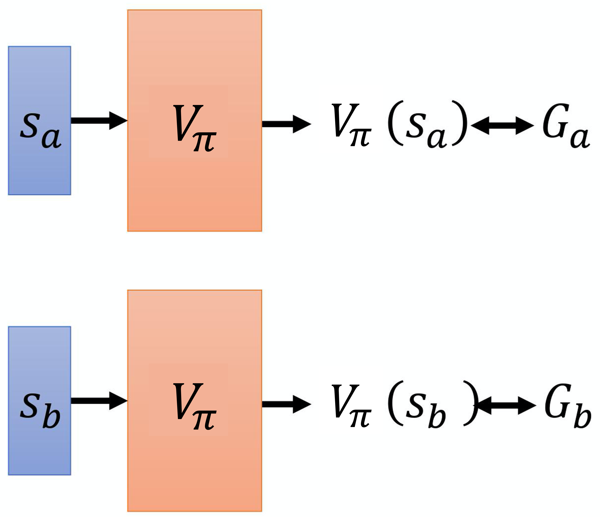
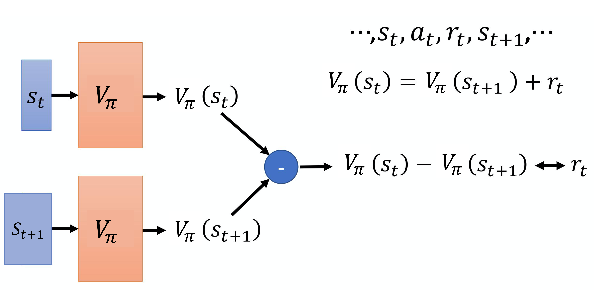
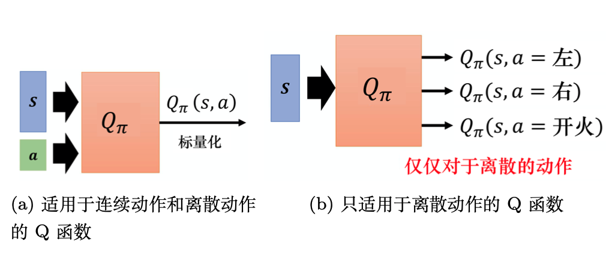
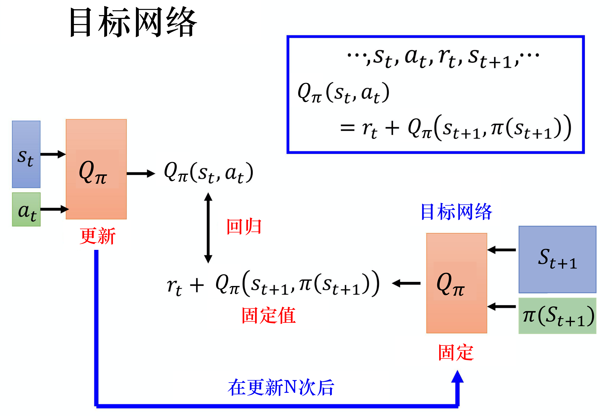
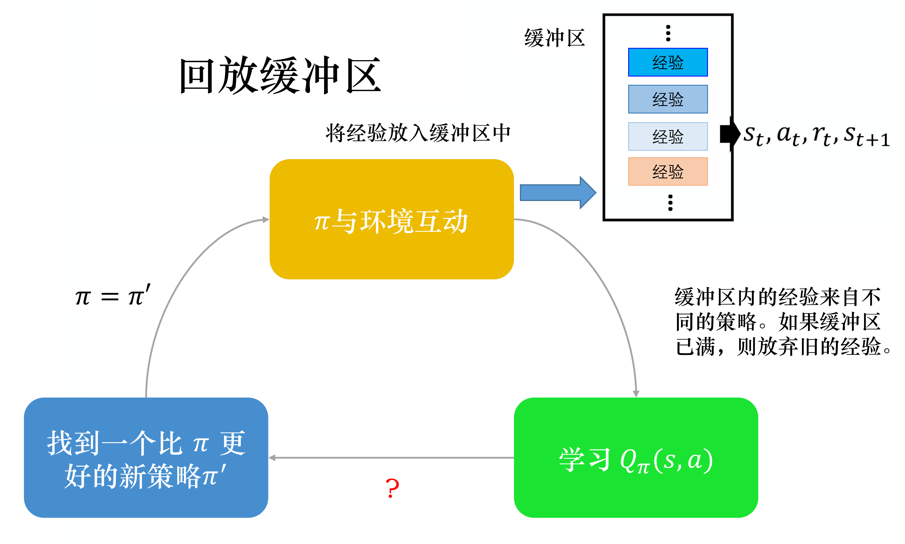

# EasyRL Chapter 6: Deep Q Network (DQN) Basic

In chapter 3, Tabular Methods, we have discuss the Q-learning. We need to store all of the state-action pairs and its corresponding Q-values in a table. However, in the real world, the state space is too large to store all of the state-action pairs. In this chapter, we will introduce a deep learning method to approximate the Q-values, which is called Deep Q Network (DQN).

We will use the value function approximation method to approximate the Q-values:

$$Q_\pi(s, a) \approx Q_\theta(s, a; \theta)$$

where $\theta$ is the parameters of the neural network. We will use the neural network to approximate the Q-values. The neural network will take the state as input and output the Q-values of all actions.

## 6.1 State Value Function

Deep Q-learning is value-based algorithm, we need to learn the critic value function instead of directly learning the policy. And one potenial critic is the state value function $V(s)$, which is the expected return starting from state $s$ following the policy $\pi$.

The first method to evaluate the state value function is Monte Carlo method. We can use the Monte Carlo method to estimate the state value function. We will do a regression on the state value function.

The second method is Temporal Difference (TD) learning. We can use the TD learning to estimate the state value function. During the training process, we are not estimate the $V_pi$ directly, but we wish the $V(s)$ can be close to the target $r + \gamma V(s')$. We can use the TD error to update the state value function.

Consider the difference between TD and MC, the main difference is that the MC needs to sample the whole episode to update the value function so it has high variance. The TD can update the value function after each step so it has low variance.

## 6.2 Q Value Function

The Q value function is the expected return starting from state $s$, taking action $a$ and following the policy $\pi$. We can use the Q value function to evaluate the action value.

The image above shows two type of Q function. One is the Q function with the state as input, and the other is the Q function with the state-action pair as input. The Q function with the state-action pair as input is more common in the deep reinforcement learning.

Consider how to compare two policy $\pi$ and $\pi'$. For any state $s$, if $V_\pi(s) \geq V_{\pi'}(s)$, then $\pi$ is better than $\pi'$. If $Q_\pi(s, a) \geq Q_{\pi'}(s, a)$, then $\pi$ is better than $\pi'$. So we can use the Q value function to evaluate the policy.

## 6.3 Target Network

Consider how to update the value function. We have discussed that we need to do a regression problem. But as the parameters of the neural network are updated, the target value will change. So we need to use the target network to fix the target value.

We have two networks, one is the target network, and the other is the evaluation network. We will use the target network to fix the target value. The target network will be updated by the evaluation network after a fixed number of steps.

## 6.4 Exploration

In the DQN, we will use the $\epsilon$-greedy policy to explore the environment. We will select the action with the highest Q value with probability $1-\epsilon$, and select the random action with probability $\epsilon$. So the action is:

$$a = \begin{cases} \text{argmax}_a Q(s, a) & \text{with probability } 1-\epsilon \\ \text{random action} & \text{with probability } \epsilon \end{cases}$$

## 6.5 Experience Replay

In the DQN, we will use the experience replay to store the experience. We will store the experience in the replay buffer. The replay buffer will store the experience as $(s, a, r, s', done)$. We will sample the experience from the replay buffer to update the value function.

