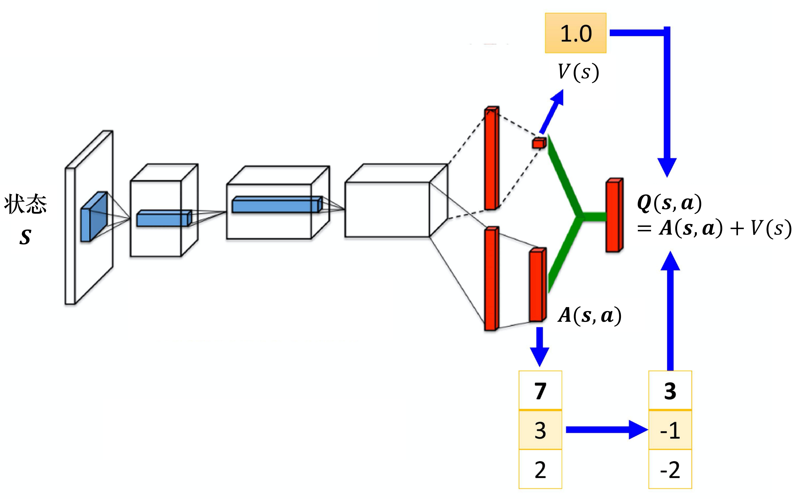
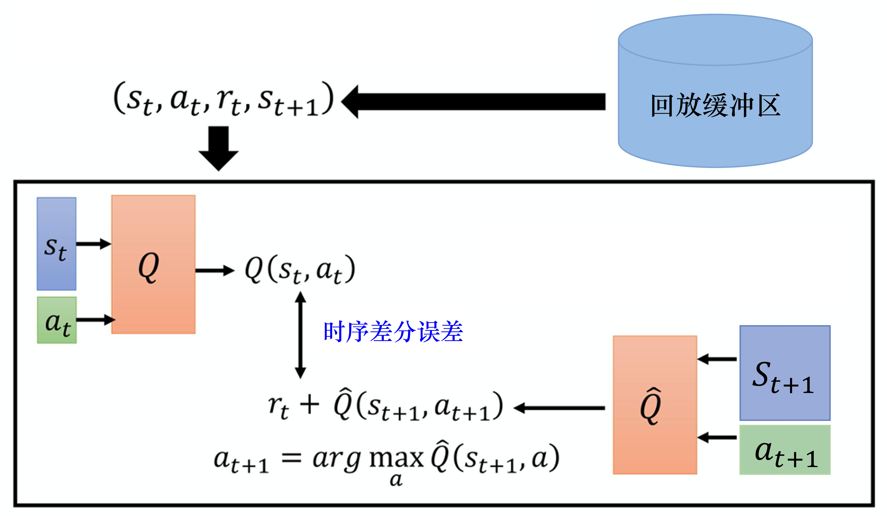
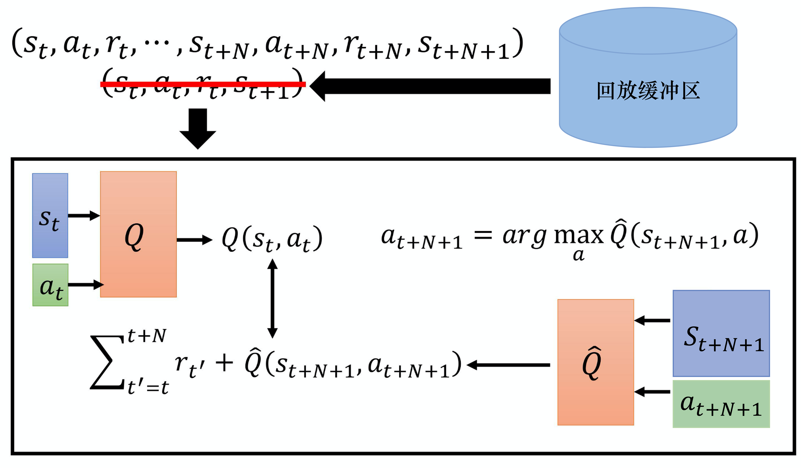
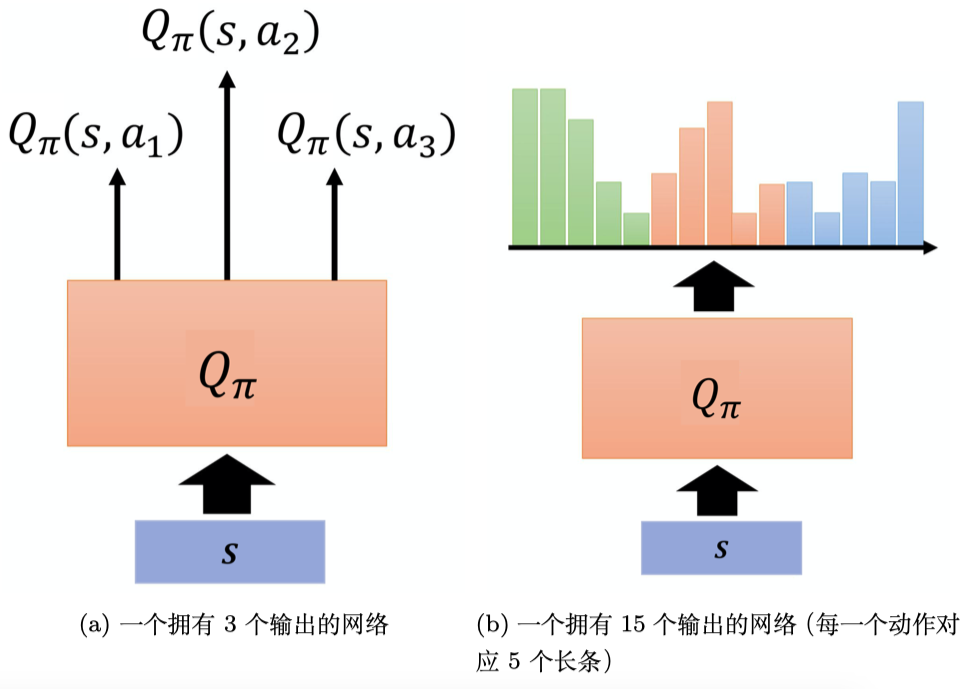

# EasyRL Chapter 7: DQN Tricks

In traditional DQN, we are updating the parameter of the Q-function, the Q-function is increasing as the epoch goes on. So the Q-function will be overestimated. Like the image below:

So one solution to reduce the overestimation is using double Q network(DDQN). We don't need to modify a lot of codes compared with DQN because there are already two network in DQN, we just need to change the target network to the current network. Previous target network is fixed and only update every C steps. But in DDQN, we use a network which parameters can be updated to select the action.

The second trick is Dueling DQN. It changes the architecture of original DQN to separate the value and advantage. The value is the expected return of the state, and the advantage is the difference between the value and the Q-value. The Q-value is the sum of the value and the advantage. The architecture of Dueling DQN is shown below:

The Q function is calculated by the state-value function and the advantage function:

$$Q(s, a) = V(s) + A(s, a)$$

The advantage of Dueling DQN is that it is efficient to learn the value and update the Q function. If we change the state-value function, it will affect all of the corrsponding Q values(in Q table which is a row or a cloumn). So we don't need to sample all of the state-action pairs to update the Q function.

One potential problem of Dueling DQN is that when the network is converge, the state-value function is zero. And at that time the Dueling DQN will be the same as the original DQN. To avoid this problem, we need to add some constraint to the $A(s, a)$ to make sure the Q function, making it is difficult to update the advantage function and let the network tend to use $V(s)$ to solve the problem.

A obvious constraint is that the sum of the advantage function is zero:

$$\sum_{a} A(s, a) = 0$$

So if we want to update the one of the advantage function, we need to update the other advantage function. 

Like the image above, the state-value function is $V(s) = 1$, and the advantage function is $[7,3,2]$. We need to first normalize the advantage function to satisfy the constraint. Then we can update the advantage function. 

The third trick is Prioritized Experience Replay. In traditional DQN, we sample the transitions uniformly. But in PER, we sample the transitions based on the TD error. The TD error is the difference between the target Q value and the current Q value. The TD error is used to measure the importance of the transitions. The transitions with high TD error are more important to update the Q function. The TD error is calculated by:

$$TD = (r + \gamma \max_{a'} Q(s', a') - Q(s, a))^2$$

The TD error is used to calculate the priority of the transitions. The priority is calculated by:

$$P = |TD| + \epsilon$$

The $\epsilon$ is a small positive constant to avoid the priority is zero. The probability of the transitions is calculated by:

$$P_i = \frac{P_i^{\alpha}}{\sum_{k} P_k^{\alpha}}$$

The next trick is the balance between MC and TD. The MC will use the entire episode to update the Q function while TD only use one step. So we can use $N$ steps to update the Q function which is the trade off between MC and TD. The $N$ steps is called n-step return. The n-step return is calculated by:

$$G_t^{(n)} = r_{t+1} + \gamma r_{t+2} + \gamma^2 r_{t+3} + \cdots + \gamma^{n-1} r_{t+n} + \gamma^n Q(s_{t+n}, a_{t+n})$$

The next trick is noisy net. The noisy net is used to add the noise to the network. The noise is added to the weights of the network. The noise is sampled from the factorized Gaussian distribution. The factorized Gaussian distribution is calculated by:

$$f(x) = \mu(x) + \sigma(x) \odot \epsilon$$

The $\mu(x)$ is the mean of the Gaussian distribution, the $\sigma(x)$ is the standard deviation of the Gaussian distribution, and the $\epsilon$ is the noise sampled from the Gaussian distribution. This trick is a updated version of $\epsilon$-greedy. $\epsilon$-greedy is adding the noise to the action space, but noisy net is adding the noise to the network. The noisy net is more efficient than $\epsilon$-greedy. And we use the noisy network to select the action.

The advantage of noisy net compared with $\epsilon$-greedy is that when we need to take actions, if we use $\epsilon$-greedy, we may take different actions in the same situation. Or in other words, it is not deterministic. But if we use noisy net, we can take the same action in the same situation. The noisy net is deterministic. The noisy net is more efficient than $\epsilon$-greedy.

The next trick is the distributional DQN. In traditional DQN, the output of the Q network is just a single number. But in distributional DQN, the output of the Q network is a distribution. The distribution is the probability of the Q value. 

Like the image above. We decompose the Q value into the probability of the Q value while previous Q network is just the expectation. The advantage of distributional network is that if we have two actions and the expectation of the corrsponding reward is the same, we can choose the action which has a lower variance in order to enhance the robustness.

The last trick is called rainbow. The rainbow is the combination of all of the tricks above. The rainbow is the state-of-the-art DQN. 