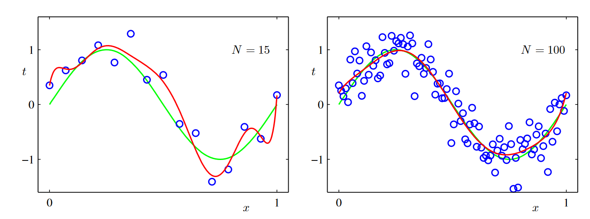

# PRML Chapter 1: Introduction

Generalization: The ability to perform accurately on new, unseen examples/tasks after having learned from a set of training examples.

## 1.1 Example: Polynomial Curve Fitting

### 1.1.1 Linear Basis Function Models

The simplest linear model for regression is one that involves a linear combination of fixed nonlinear functions of the input variables. This is known as a linear basis function model. The following equation is a linear model of the form:

$$y(x, \textbf{w}) = w_0 + w_1x + w_2x^2 + ... + w_Mx^M = \sum_{j=0}^{M}w_jx^j$$

where $x$ is the input variable, $y$ is the output variable, $w$ is the weight vector, and $M$ is the order of the polynomial. Although the model is nonlinear in the input variable $x$, it is linear in the parameters $\textbf{w}$.

We need to minimize the error function, which is the sum of the squares of the differences between the target values $t$ and the values predicted by the model $y(x, \textbf{w})$:

$$E(\textbf{w}) = \frac{1}{2}\sum_{n=1}^{N}\{y(x_n, \textbf{w}) - t_n\}^2$$

where $N$ is the number of data points.

So in this problem, we just need to find the optimal values of the weight vector $\textbf{w}$ that minimize the error function $E(\textbf{w})$. And it has a closed-form solution, denoted as $\textbf{w}^*$:

$$\textbf{w}^* = (\textbf{Φ}^T\textbf{Φ})^{-1}\textbf{Φ}^T\textbf{t}$$

where $\textbf{Φ}$ is the design matrix, whose elements are given by $\textbf{Φ}_{nj} = x_n^j$, and $\textbf{t}$ is the vector of target values.

Figure 1 shows different value of polynomial order $M$ and the corresponding polynomial curve fitting. As we can see, the polynomial curve fitting becomes more flexible as the order $M$ increases. However, if we set $M$ too large, the model will overfit the data, which means it will perform well on the training data but poorly on the test data.

Another error measuring equation is RMS, which is the square root of the mean of the squares of the error function:

$$E_{RMS} = \sqrt{2E(\textbf{w}^*)/N}$$

The figure above shows the RMS error as a function of the order $M$ of the polynomial. As we can see, for training data, the RMS error decreases as the order $M$ increases. However, the RMS error on the test data increases as the order $M$ increases, which means the model is overfitting the data. 

This is a little paradoxical, but it is a common phenomenon in machine learning. If $M=9$, there are 10 coefficients which means it should be able to fit 10 points exactly. However, as the figure shows, the RMS error on the test data is very large.

As the figure above shows, the coefficients of the polynomial model with $M=9$ are very large. So it only perform well on the training data. This a also a proof that we need add a regularization term to the error function to prevent overfitting.

What means regularization? It means we add a term to the error function to penalize the large coefficients. In fact, in the coefficient space, there are a lot of solutions that can minimize the error function. But some of them are too large, it will obviously perform poorly on the unknwon data. So we need to choose the solution that has the smallest coefficients that will have a better generalization ability.

So the regularized error function is:

$$E(\textbf{w}) = \frac{1}{2}\sum_{n=1}^{N}\{y(x_n, \textbf{w}) - t_n\}^2 + \frac{\lambda}{2}||\textbf{w}||^2$$

where $\lambda$ is the regularization coefficient, and $||\textbf{w}||^2$ is the square of the Euclidean norm of the weight vector $\textbf{w}$. From a high level aspect, we consider that we need to minimized the error function, incluing two terms. On the one hand, we need to minimized the original error function which is like MSE. On the other hand, we need to minimized the Euclidean norm of the weight vector. $\lambda$ is a trade off between the model complexity and the fitting ability.

And the figure above shows different $\lambda$ and the corresponding coefficients of the polynomial model with $M=9$. As we can see, the coefficients become smaller as $\lambda$ increases. And the RMS error on the test data decreases as $\lambda$ increases. So the regularization term can prevent overfitting.

Another methods to prevent overfitting is to add more training data. As the figure below shows, if we add more training data, the RMS error on the test data will decrease. Another way to say this is that the larger the training data, the better the generalization ability of the model.

## 1.2 Probability Theory

**Sum rule**: $$p(X = x_i) = \sum_{j}p(X = x_i, Y = y_j) = \frac{c_i}{N}$$

Conditional probability: $$p(X = x_i|Y = y_j) =  \frac{n_{i,j}}{c_i}=\frac{p(X = x_i, Y = y_j)}{p(Y = y_j)}$$

In conditional probability, $n_{i,j}$ is the number of times $X = x_i$ and $Y = y_j$ occur together, and $c_i$ is the number of times $X = x_i$ occurs. We can say that the core of conditional probability is shrink the sample space. The original sample space is $N$ while the new sample space is $c_i$. And based on it, we can give the equation of conditional probability as above. 

And we can change the equation of conditional probability to the form of joint probability:

$$p(X = x_i, Y = y_j) =\frac{n_{i,j}}{N}=\frac{n_{i,j}}{c_i} \times \frac{c_i}{N} =p(Y = y_j|X = x_i)p(Y = x_i)$$

The equation above is also called product rule. It is the core of probability theory. It is the foundation of the Bayes' theorem.

And we can also get the Bayes' theorem from the product rule:

$$p(Y = y_j|X = x_i) = \frac{p(X = x_i|Y = y_j)p(Y = y_j)}{p(X = x_i)}$$

### 1.2.1 Probability densities

We call $p(x)$ the probability density function of the continuous variable $x$. And the probability that $x$ lies in the range $[x, x + \delta x]$ is given by $p(x)\delta x$. And the probability that $x$ lies in the range $[x, x + \delta x]$ and $y$ lies in the range $[y, y + \delta y]$ is given by $p(x, y)\delta x \delta y$. So for the single variable, if we need to calculate the probability that $x$ lies in the range $[a, b]$, we can use the following equation:

$$p(a \leq x \leq b) = \int_{a}^{b}p(x)dx$$

And for the joint probability, we can use the following equation:

$$p(a \leq x \leq b, c \leq y \leq d) = \int_{a}^{b}\int_{c}^{d}p(x, y)dxdy$$

If we need to calculate the probability that $x$ lies in the range $[a, b]$, and y lies in the range $[-\infty, +\infty]$, we can use the following equation:

$$p(a \leq x \leq b) = \int_{a}^{b}\int_{-\infty}^{+\infty}p(x, y)dydx$$

And if the variable $x$ is non-linearly transformed by $y$,which means $x=g(y)$, we can get the following equation:

$$
p(y) = p(x)\left|\frac{dx}{dy}\right| = p(g(y))\left|\frac{dg(y)}{dy}\right|
$$

The equation above is the transformation of the probability density function. And the absolute value of the derivative of the transformation function is the Jacobian of the transformation. It will make sure the probability is conserved and non-negative.

This is the PDF(Probability Density Function) of the continuous variable. And the CDF(Cumulative Distribution Function) is the integral of the PDF. The CDF of the continuous variable $x$ is defined as:

$$P(x) = \int_{-\infty}^{x}p(x')dx'$$

Obviously, the CDF is a monotonically increasing function. And the PDF is the derivative of the CDF. So we can get the PDF from the CDF. And if we need to calculate the probability that $x$ lies in the range $[a, b]$, we can use the following equation:

$$p(a \leq x \leq b) = P(b) - P(a)$$
 
And it also have:

$$\lim_{x \to -\infty}P(x) = 0$$

$$\lim_{x \to +\infty}P(x) = 1$$

### 1.2.2 Expectations and Covariances

The expectation and variance of a function $f(x)$ with respect to the probability distribution $p(x)$ are defined as:

$$E[f] = \int f(x)p(x)dx $$

$$E[f] \approx \frac{1}{N}\sum_{n=1}^{N}f(x_n)$$

$$var[f] = E[(f(x) - E[f(x)])^2] = E[f(x)^2] - E[f(x)]^2$$

Expectation is the value to measure the center of the distribution. And variance is the value to measure the spread of the distribution. And the covariance between two variables $x$ and $y$ is defined as:

$$cov[x, y] = E[(x - E[x])(y - E[y])] = E[xy] - E[x]E[y]$$

Which is a measure of the degree to which $x$ and $y$ vary together. If $x$ and $y$ are independent, then $cov[x, y] = 0$. And the covariance matrix(for vectors of varibles) is defined as:

$$cov[\textbf{x}] = E[(\textbf{x} - E[\textbf{x}])(\textbf{x} - E[\textbf{x}])^T]$$

Obviously, accoding to the definition of covariance matrix, it is a symmetric matrix. And the diagonal elements of the covariance matrix are the variances of the corresponding variables. And the off-diagonal elements are the covariances between the corresponding variables. For the vector $\textbf{x} = [x_1, x_2, ..., x_D]^T$, the covariance matrix is a $\mathbb{M} = D \times D$ matrix. And $\mathbb{M}_{i,j}$ is the covariance between $x_i$ and $x_j$ which is the same as $\mathbb{M}_{j,i}$. The calculation of the covariance matrix is:

$$\mathbb{M}_{i,j} = \frac{1}{N}\sum_{n=1}^{N}(x_{i,n} - \bar{x}_i)(x_{j,n} - \bar{x}_j)$$

where $\bar{x}_i$ is the mean of the variable $x_i$. 

### 1.2.3 Bayesian Probability Theory

Modern machine learning and pattern recognition are based on the Bayesian probability theory. The Bayesian probability theory is a way to quantify uncertainty. It is a way to measure the degree of belief in a hypothesis. The Bayesian probability theory is based on the Bayes' theorem:

$$p(\textbf{w}|D, M) = \frac{p(D|\textbf{w}, M)p(\textbf{w}|M)}{p(D|M)}$$

where $p(\textbf{w}|D, M)$ is the posterior distribution, $p(D|\textbf{w}, M)$ is the likelihood function, $p(\textbf{w}|M)$ is the prior distribution, and $p(D|M)$ is the evidence. The posterior distribution is the distribution of the parameters $\textbf{w}$ given the data $D$ and the model $M$. The likelihood function is the probability of the data given the parameters and the model. The prior distribution is the distribution of the parameters before observing the data. The evidence is the probability of the data given the model. The Bayesian probability theory is a way to update the prior distribution to the posterior distribution based on the data. It is a way to quantify the uncertainty of the parameters.

Let's consider the polynomial curve fitting problem. We have the data $D = \{(x_1, t_1), (x_2, t_2), ..., (x_N, t_N)\}$, and the model $M$ is the polynomial model of order $M$. The coifficients of the polynomial model are the parameters $\textbf{w} = \{w_0, w_1, ..., w_M\}$. 

The core of the Bayesian probability theory is the posterior distribution. And we will use the equation above to use prior distribution to calculate posterior distribution. Before we observe the data, the prior distribution is the distribution of the coifficients, denoted as $p(\textbf{w}|M)$. And after we observe the data, the posterior distribution is the distribution of the coifficients, denoted as $p(\textbf{w}|D, M)$. The likelihood function is the probability of the data given the parameters and the model, denoted as $p(D|\textbf{w}, M)$. The evidence is the probability of the data given the model, denoted as $p(D|M)$.

The likelihood function is the probability of the data given the parameters and the model:

$$p(D|\textbf{w}, M) = \prod_{n=1}^{N}p(t_n|x_n, \textbf{w}, M)$$

where $p(t_n|x_n, \textbf{w}, M)$ is the probability of the target value $t_n$ given the input value $x_n$, the parameters $\textbf{w}$, and the model $M$. 

So given the definition of the likelihood function, we can state Bayes' theorem in words:

$$\text{posterior} \propto \text{likelihood} \times \text{prior}$$

It is hard to understand the meaning of $p(D|\textbf{w}, M)$ which is called likelihood function. Before I thought that the likelihood is meaningless because since the coiffient $\textbf{w}$ is determined, the likelihood is a binary value. I ignore that the problem is we can not determine the coiffient $\textbf{w}$, so the $\textbf{w}$ is a random varible too. So we can consider the polynomial fitting problem in possibility. The $\textbf{w}$ is a random varible in the $M$ order space, it's a joint distribution of $M$ variable $w_1,w_2,\dots,w_M$. We need to maximize the likelihood function which is maximize the possibility to calculate the value $t_n$ for given input $x_n$. And it will obviously has the minimized error. 

### 1.2.4 The Gaussian Distribution

Gaussian distribution is the most important distribution in probability theory. It is a bell-shaped curve. The Gaussian distribution is defined as:

$$\mathcal{N}(x|\mu, \sigma^2) = \frac{1}{(2\pi\sigma^2)^{1/2}}\exp\{-\frac{1}{2\sigma^2}(x - \mu)^2\}$$

where $\mu$ is the mean of the distribution, and $\sigma^2$ is the variance of the distribution. 

The vector $x$ is a $D$-dimensional vector, and the Gaussian distribution is defined as:

$$\mathcal{N}(\textbf{x}|\textbf{μ}, \mathbb{Σ}) = \frac{1}{(2\pi)^{D/2}}\frac{1}{|\mathbb{Σ}|^{1/2}}\exp\{-\frac{1}{2}(\textbf{x} - \textbf{μ})^T\mathbb{Σ}^{-1}(\textbf{x} - \textbf{μ})\}$$

where $\textbf{μ}$ is the mean vector, and $\mathbb{Σ}$ is the covariance matrix.

And if each dimension of vector $\textbf{x}$ has the same expectation and variance the possibility of the data given the Gaussian distribution is:

$$p(\textbf{x}|μ, \sigma^2) = \prod_{i=1}^{D}\mathcal{N}(x_i|\mu, \sigma^2)$$

And the log form of the possibility is:

$$\ln p(\textbf{x}|μ, \sigma^2) = -\frac{1}{2\sigma^2}\sum_{i=1}^{D}(x_i - μ)^2 - \frac{D}{2}\ln(2\pi\sigma^2)$$

Back to the polynomial curve fitting problem, if we use maximize likelihood methods to solve the problem, there will be bias.

**Unbias Estimation**: 

