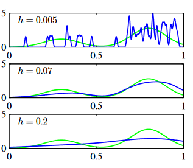

# PRML Chapter 2: Probability Distributions

Likelihood and probability: The probability of the data is when we know the parameters of the model, which means in the case of parameters $\theta$, the events $A$ occur which can denoted as $P(A|\theta)$. The likelihood of the parameters is the probability of the parameters when we know the data, which means in the case of data $D$, the parameters $\theta$ occur which can denoted as $P(\theta|D)$. The likelihood function is given by $P(D|\theta)$. We need to do MLE because MLE can find the parameters that maximize the likelihood function, which means the probability of the events $A$ occur is maximized.

## 2.1 Binary Variables

Consider a binary variable $x \in \{0,1\}$ which $x=1$ respresents the head of a coin and $x=0$ represents the tail of a coin. The probability of the head of a coin is given by $P(x=1) = \mu$ and the probability of the tail of a coin is given by $P(x=0) = 1-\mu$. The probability of the binary variable $x$ can be written as:

$$
P(x|\mu) = \mu^x(1-\mu)^{1-x}
$$

where $\mu \in [0,1]$ is the parameter of the distribution. This distribution is called the Bernoulli distribution. When $x=1$, the probability of the head of a coin is given by $\mu$ and when $x=0$, the probability of the tail of a coin is given by $1-\mu$. The expected value of the Bernoulli distribution is given by:

$$
E[x] = \sum_{x=0}^{1} xP(x) = 0 \times (1-\mu) + 1 \times \mu = \mu
$$

The variance of the Bernoulli distribution is given by:

$$
Var[x] = E[x^2] - E[x]^2 = \mu - \mu^2 = \mu(1-\mu)
$$

And suppose we have a data set $\mathcal{D} = \{x_1,x_2,\ldots,x_N\}$ where $x_i \in \{0,1\}$ and the data set is generated by a coin with probability $\mu$. The likelihood function of the data set $\mathcal{D}$ is given by:

$$
P(\mathcal{D}|\mu) = \prod_{n=1}^{N} P(x_n|\mu) = \prod_{n=1}^{N} \mu^{x_n}(1-\mu)^{1-x_n}
$$

The likelihood function means that the probability of the data set $\forall x \in \mathcal{D}$, the events $x$ all occur. And the log likelihood function is given by:

$$
\ln P(\mathcal{D}|\mu) = \sum_{n=1}^{N} \ln P(x_n|\mu) = \sum_{n=1}^{N} \{x_n \ln \mu + (1-x_n) \ln (1-\mu)\}
$$

Due to the $\mu$ can be seen as a constant, so the log likelihood function is only depends on the sum of the observed data points $x_n$. We want to maximize the likelihood function, so we can take derivative of the log likelihood function with respect to $\mu$ and set it to zero:

$$
\frac{d}{d\mu} \ln P(\mathcal{D}|\mu) = \sum_{n=1}^{N} \left( \frac{x_n}{\mu} - \frac{1-x_n}{1-\mu} \right) = 0
$$

And we can solve the above equation to get the maximum likelihood estimator of $\mu$:

$$
\mu_{ML} = \frac{1}{N} \sum_{n=1}^{N} x_n
$$

Which means if we want to estimate the probability of the head of a coin, we can just calculate the proportion of the head of a coin in the data set. Using the statistical average of the dataset to apporximate the probability of the head of a coin is a reasonable method. It can maximize the likelihood function of the data set. And then, have the minimized error of the estimation.

For $x$ is a binary value, if we count the number of the head of a coin in the dataset is $m$ and the length of dataset is $N$, the probability of the head of a coin is given by:

$$
\mu_{ML} = \frac{m}{N}
$$

If we observe 3 data points and the data set is $\mathcal{D} = \{1,1,1\}$, the probability of the head of a coin is given by:

$$
\mu_{ML} = \frac{3}{3} = 1
$$

$\mu_{ML}$ is used to do decision-making when we meet new data. So it is obviously impossible in real world that the coin is always the head. The phenomenon is called overfitting as we only want to maximize the likelihood function.

If we have $m$ numbers that $x=1$ occurs and the total number of the data set is $N$, since each event is independent, the probability of this is called the binomial distribution:

$$
P(m|N,\mu) = \binom{N}{m} \mu^m(1-\mu)^{N-m}
$$

where $\binom{N}{m}$ is the binomial coefficient. This is says that we will choose $m$ events that happen in total $N$ events and another $N-m$ events that do not happen. So there will be a binomial coefficient $\binom{N}{m}$ ways to choose $m$ events from $N$ events. The expected value of the binomial distribution is given by:

$$
E[m] = \sum_{m=0}^{N} mP(m) = N\mu
$$

The variance of the binomial distribution is given by:

$$
Var[m] = E[m^2] - E[m]^2 = N\mu(1-\mu)
$$

### 2.1.1 The Beta Distribution

We have discussed above that if we only maximize the likelihood function, we may meet over-fitting problem. And the key to Bayesian theory is using prior probility to estimate the posterior probability. Previously, we only consider $\mu$ is a constant, we can regard $\mu$ as a random variable and use the prior probability $p(\mu)$ to estimate the posterior probability.

Conjudacy prior distribution: If the prior distribution $p(\mu)$ has the same distribution form(e.g. both Gauss Distribution) as the posterior distribution $p(\mu|\mathcal{D})$, the prior distribution is called the conjudacy prior distribution of the likelihood function.

Due to the prior distribution is random, we can choose any form of the prior distribution. We need to choose one that is easy to calculate for the posterior distribution. So we can choose the Beta distribution as the prior distribution of the Bernoulli distribution. The Beta distribution is given by:

$$
Beta(\mu|a,b) = \frac{\Gamma(a+b)}{\Gamma(a)\Gamma(b)}\mu^{a-1}(1-\mu)^{b-1}
$$

where $a$ and $b$ are the parameters of the Beta distribution, $\Gamma(x)$ is the gamma function which is given by:

$$
\Gamma(x) = \int_{0}^{\infty} u^{x-1}e^{-u}du
$$

The expected value of the Beta distribution is given by:

$$
E[\mu] = \frac{a}{a+b}
$$

The variance of the Beta distribution is given by:

$$
Var[\mu] = \frac{ab}{(a+b)^2(a+b+1)}
$$

In beta distrbution, the $\gamma$ function is used to normalized the distribution, ensuring the integral of the distribution is 1. For any $a$ and $b$, the integral of the Beta distribution is 1, so that:

$$
\int_{0}^{1} Beta(\mu|a,b)d\mu = 1
$$

The image above shows the curve in different hyperparameters. Let's back to the question. We need to choose the conjugate prior distribution of the Bernoulli distribution and we have already chosen the beta distribution. Consider how to calculate the posterior distribution of the Bernoulli distribution. The posterior distribution is given by:

$$
P(\mu|\mathcal{D}) = \frac{P(\mathcal{D}|\mu)P(\mu)}{P(\mathcal{D})}
$$

where $P(\mathcal{D})$ is the normalization factor. The posterior distribution is proportional to the product of the likelihood function and the prior distribution. And we know that $P(D)$ is a constant, so $P(\mu|\mathcal{D}) \propto P(\mathcal{D}|\mu)P(\mu)$. The likelihood function in Bernoulli distribution is given by:

$$
P(\mathcal{D}|\mu) = \prod_{n=1}^{N} \mu^{x_n}(1-\mu)^{1-x_n}
$$

Combine the likelihood function and the prior distribution, we can get the posterior distribution of the Bernoulli distribution:

$$
P(\mu|\mathcal{D}) \propto \mu^{\sum_{n=1}^{N} x_n + a - 1}(1-\mu)^{N - \sum_{n=1}^{N} x_n + b - 1}
$$

It is still a Beta distribution and only the parameters are changed. The posterior distribution is given by:

$$
P(\mu|\mathcal{D}) = Beta(\mu|\sum_{n=1}^{N} x_n + a, N - \sum_{n=1}^{N} x_n + b)
$$

The prior distribution is given by $Beta(\mu|a,b)$. As we can see that, after observing the data set, the parameters of the prior distribution are changed. The benefit of using the beta distribution is the prior distribution and posterior distribution remain the same form. And when we calculate the expectation and variance of the posterior distribution, we can avoid the complex integral calculation and use the formula of the expectation and variance of the beta distribution.

The image above shows the difference before and after observing the dataset. We have a prior distritbution and after we observe the dataset(likelihood function), the posterior distritbution changed. In the figure, we can see that the likelihood function is increased as $\mu$ increases. As the result, the posterior distribution is also increased compared with prior distribution along with the same value of $\mu$. At the same time, the over-fitting problem is also avoid in some degree, the posterior distribution is moew smooth than the likelihood function.

Let's have a more general discussion. The Machine Learning is aimed to update the parameter $\theta$ when observing the dataset $\mathcal{D}$ in different batches which can be formulated as a joint distribution $p(\theta,\mathcal{D})$. We have:

$$\mathbb{E}_\theta[\theta] = \mathbb{E}_\mathcal{D}[\mathbb{E}[\theta|\mathcal{D}]]$$

Because:

$$
\mathbb{E}_\theta[\theta] = \int \theta p(\theta)d\theta
$$

$$ 
\mathbb{E}_\mathcal{D}[\mathbb{E}[\theta|\mathcal{D}]] = \int \left \{ \int \theta p(\theta|\mathcal{D})d\theta\right \} p(\mathcal{D}) d\mathcal{D}
$$

$$
= \int \theta \left \{ \int  p(\theta,\mathcal{D}) d\mathcal{D}\right \} d\theta
$$

$$
= \int \theta p(\theta)d\theta
$$

$$
= \mathbb{E}_\theta[\theta]
$$

So it means the posterior mean of $\theta$ is equal to the prior mean of $\theta$. So if we use MLE to estimate the parameter $\theta$, it is unbiased estimation.

## 2.2 Multinomial Variables

In chapter 2.1, we consider a binary value $x \in \{0,1\}$ and the probability of the head of a coin is given by $\mu$. Now we consider a multinomial value $x \in \{1,2,\ldots,K\}$ and the probability of the $k$-th value is given by $\mu_k$. The probability of the multinomial value $x$ is given by:

$$
P(x|\mu) = \prod_{k=1}^{K} \mu_k^{x_k}
$$

where $\sum_{k=1}^{K} \mu_k = 1$. The distribution is called the multinomial distribution. The expected value of the multinomial distribution is given by:

$$
E[x_k] = \sum_{x_k=1}^{K} x_kP(x_k) = \mu_k
$$

And consider a data set $\mathcal{D} = \{x_1,x_2,\ldots,x_N\}$ where $x_i$ is a K-dimensional vector. The likelihood function of the data set $\mathcal{D}$ is given by:

$$
P(\mathcal{D}|\mu) = \prod_{n=1}^{N} \prod_{k=1}^{K} \mu_k^{x_{nk}} = \prod_{k=1}^{K} \mu_k^{(\sum_{n=1}^{N} x_{nk})} = \prod_{k=1}^{K} \mu_k^{m_k}
$$

where $m_k = \sum_{n=1}^{N} x_{nk}$ is the number of the $k$-th value in the data set and it represents the number of the $k$-th value occurs in the data set. The log likelihood function is given by:

$$
\ln P(\mathcal{D}|\mu) = \sum_{k=1}^{K} m_k \ln \mu_k
$$

And we have a constraints that $\sum_{k=1}^{K} \mu_k = 1$. We can use the Lagrange multiplier to solve the optimization problem. The Lagrange function is given by:

$$
L(\mu,\lambda) = \sum_{k=1}^{K} m_k \ln \mu_k + \lambda(\sum_{k=1}^{K} \mu_k - 1)
$$

Take the derivative of the Lagrange function with respect to $\mu_k$ and set it to zero:

$$
\frac{\partial L}{\partial \mu_k} = \frac{m_k}{\mu_k} + \lambda = 0
$$

And we can solve the above equation to get the maximum likelihood estimator of $\mu_k$:

$$
\mu_k = -\frac{m_k}{\lambda}
$$

What about the joint distribution of the multinomial distribution? The joint distribution of the multinomial distribution is given by:

$$
P(m_1,m_2,\dots,m_K|\mu) = \frac{N!}{\prod_{k=1}^{K} m_k!} \prod_{k=1}^{K} \mu_k^{m_k}
$$

where $N = \sum_{k=1}^{K} m_k$ is the total number of the data set. The joint distribution is a multinomial coefficient times the likelihood function. The multinomial coefficient is used to normalize the distribution, ensuring the integral of the distribution is 1. The expected value of the multinomial distribution is given by:

$$
E[m_k] = N\mu_k
$$

### 2.2.1 The Dirichlet Distribution

Similar to the Beta distribution, we can use the Dirichlet distribution as the prior distribution of the multinomial distribution. The Dirichlet distribution is given by:

$$
Dir(\mu|\alpha) = \frac{\Gamma(\alpha_0)}{\prod_{k=1}^{K} \Gamma(\alpha_k)} \prod_{k=1}^{K} \mu_k^{\alpha_k - 1}
$$

where $\alpha = \{\alpha_1,\alpha_2,\ldots,\alpha_K\}$ is the parameter of the Dirichlet distribution and $\alpha_0 = \sum_{k=1}^{K} \alpha_k$. $\alpha_0$ is used to normalize the distribution, ensuring the integral of the distribution is 1.And the $\Gamma(x)$ is the gamma function which is given by:

$$
\Gamma(x) = \int_{0}^{\infty} u^{x-1}e^{-u}du
$$

The image above shows the constraints over three variables $\mu_1,\mu_2,\mu_3$. We need to ensure the sum of the three variables is 1. So the bound is a 2-dimensional plane.

Back to the question. Combine the likelihood function and the prior distribution that using Dirichlet distribution, we can get the posterior distribution of the multinomial distribution:

$$
P(\mu|\mathcal{D}) = Dir(\mu|\alpha + m) = \frac{\Gamma(\alpha_0 + N)}{\prod_{k=1}^{K} \Gamma(\alpha_k + m_k)} \prod_{k=1}^{K} \mu_k^{\alpha_k + m_k - 1}
$$

where $m = \{m_1,m_2,\ldots,m_K\}$ is the number of the $k$-th value in the data set.

The image above shows when $N=3$, the curve of Dirichlet distribution along with different $\alpha$. The first one $\alpha_k = 0.1$, the second one $\alpha_k = 1$, the third one $\alpha_k = 10$.

And in fact, the beta distribution is a special case of the Dirichlet distribution when $K=2$.

## 2.3 The Gaussian Distribution

If the variable is continuous, the most common distribution is the Gaussian distribution. The Gaussian distribution is given by:

$$
\mathcal{N}(x|\mu,\sigma^2) = \frac{1}{(2\pi\sigma^2)^{1/2}} \exp \left \{ -\frac{1}{2\sigma^2}(x-\mu)^2 \right \}
$$

where $\mu$ is the mean of the distribution and $\sigma^2$ is the variance of the distribution. The expected value of the Gaussian distribution is given by:

$$
E[x] = \int x\mathcal{N}(x|\mu,\sigma^2)dx = \mu
$$

The variance of the Gaussian distribution is given by:

$$
Var[x] = E[x^2] - E[x]^2 = \sigma^2
$$

If the prior distribution of the Gaussian distribution is given by:

$$
p(\mu) = \mathcal{N}(\mu|\mu_0,\sigma_0^2)
$$

And the likelihood function of the Gaussian distribution is given by:

$$
p(x|\mu) = \mathcal{N}(x|\mu,\sigma^2) 
$$

The posterior distribution of the Gaussian distribution is given by:

$$
p(\mu|x) = \mathcal{N}(\mu|\mu_N,\sigma_N^2) = \mathcal{N}(\mu|\frac{\sigma^2}{N\sigma_0^2+\sigma^2}\mu_0 + \frac{N\sigma_0^2}{N\sigma_0^2+\sigma^2}x,\frac{\sigma^2\sigma_0^2}{N\sigma_0^2+\sigma^2})
$$

If the variable is a D-dimensional vector, the Gaussian distribution is given by:

$$
\mathcal{N}(\mathbf{x}|\mathbf{\mu},\mathbf{\Sigma}) = \frac{1}{(2\pi)^{D/2}} \frac{1}{|\mathbf{\Sigma}|^{1/2}} \exp \left \{ -\frac{1}{2}(\mathbf{x}-\mathbf{\mu})^T\mathbf{\Sigma}^{-1}(\mathbf{x}-\mathbf{\mu}) \right \}
$$

where $\mathbf{\mu}$ is the mean of the distribution and $\mathbf{\Sigma}$ is the covariance matrix of the distribution. Let's review the covariance matrix. The covariance matrix is given by:

$$
\mathbf{\Sigma} = \begin{bmatrix} \sigma_{11} & \sigma_{12} & \cdots & \sigma_{1D} \\ \sigma_{21} & \sigma_{22} & \cdots & \sigma_{2D} \\ \vdots & \vdots & \ddots & \vdots \\ \sigma_{D1} & \sigma_{D2} & \cdots & \sigma_{DD} \end{bmatrix}
$$

Where $\sigma_{ij}$ is the covariance between the $i$-th variable and the $j$-th variable. The diagonal elements of the covariance matrix are the variance of the variables. The off-diagonal elements of the covariance matrix are the covariance between the variables. The equation to calculate covariance is given by:

$$
\sigma_{ij} = E[(x_i-\mu_i)(x_j-\mu_j)]
$$

In chapter 1, we know the maximum entropy theorem. The Gaussian distribution is the maximum entropy distribution when the mean and the variance are given. The entropy of the Gaussian distribution is given by:

$$
H[x] = \frac{D}{2}(1+\ln(2\pi\sigma^2))
$$

Another situation that Gaussian distribution is the central limit theorem. The central limit theorem says that the sum of a large number of independent random variables is approximately Gaussian distributed. The central limit theorem is the foundation of the Gaussian distribution in the real world.

The image above shows the trend of the independent random variables. The sum of the independent random variables is approximately Gaussian distributed. The more the number of the random variables, the more the Gaussian distribution is close to the sum of the random variables.

The equation of central limit theorem is given by:

$$
\lim_{N \to \infty} \frac{1}{N} \sum_{n=1}^{N} x_n \sim \mathcal{N}(\mu,\frac{\sigma^2}{N})
$$

If there are two random variables $x_1$ and $x_2$ and the sum of the two random variables is approximately Gaussian distributed. The sum of the two random variables is given by:

$$
x = x_1 + x_2
$$

The mean of the sum of the two random variables is given by:

$$
E[x] = E[x_1] + E[x_2] = \mu_1 + \mu_2
$$

The variance of the sum of the two random variables is given by:

$$
Var[x] = Var[x_1] + Var[x_2] = \sigma_1^2 + \sigma_2^2
$$

Before continue considering the geometrical form of Gaussian distribution, we need to review the linear algebra. 

- Eigenvalue and eigenvector: The eigenvector of a matrix is a vector that does not change its direction when multiplied by the matrix. The eigenvalue of a matrix is a scalar that represents how the eigenvector is stretched or compressed when multiplied by the matrix. The equation of the eigenvector and eigenvalue is given by:

$$
\mathbf{A}\mathbf{v} = \lambda\mathbf{v}
$$

where $\mathbf{A}$ is a matrix, $\mathbf{v}$ is the eigenvector, and $\lambda$ is the eigenvalue. The eigenvector and eigenvalue can be calculated by the equation above. The eigenvalue is represented by $\lambda$. We know that matrix multiply a vector is a linear transformation, the eigenvalue tells us how many times the eigenvector is stretched or compressed when multiplied by the matrix **compared with eigenvector**.

Back to the Gaussian distribution. Let's consider the quadratic form of the Gaussian distribution. The quadratic form of the Gaussian distribution is given by:

$$
\Delta^2 = (\mathbf{x}-\mathbf{\mu})^T\mathbf{\Sigma}^{-1}(\mathbf{x}-\mathbf{\mu})
$$

The quantity $\Delta$ is called the Mahalanobis distance. The Mahalanobis distance is a measure of the distance between a point and a distribution. The Mahalanobis distance is a generalization of the Euclidean distance. The Euclidean distance is a special case of the Mahalanobis distance when the covariance matrix is the identity matrix.

We know that the covariance matrix can be taken to be symmetric and positive definite. The covariance matrix can be diagonalized by the eigenvector and eigenvalue. The covariance matrix can be written as:

$$
\mathbf{\Sigma} = \mathbf{U}\mathbf{\Lambda}\mathbf{U}^T
$$

where $\mathbf{U}$ is the matrix of the eigenvector and $\mathbf{\Lambda}$ is the diagonal matrix of the eigenvalue. The eigenvector and eigenvalue can be calculated by the equation above.

Similarly, the inverse of the covariance matrix can be written as:

$$
\mathbf{\Sigma}^{-1} = \mathbf{U}\mathbf{\Lambda}^{-1}\mathbf{U}^T
$$

### 2.3.1 Conditional Gaussian Distribution

Multiple random variables joint distribution can be seen as Gaussian Distribution. The conditional distribution of the Gaussian distribution is also Gaussian distribution as well as the marginal distribution.

### 2.3.3 Bayesian theorem for Gaussian variables

### 2.3.4 Maximum Likelihood Estimation of Gaussian Distribution
 
This section explains how to use maximum likelihood estimation (MLE) to estimate the parameters of a multivariate Gaussian distribution. Here is a detailed explanation:
 
#### Data Set and Log Likelihood Function
Suppose we have a dataset $ \mathbf{X} = (\mathbf{x}_1, \ldots, \mathbf{x}_N)^T $, where the observations $ \{\mathbf{x}_n\} $ are assumed to be drawn independently from a multivariate Gaussian distribution. Our goal is to estimate the parameters of the distribution through maximum likelihood estimation. The log-likelihood function is defined as:
 
$$ \ln p(\mathbf{X}|\boldsymbol{\mu}, \boldsymbol{\Sigma}) = -\frac{ND}{2} \ln(2\pi) - \frac{N}{2} \ln |\boldsymbol{\Sigma}| - \frac{1}{2} \sum_{n=1}^N (\mathbf{x}_n - \boldsymbol{\mu})^T \boldsymbol{\Sigma}^{-1} (\mathbf{x}_n - \boldsymbol{\mu}) $$
 
By simple rearrangement, we find that the likelihood function depends on the dataset only through the following two quantities:
 
$$ \sum_{n=1}^N \mathbf{x}_n, \quad \sum_{n=1}^N \mathbf{x}_n \mathbf{x}_n^T $$
 
These are called sufficient statistics for the Gaussian distribution.
 
#### Maximum Likelihood Estimation of Mean Parameter
By taking the derivative of the log-likelihood function with respect to $ \boldsymbol{\mu} $, we obtain:
 
$$ \frac{\partial}{\partial \boldsymbol{\mu}} \ln p(\mathbf{X}|\boldsymbol{\mu}, \boldsymbol{\Sigma}) = \boldsymbol{\Sigma}^{-1} \sum_{n=1}^N (\mathbf{x}_n - \boldsymbol{\mu}) $$
 
By setting the derivative to zero, we obtain the maximum likelihood estimate of the mean as:
 
$$ \boldsymbol{\mu}_{ML} = \frac{1}{N} \sum_{n=1}^N \mathbf{x}_n $$
 
This is the mean of the observed values of the data points.
 
#### Maximum Likelihood Estimation of Covariance Matrix
The maximization of $ \boldsymbol{\Sigma} $ is more complex. The simplest method is to ignore the symmetry constraint, and the final result is as follows:
 
$$ \boldsymbol{\Sigma}_{ML} = \frac{1}{N} \sum_{n=1}^N (\mathbf{x}_n - \boldsymbol{\mu}_{ML})(\mathbf{x}_n - \boldsymbol{\mu}_{ML})^T $$
 
This estimation involves $ \boldsymbol{\mu}_{ML} $, as it is the result of jointly maximizing $ \boldsymbol{\mu} $ and $ \boldsymbol{\Sigma} $.
 
#### Expected value
If we evaluate the expectation of the maximum likelihood estimate under the true distribution, we obtain the following result:
 
$$ \mathbb{E}[\boldsymbol{\mu}_{ML}] = \boldsymbol{\mu} $$
 
$$ \mathbb{E}[\boldsymbol{\Sigma}_{ML}] = \frac{N-1}{N} \boldsymbol{\Sigma} $$
 
We see that the expectation of the maximum likelihood estimate of the mean is equal to the true mean. However, the maximum likelihood estimate of the covariance has an expectation that is smaller than the true value, so it is biased. We can correct this bias by defining different estimates:
 
$$ \tilde{\boldsymbol{\Sigma}} = \frac{1}{N-1} \sum_{n=1}^N (\mathbf{x}_n - \boldsymbol{\mu}_{ML})(\mathbf{x}_n - \boldsymbol{\mu}_{ML})^T $$
 
Obviously, from (2.122) and (2.124), we can see that the expectation of $\tilde{\boldsymbol{\Sigma}}$ is equal to $\boldsymbol{\Sigma}$.
 

### 2.3.5 Sequential estimation

We know that if we use MLE to estimate the expectation of the observation $\mathbf{x}$, the estimation is that:

$$
\mathbf{\mu}_{ML} = \frac{1}{N} \Sigma \mathbf{x_i}
$$

Using the equation above, we need to process all of the data items, which is not efficient. So we can use the sequential estimation to estimate the expectation of the observation $\mathbf{x}$. The sequential estimation is given by:

$$
\mathbf{\mu}_{ML} = \frac{1}{N} \Sigma \mathbf{x_i} = \frac{1}{N} \mathbf{x}_N + \frac{N-1}{N} \mathbf{\mu}_{ML}^{(N-1)} = \mathbf{\mu}_{ML}^{(N-1)} + \frac{1}{N} (\mathbf{x}_N - \mathbf{\mu}_{ML}^{(N-1)})
$$

It is a dynamic programming methods, we can use the last time step's parameter and the current data to calculate the current time step's parameter. The sequential estimation can be used in the online learning, which means we can update the parameter when we meet new data.

But we can not always be able to derive a sequential algorithm by this, so we will give a more general method to derive the sequential estimation which is Robbins-Monro algorithm.

We want to find the root of the equation:

$$
\mathbb{E}[f(\mathbf{\theta})] = 0
$$

We update the parameter $\theta$ by the equation:

$$
\theta_{N+1} = \theta_N - a_Nf(\theta_N)
$$

where $a_N$ is the step size. The Robbins-Monro algorithm is a general method to derive the sequential estimation.

The problem is a fixed point problem. And we can use banach fixed point theorem to prove the convergence of the algorithm. The converge condition is given by:

$$
\sum_{N=1}^{\infty} a_N = \infty, \quad \sum_{N=1}^{\infty} a_N^2 < \infty
$$

Now let us consider how a general maximum likelihood problem can be solved sequentially using the Robbins-Monro algorithm. By definition, the maximum likelihood solution $\theta_{ML}$ is a stationary point of the log likelihood function:

$$
\frac{\partial}{\partial \theta} \ln p(\mathcal{D}|\theta) = 0
$$

When $N -> \infty$ the maximum likelihood solution can be approximated by the solution of the equation:

$$
lim_{N->\infty} \frac{1}{N} \sum_{n=1}^{N} \frac{\partial}{\partial \theta} \ln p(x_n|\theta) = E[\frac{\partial}{\partial \theta} \ln p(x|\theta)] 
$$

And the Robbins-Monro algorithm can rewrite as:

$$
\theta_{N+1} = \theta_N - a_N \frac{\partial}{\partial \theta} \ln p(x_N|\theta)
$$

### 2.3.7 Student's t-distribution

In Section 2.3.7, we discuss how the Student's t-distribution can be derived by using a Gaussian distribution with a Gamma distribution as its conjugate prior for the precision (inverse variance). Below is the detailed derivation and explanation.

#### Conjugate Prior for the Gaussian Distribution

For a Gaussian distribution, the conjugate prior for the precision (inverse of the variance) is the Gamma distribution, given by:

$$ p(\tau) = \text{Gam}(\tau|a,b) = \frac{b^a}{\Gamma(a)} \tau^{a-1} e^{-b\tau} $$

where $ \tau = \frac{1}{\sigma^2} $ is the precision, and $ a $ and $ b $ are the shape and rate parameters of the Gamma distribution, respectively.

#### Derivation of the Student's t-distribution

If we have a univariate Gaussian distribution $ \mathcal{N}(x|\mu, \tau^{-1}) $ with a Gamma prior $ \text{Gam}(\tau|a, b) $, and we integrate out the precision, we obtain the marginal distribution of $ x $ as follows:

$$ p(x|\mu, a, b) = \int_0^\infty \mathcal{N}(x|\mu, \tau^{-1}) \text{Gam}(\tau|a, b) \, d\tau $$

This integral can be computed by substituting the expressions for the Gaussian and Gamma distributions and integrating with respect to $ \tau $:

$$ p(x|\mu, a, b) = \int_0^\infty \left( \frac{\sqrt{\tau}}{\sqrt{2\pi}} e^{-\frac{\tau (x - \mu)^2}{2}} \right) \left( \frac{b^a}{\Gamma(a)} \tau^{a-1} e^{-b\tau} \right) \, d\tau $$

Simplifying this integral, we get:

$$ p(x|\mu, a, b) = \frac{\Gamma(a + \frac{1}{2})}{\Gamma(a)} \left( \frac{b}{\pi} \right)^{\frac{1}{2}} \left( 1 + \frac{(x - \mu)^2}{2b} \right)^{-(a + \frac{1}{2})} $$

By introducing new parameters $ \nu = 2a $ and $ \lambda = \frac{a}{b} $, we can rewrite the distribution in the form of the Student's t-distribution:

$$ \text{St}(x|\mu, \lambda, \nu) = \frac{\Gamma(\frac{\nu + 1}{2})}{\Gamma(\frac{\nu}{2})} \left( \frac{\lambda}{\pi \nu} \right)^{\frac{1}{2}} \left( 1 + \frac{\lambda (x - \mu)^2}{\nu} \right)^{-\frac{\nu + 1}{2}} $$

This is known as the Student's t-distribution, where $ \nu $ is the degrees of freedom, and $ \lambda $ is related to the precision of the t-distribution.

#### Properties of the Student's t-distribution

1. When $ \nu $ approaches 1, the t-distribution reduces to the Cauchy distribution.
2. When $ \nu $ approaches infinity, the t-distribution approaches the Gaussian distribution.
3. The t-distribution has heavier tails than the Gaussian distribution, making it more robust to outliers.

#### Multivariate Student's t-distribution

We can extend the univariate case to the multivariate case. For a multivariate Gaussian distribution $ \mathcal{N}(\mathbf{x}|\boldsymbol{\mu}, \mathbf{\Lambda}^{-1}) $ with a Gamma distribution as the prior for the precision, we get the multivariate Student's t-distribution:

$$ \text{St}(\mathbf{x}|\boldsymbol{\mu}, \mathbf{\Lambda}, \nu) = \frac{\Gamma(\frac{D}{2} + \frac{\nu}{2})}{\Gamma(\frac{\nu}{2})} \frac{|\mathbf{\Lambda}|^{\frac{1}{2}}}{(\pi \nu)^{\frac{D}{2}}} \left( 1 + \frac{\Delta^2}{\nu} \right)^{-\frac{D}{2} - \frac{\nu}{2}} $$

where $ \Delta^2 = (\mathbf{x} - \boldsymbol{\mu})^T \mathbf{\Lambda} (\mathbf{x} - \boldsymbol{\mu}) $ is the squared Mahalanobis distance, and $ D $ is the dimensionality of $ \mathbf{x} $.

#### Properties of the Multivariate Student's t-distribution

1. **Expectation**:
   $$ \mathbb{E}[\mathbf{x}] = \boldsymbol{\mu} \quad \text{if} \quad \nu > 1 $$
2. **Covariance**:
   $$ \text{cov}[\mathbf{x}] = \frac{\nu}{\nu - 2} \mathbf{\Lambda}^{-1} \quad \text{if} \quad \nu > 2 $$
3. **Mode**:
   $$ \text{mode}[\mathbf{x}] = \boldsymbol{\mu} $$

### 2.3.8 Periodic variables

Gaussian distributions are crucial in many applications and serve as building blocks for complex probabilistic models. However, they are not always suitable for continuous variables, especially periodic variables, which are common in practical applications.

A typical example is the wind direction at a specific geographical location. Similarly, quantities measured over a 24-hour cycle or an annual cycle, like time of day or month of the year, are periodic. These can be represented using an angular (polar) coordinate $0 \leq \theta < 2\pi$.

To treat periodic variables, we might choose an arbitrary origin and apply a conventional distribution, such as Gaussian. However, this approach heavily depends on the chosen origin. For example, if the observations are $\theta_1 = 1^\circ$ and $\theta_2 = 359^\circ$, a Gaussian model with an origin at $0^\circ$ would yield a mean of $180^\circ$ and a standard deviation of $179^\circ$. To address this, we need a method that is invariant to the origin.

#### Method for Evaluating Periodic Variables
1. **Mapping to Unit Circle**:
   Convert the angular observations $\theta_n$ into Cartesian coordinates:
   $$ \mathbf{x}_n = (\cos \theta_n, \sin \theta_n) $$

2. **Averaging**:
   Compute the average of the Cartesian coordinates:
   $$ \mathbf{\bar{x}} = \frac{1}{N} \sum_{n=1}^N \mathbf{x}_n $$

3. **Finding the Mean Angle**:
   Determine the corresponding angle of this average:
   $$ \bar{\theta} = \tan^{-1} \left( \frac{\sum_{n=1}^N \sin \theta_n}{\sum_{n=1}^N \cos \theta_n} \right) $$
   This result is the maximum likelihood estimate of the mean direction.

The von Mises distribution, or circular normal distribution, is a generalization of the Gaussian for periodic variables. It is defined as:
$$ p(\theta|\mu, \kappa) = \frac{1}{2\pi I_0(\kappa)} e^{\kappa \cos(\theta - \mu)} $$
where $\mu$ is the mean direction and $\kappa$ is the concentration parameter (similar to precision in Gaussian).

1. **Log-Likelihood**:
   The log-likelihood function for the von Mises distribution is:
   $$ \ln p(\theta|\mu, \kappa) = -N \ln(2\pi) - N \ln I_0(\kappa) + \kappa \sum_{n=1}^N \cos(\theta_n - \mu) $$

2. **Estimating $\mu$**:
   Set the derivative with respect to $\mu$ to zero:
   $$ \sum_{n=1}^N \sin(\theta_n - \mu) = 0 $$
   Solving gives:
   $$ \mu_{ML} = \tan^{-1} \left( \frac{\sum_{n=1}^N \sin \theta_n}{\sum_{n=1}^N \cos \theta_n} \right) $$

3. **Estimating $\kappa$**:
   Set the derivative with respect to $\kappa$ to zero:
   $$ \frac{I_1(\kappa)}{I_0(\kappa)} = \frac{1}{N} \sum_{n=1}^N \cos(\theta_n - \mu_{ML}) $$

- **Histogram Methods**:
  Using histograms of observations divided into fixed bins. Simple and flexible but less accurate.
- **Transforming Distributions**:
  Starting from Gaussian and transforming into periodic distributions.
  
#### Limitations of von Mises Distribution
- **Unimodal Nature**:
  von Mises distribution is unimodal. Mixtures of von Mises distributions can handle multimodal data.

### 2.3.9 Mixtures of Gaussians

While Gaussian distributions have important analytical properties, they are limited when modeling real data sets. For example, the "Old Faithful" data set, which records the eruption times of the Old Faithful geyser, shows two distinct clusters that a single Gaussian distribution cannot capture. A mixture of Gaussians provides a better model for such data.

Mixture distributions combine multiple probability distributions to model more complex densities. A mixture of $ K $ Gaussian distributions is represented as:

$$ p(\mathbf{x}) = \sum_{k=1}^K \pi_k \mathcal{N}(\mathbf{x}|\boldsymbol{\mu}_k, \boldsymbol{\Sigma}_k) $$

where:
- $ \pi_k $ are the mixing coefficients, with $ 0 \leq \pi_k \leq 1 $ and $ \sum_{k=1}^K \pi_k = 1 $.
- $ \mathcal{N}(\mathbf{x}|\boldsymbol{\mu}_k, \boldsymbol{\Sigma}_k) $ are the Gaussian components with their own means $ \boldsymbol{\mu}_k $ and covariances $ \boldsymbol{\Sigma}_k $.

From the sum and product rules, the marginal density is:

$$ p(\mathbf{x}) = \sum_{k=1}^K p(k)p(\mathbf{x}|k) $$

This can be interpreted as:

- $ p(k) = \pi_k $: the prior probability of selecting the $ k $-th component.
- $ p(\mathbf{x}|k) = \mathcal{N}(\mathbf{x}|\boldsymbol{\mu}_k, \boldsymbol{\Sigma}_k) $: the probability of $ \mathbf{x} $ given the $ k $-th component.

Using Bayes' theorem, the posterior probabilities (responsibilities) are:

$$ \gamma_k(\mathbf{x}) = p(k|\mathbf{x}) = \frac{\pi_k \mathcal{N}(\mathbf{x}|\boldsymbol{\mu}_k, \boldsymbol{\Sigma}_k)}{\sum_{j=1}^K \pi_j \mathcal{N}(\mathbf{x}|\boldsymbol{\mu}_j, \boldsymbol{\Sigma}_j)} $$

The parameters of the Gaussian mixture model ($\pi$, $\mu$, $\Sigma$) are typically estimated using maximum likelihood. The log-likelihood function is:

$$ \ln p(\mathbf{X}|\pi, \mu, \Sigma) = \sum_{n=1}^N \ln \left( \sum_{k=1}^K \pi_k \mathcal{N}(\mathbf{x}_n|\boldsymbol{\mu}_k, \boldsymbol{\Sigma}_k) \right) $$

Maximizing this log-likelihood is complex due to the summation inside the logarithm. Therefore, iterative numerical optimization techniques or the Expectation-Maximization (EM) algorithm are used.

The EM algorithm is a powerful framework for parameter estimation in mixture models. It iteratively maximizes the expected log-likelihood with respect to the parameters.

This section highlights the limitations of single Gaussian distributions in modeling complex data and introduces mixtures of Gaussians as a solution. It explains the probabilistic interpretation of mixtures, the calculation of responsibilities, and the use of maximum likelihood and the EM algorithm for parameter estimation. The mixture model provides a flexible framework for representing a wide range of complex data distributions.

## 2.4 The Exponential Family

We have discussed the Gaussian Distribution, Bernoulli Distribution, and Multinomial Distribution. These distributions are all members of the exponential family. The exponential family is a class of probability distributions that can be expressed in the form:

$$ p(\mathbf{x}|\mathbf{\eta}) = h(\mathbf{x}) g(\mathbf{\eta}) \exp(\mathbf{\eta}^T \mathbf{u}(\mathbf{x})) $$

where: $h(\mathbf{x})$ is called the base measure, $g(\mathbf{\eta})$ is the normalization factor, $\mathbf{\eta}$ is the natural parameter, and $\mathbf{u}(\mathbf{x})$ is the sufficient statistic.

The base measure $h(\mathbf{x})$ is a non-negative function of $\mathbf{x}$ that does not depend on the parameter $\mathbf{\eta}$. The normalization factor $g(\mathbf{\eta})$ ensures that the distribution integrates to 1. The natural parameter $\mathbf{\eta}$ is a function of the mean and variance of the distribution. The sufficient statistic $\mathbf{u}(\mathbf{x})$ summarizes the data in a compact form.

Firstly, let's consider the Bernoulli distribution. The Bernoulli distribution is given by:

$$ p(x|\mu) = \mu^x (1-\mu)^{1-x} $$

where $x \in \{0, 1\}$ and $\mu \in [0, 1]$. The Bernoulli distribution can be expressed in the form of the exponential family:

$$ p(x|\mu) = \mu^x (1-\mu)^{1-x} = \exp(x \ln \mu + (1-x) \ln (1-\mu)) $$
$$ = \exp((\ln \frac{\mu}{1-\mu})x + \ln (1-\mu)) $$

where $\eta = \ln \frac{\mu}{1-\mu}$ and $u(x) = x$. The natural parameter $\eta$ is a function of the mean $\mu$. The sufficient statistic $u(x)$ is the data itself. And the $h(x)$ and $g(\eta)$ are:

$$ h(x) = 1, \quad g(\eta) = (1-\mu) $$

Similarly, the Gaussian distribution is also a member of the exponential family. The Gaussian distribution is given by:

$$ p(x|\mu, \sigma^2) = \frac{1}{(2\pi \sigma^2)^{1/2}} \exp \left \{ -\frac{1}{2\sigma^2}(x-\mu)^2 \right \} $$

The Gaussian distribution can be expressed in the form of the exponential family:

$$ p(x|\mu, \sigma^2) = \frac{1}{(2\pi \sigma^2)^{1/2}} \exp \left \{ -\frac{1}{2\sigma^2}(x-\mu)^2 \right \} $$

$$ = \frac{1}{(2\pi \sigma^2)^{1/2}} \exp \left \{ -\frac{1}{2\sigma^2}x^2 + \frac{\mu}{\sigma^2}x - \frac{\mu^2}{2\sigma^2} \right \} $$

$$ = \frac{1}{(2\pi \sigma^2)^{1/2}} \exp \left \{ \frac{x^2}{-2} \right \} \exp \left \{ \frac{\mu}{\sigma^2}x - \frac{\mu^2}{2\sigma^2} \right \} $$

$$ = \exp \left \{ \frac{x^2}{-2} \right \} \exp \left \{ \frac{\mu}{\sigma^2}x - \frac{\mu^2}{2\sigma^2} \right \} $$

$$ = \exp \left \{ \frac{x^2}{-2} + \frac{\mu}{\sigma^2}x - \frac{\mu^2}{2\sigma^2} \right \} $$

where $\eta = \frac{\mu}{\sigma^2}$ and $u(x) = x^2$. The natural parameter $\eta$ is a function of the mean $\mu$ and variance $\sigma^2$. The sufficient statistic $u(x)$ is the square of the data. And the $h(x)$ and $g(\eta)$ are:

$$ h(x) = 1, \quad g(\eta) = (2\pi)^{1/2} \sigma $$

## 2.5 Nonparametric Methods

Previous methods is parametric methods, which means we need to assume the form of the distribution. But what if the distribution is werid and we can not formulate it as Gaussian distribution or others. We need to know some Nonparametric Methods.

The image above shows the histogram methods. Asume we have a single continuous variable $x$ and some observations. We can partition the variable $x$ into some bins and count the number of the observations in each bin. The histogram is a simple nonparametric method to estimate the probability density function.

If the total number of observation is $N$ and the bins' width is $\delta_i$, the probability value for each bin given by:

$$
p(x) = \frac{C_i}{N\delta_i}
$$

where $C_i$ is the number of the observations in the $i$-th bin. The histogram is a simple nonparametric method to estimate the probability density function.

From the image above, we can see that the smaller $\delta_i$ is, the more the bins are. The more the bins are, the more the histogram is close to the true probability density function. But the more the bins are, the more the variance is. So we need to balance the variance and the bias. 

But if we use histogram, the bin has a fixed width and the data near the fixed width will easily disclassify into the near bin which will cause a incorrect density estimation. So we can choose another method to estimate the probability density function which is Kernel Density Estimation.

### 2.5.1 Kernel Density Estimators

If we have a observation $\mathbf{x}$ from some unknown probability density $p(\mathbf{x})$ and $\mathbf{x}$ is a D-dimensional vector. The probability that a small region $V$ containing $\mathbf{x}$ is given by:

$$
p(\mathbf{x}) = \int_V p(\mathbf{x})d\mathbf{x}
$$

And now we have $N$ observation that are independently drawn from $p(\mathbf{x})$. The probability that a small region $V$ contains $n$ of the observations is given by:

$$
Bin(n|N,p) = \binom{N}{n}p^n(1-p)^{N-n}
$$

The expected value of the number of observations in the region $V$ is given by:

$$
E[n] = Np
$$ 

So if the $N$ is large, the total number of the observations in the region $V$ is approximately $Np$.

Let's discuss the kernel method in detail. We take the region $V$ to be a small hypercube that is centered on $\mathbf{x}$ and has fixed sides of length. In order to count the number $K$ of points falling within the region, we will define the follow function:

$$
K(\mathbf{u}) = \begin{cases} 1 & \text{if} |u_i| \leq \frac{1}{2} \text{for all} i \\ 0 & \text{otherwise} \end{cases}
$$

The function bounds the region $V$ by the hypercube. The function $K(\mathbf{u})$ is called the kernel function. The quantity $k = K(\frac{\mathbf{x}-\mathbf{x}_n}{h})$ is 1 if the point $\mathbf{x}_n$ falls within the region $V$ and 0 otherwise. BTW, the $h$ is the width of the hypercube. The total amount of the points in the region $V$ is given by:

$$
K(\mathbf{u}) =  \sum_{n=1}^{N} k(\frac{\mathbf{x}-\mathbf{x}_n}{h})
$$

The probability that the region $V$ contains $n$ of the observations is given by:

$$
p(\mathbf{x}) = \frac{1}{Nh^D} \sum_{n=1}^{N} K(\frac{\mathbf{x}-\mathbf{x}_n}{h})
$$

where $h^D$ is the volume of the region $V$. The equation above is the kernel density estimator. We can interpret the equation as the sum of $N$ hypercubes centered on the observations $\mathbf{x}_n$ and normalized by the volume of the region $V$. 

Similar to the histogram, the boundary of the region is discontinuous. So if we choose a more smooth kernel function, the density estimation will be more smooth. The Gaussian kernel is a common choice for the kernel function. The Gaussian kernel is given by:

$$
p(\mathbf{x}) = \frac{1}{N} \sum_{n=1}^{N} \frac{1}{(2\pi h^2)^{1/2}} \exp(-\frac{||\mathbf{x}-\mathbf{x}_n||^2}{2h^2})
$$

where $h$ represents the standard deviation of the Gaussian kernel. The kernel method is aimed to using a function that can make a boundary of the region where centered on the observation $\mathbf{x}_n$, the data items in the region will make contribution to the density for $\mathbf{x_n}$. The hypercube is a simple kernel function, the region is a hypercube that is easy to imagine. The Gaussian kernel can also do the same thing, but it will has a more smooth boundary that can avoid the discontinuous boundary.

The image above shows the kernel density estimation when using different $h$. We can see that $h$ is a trade-off between the sensitivity to noise and over-smoothing. The smaller $h$ is, the more the noise is. The larger $h$ is, the more the over-smoothing is. 

The kernel function is random as long as satisfies the following conditions:

$$
K(\mathbf{u}) \geq 0, \quad \int K(\mathbf{u})d\mathbf{u} = 1
$$

which will ensure that the resulting probability distribution is normalized and non-negative.

### 2.5.2 Nearest-Neighbor Methods

We know that the density is eneven, somewhere the density is high so we will turn up the $h$ but it will introduce more noise where the density is low. So we want to solve this problem that we can choose different $h$ depends on the location within the data space. The nearest-neighbor methods can solve this problem.

We can see that the image above shows that the parameter $k$ will control the smoothness of the estimation. In kernel methods, the volume of the region is fixed which will depends on the parameter $h$ and the kernel function. While in KNN, we will use the nearest $K$ data points to estimate the density. The volume of the region is the minimum volume that contains $K$ data points. 

The image above shows the decision boundary for different $K$. The greater $K$ is, the more smooth the decision boundary is.  

And one interesting property of KNN is that if the amount of data $N -> \infty$, when $K=1$, the error rate will not greater than twice the Bayes error rate.