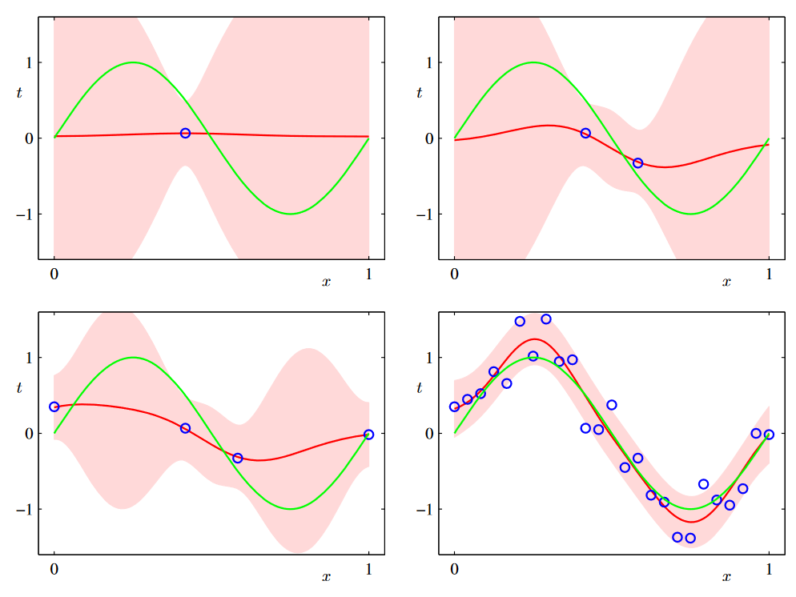
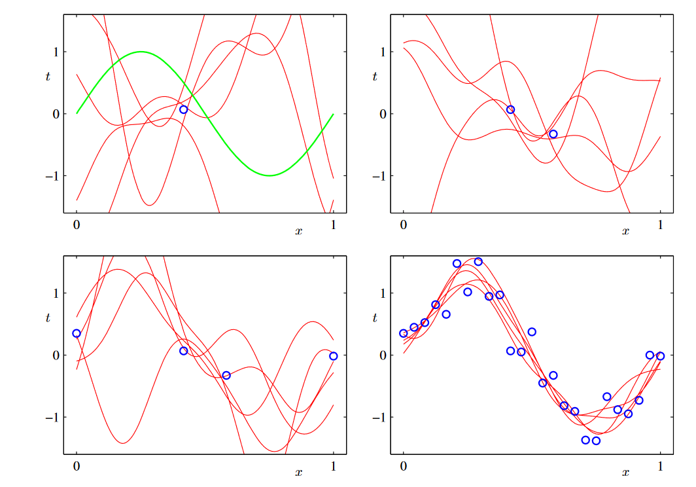

# PRML Chapter 3: Linear Models for Regression

## 3.1 Linear Basis Function Models

The simplest linear model we used for regression is the one that involves a linear combination of fixed nonlinear functions of the input variables. This is known as a linear basis function model.

$$
y(\mathbf{x}, \mathbf{w}) = w_0 + w_1x_1 + \dots + w_nx_n 
$$

But the it is the linear function both for the coefficients $\mathbf{w}$ and the input variables $\mathbf{x}$. We can generalize this model by considering linear combinations of fixed nonlinear functions of the input variables. This leads to the following form for the regression function:

$$
y(\mathbf{x}, \mathbf{w}) = w_0 + \sum_{j=1}^{M-1} w_j \phi_j(\mathbf{x})
$$

where $\phi_j(\mathbf{x})$ are fixed nonlinear functions of the input variables. So the linear model is the linear in the parameters $\mathbf{w}$, but it is nonlinear in the input variables $\mathbf{x}$.

Also, if we rewrite the above equation in vector form, we have:

$$
y(\mathbf{x}, \mathbf{w}) = \mathbf{w}^T\mathbf{\phi}(\mathbf{x})
$$

where $\mathbf{w} = (w_0, w_1, \dots, w_{M-1})^T$ and $\mathbf{\phi}(\mathbf{x}) = (\phi_0(\mathbf{x}), \phi_1(\mathbf{x}), \dots, \phi_{M-1}(\mathbf{x}))^T$. Specifically, $\phi_0(\mathbf{x}) = 1$.

In pattern recognition, the functions $\phi_j(\mathbf{x})$ are known as basis function, it can be expressed by the features of the input variables. There are many choices for the basis functions, such as polynomial basis functions, Gaussian basis functions, sigmoidal basis functions, etc. The equation of Gaussian basis functions and sigmoidal basis functions are as follows:

$$
\phi_j(\mathbf{x}) = \exp\left\{-\frac{(x-\mu_j)^2}{2s^2}\right\}
$$

$$
\phi_j(\mathbf{x}) = \sigma\left(\frac{x-\mu_j}{s}\right)
$$

where $\mu_j$ and $s$ are the parameters of the basis functions.

### 3.1.1 Maximum likelihood and least squares

Assume that we are fitting a variable $t$ is given by a deterministic function $y(\mathbf{x}, \mathbf{w})$ with additive Gaussian noise so that

$$
t = y(\mathbf{x}, \mathbf{w}) + \epsilon
$$

where $\epsilon$ is a zero mean Gaussian random variable with precision $\beta$. According the property of Gaussian distribution, we can write:

$$

p(t|\mathbf{x}, \mathbf{w}, \beta) = \mathcal{N}(t|y(\mathbf{x}, \mathbf{w}), \beta^{-1})
$$

where $\mathcal{N}(x|\mu, \sigma^2)$ is the Gaussian distribution with mean $\mu$ and variance $\sigma^2$. The likelihood function is given by:

$$
p(\mathbf{t}|\mathbf{X}, \mathbf{w}, \beta) = \prod_{n=1}^{N} \mathcal{N}(t_n|\mathbf{w}^T\mathbf{\phi}(\mathbf{x}_n), \beta^{-1})
$$

where $\mathbf{t} = (t_1, t_2, \dots, t_N)^T$, $\mathbf{X} = (\mathbf{x}_1, \mathbf{x}_2, \dots, \mathbf{x}_N)^T$. And the log likelihood function is given by:

$$
\ln p(\mathbf{t}|\mathbf{X}, \mathbf{w}, \beta) = \frac{N}{2}\ln\beta - \frac{N}{2}\ln(2\pi) - \beta E_D(\mathbf{w})
$$

where $E_D(\mathbf{w}) = \frac{1}{2}\sum_{n=1}^{N}\{t_n - \mathbf{w}^T\mathbf{\phi}(\mathbf{x}_n)\}^2$ is the sum-of-squares error function. The maximum likelihood solution for $\mathbf{w}$ is obtained by minimizing $E_D(\mathbf{w})$. Then,let's calculate the derivative of $E_D(\mathbf{w})$ with respect to $\mathbf{w}$:

$$
\frac{\partial E_D(\mathbf{w})}{\partial \mathbf{w}} = -\sum_{n=1}^{N}\{t_n - \mathbf{w}^T\mathbf{\phi}(\mathbf{x}_n)\}\mathbf{\phi}(\mathbf{x}_n)^T
$$

Setting this derivative to zero, we obtain the following normal equations:

$$
\sum_{n=1}^{N}\mathbf{\phi}(\mathbf{x}_n)\mathbf{\phi}^T(\mathbf{x}_n)\mathbf{w}^T = \sum_{n=1}^{N}t_n\mathbf{\phi}(\mathbf{x}_n)^T
$$

And the solution is given by:

$$
\mathbf{w}_{ML} = (\mathbf{\Phi}^T\mathbf{\Phi})^{-1}\mathbf{\Phi}^T\mathbf{t}
$$

where $\mathbf{w}_{ML}$ is the maximum likelihood solution for $\mathbf{w}$, $\mathbf{\Phi}$ is the design matrix whose elements are $\Phi_{nj} = \phi_j(\mathbf{x}_n)$, and $\mathbf{t} = (t_1, t_2, \dots, t_N)^T$.

Let's consider the cofficient $\mathbf{w_0}$:

$$
E_D(\mathbf{w}) = \frac{1}{2}\sum_{n=1}^{N}\{t_n - \mathbf{w}^T\mathbf{\phi}(\mathbf{x}_n)\}^2 = \frac{1}{2}\sum_{n=1}^{N}\{t_n - w_0 - \sum_{j=1}^{M-1}w_j\phi_j(\mathbf{x}_n)\}^2
$$

Taking the derivative of $E_D(\mathbf{w})$ with respect to $w_0$ and setting it to zero, we have:

$$
\frac{\partial E_D(\mathbf{w})}{\partial w_0} = -\sum_{n=1}^{N}\{t_n - w_0 - \sum_{j=1}^{M-1}w_j\phi_j(\mathbf{x}_n)\} = 0
$$

Then we can get the solution for $w_0$:

$$
w_0 = \bar{t} - \sum_{j=1}^{M-1}w_j\bar{\phi}_j
$$

where $\bar{t} = \frac{1}{N}\sum_{n=1}^{N}t_n$, $\bar{\phi}_j = \frac{1}{N}\sum_{n=1}^{N}\phi_j(\mathbf{x}_n)$.

So the bias $w_0$ compensates for the difference between the average of the target values and the weighted sum of the averages of the basis functions.

### 3.1.3 Sequential Learning

In training process, if we use the whole training set to update the parameters, the computational cost is high. So we can use the sequential learning to update the parameters. The training data is coming in a continuous stream, and we can update the parameters one by one. The famous updating method is Stochastic Gradient Descent (SGD). The update rule is given by:

$$
\mathbf{w}^{(\tau+1)} = \mathbf{w}^{(\tau)} - \eta\nabla E_n

$$

where $\eta$ is the learning rate, and $\nabla E_n = -\{t_n - \mathbf{w}^T\mathbf{\phi}(\mathbf{x}_n)\}\mathbf{\phi}(\mathbf{x}_n)^T$ is the gradient of the error function with respect to $\mathbf{w}$. And is is also known as LMS (Least Mean Squares) algorithm.

### 3.1.4 Regularized Least Squares

We know that the insight of regularization is to add a penalty term to the error function in order to find the solution with smaller norm. The regularized sum-of-squares error function is given by:

$$
E_D(\mathbf{w}) + \lambda E_W(\mathbf{w})
$$

where $E_W(\mathbf{w}) = \frac{1}{2}\mathbf{w}^T\mathbf{w}$ is the weight decay term, and $\lambda$ is the regularization coefficient. So the total error function is given by:

$$
E(\mathbf{w}) = \frac{1}{2}\sum_{n=1}^{N}\{t_n - \mathbf{w}^T\mathbf{\phi}(\mathbf{x}_n)\}^2 + \frac{\lambda}{2}\mathbf{w}^T\mathbf{w}
$$

We can get the closed-form solution for $\mathbf{w}$ by minimizing the error function. The solution is given by:

$$
\mathbf{w} = (\lambda\mathbf{I} + \mathbf{\Phi}^T\mathbf{\Phi})^{-1}\mathbf{\Phi}^T\mathbf{t}
$$

where $\mathbf{I}$ is the identity matrix. Let's consider a general form of the regularizer:

$$
E_W(\mathbf{w}) = \frac{1}{2}\sum_{j=0}^{M-1}w_j^q
$$

If $q = 1$, it is called Lasso regression, and if $q = 2$, it is called Ridge regression. Lasso regression has the property taht if $\lambda$ is large, some of the coefficients will be zero, leading to a sparse model.

And consider, the regularization can be seen as a constraint on the parameters that forces them to be small, we can write a constraint:

$$
\sum_{j=0}^{M-1}w_j^2 \leq \eta
$$

where $\eta$ is a positive constant. We want to minimize the error function with a regularization term is equivalent to minimizing the error function with a constraint. We can use the Lagrange multiplier to solve this problem. 

### 3.1.5 Multiple Outputs

In the above discussion, we only consider the single output regression. But we can also consider the multiple outputs regression. The regression function is given by:

$$
\mathbf{y}(\mathbf{x}, \mathbf{w}) = \mathbf{W}^T\mathbf{\phi}(\mathbf{x})
$$

where $\mathbf{y} = (y_1, y_2, \dots, y_D)^T$, $\mathbf{W}$ is the matrix of the coefficients, and $\mathbf{\phi}(\mathbf{x}) = (\phi_0(\mathbf{x}), \phi_1(\mathbf{x}), \dots, \phi_{M-1}(\mathbf{x}))^T$. We know that if $y$ is a single output, the probability distribution of $t$ is given by:

$$
p(t|\mathbf{x}, \mathbf{w}, \beta) = \mathcal{N}(t|\mathbf{w}^T\mathbf{\phi}(\mathbf{x}), \beta^{-1})
$$

And now we have a set of observation, we can combine them into a matrix $\mathbf{T} = (\mathbf{t}_1, \mathbf{t}_2, \dots, \mathbf{t}_N)^T$, where $\mathbf{t}_n = (t_{n1}, t_{n2}, \dots, t_{nD})^T$. The likelihood function is given by:

$$
p(\mathbf{T}|\mathbf{X}, \mathbf{W}, \beta) = \prod_{n=1}^{N}\mathcal{N}(\mathbf{t}_n|\mathbf{W}^T\mathbf{\phi}(\mathbf{x}_n), \beta^{-1})
$$

And the log likelihood function is given by:

$$
\begin{aligned}
\ln p(\mathbf{T}|\mathbf{X}, \mathbf{W}, \beta) &= \sum_{n=1}^{N}\ln\mathcal{N}(\mathbf{t}_n|\mathbf{W}^T\mathbf{\phi}(\mathbf{x}_n), \beta^{-1})\\
 &= \frac{ND}{2}\ln\beta - \frac{ND}{2}\ln(2\pi) - \beta E_D(\mathbf{W})
\end{aligned}
$$

where $E_D(\mathbf{W}) = \frac{1}{2}\sum_{n=1}^{N}||\mathbf{t}_n - \mathbf{W}^T\mathbf{\phi}(\mathbf{x}_n)||^2$ is the sum-of-squares error function. The maximum likelihood solution for $\mathbf{W}$ is obtained by minimizing $E_D(\mathbf{W})$. Then, let's calculate the derivative of $E_D(\mathbf{W})$ with respect to $\mathbf{W}$:

$$
\frac{\partial E_D(\mathbf{W})}{\partial \mathbf{W}} = -\sum_{n=1}^{N}(\mathbf{t}_n - \mathbf{W}^T\mathbf{\phi}(\mathbf{x}_n))\mathbf{\phi}(\mathbf{x}_n)^T
$$

Setting this derivative to zero, we obtain the following normal equations:

$$
\sum_{n=1}^{N}\mathbf{\phi}(\mathbf{x}_n)\mathbf{\phi}^T(\mathbf{x}_n)\mathbf{W}^T = \sum_{n=1}^{N}\mathbf{t}_n\mathbf{\phi}(\mathbf{x}_n)^T
$$

And the solution is given by:

$$
\mathbf{W}_{ML} = (\mathbf{\Phi}^T\mathbf{\Phi})^{-1}\mathbf{\Phi}^T\mathbf{T}
$$

where $\mathbf{W}_{ML}$ is the maximum likelihood solution for $\mathbf{W}$, $\mathbf{\Phi}$ is the design matrix whose elements are $\Phi_{nj} = \phi_j(\mathbf{x}_n)$, and $\mathbf{T} = (\mathbf{t}_1, \mathbf{t}_2, \dots, \mathbf{t}_N)^T$.

## 3.2 The Bias-Variance Decomposition

So far in our discussion, we have assumed that the form and number of basis functions are both fixed. If we directly use maximize likelihood or least squares to estimate the parameters, the model will be overfitting. Even if we can add a penalty term to prevent overfitting, the penalty term parameter is still remain difficult to choose. 

Maximizing likelihood function has the risk of overfitting while in Bayesian framework, when we calculate the edge posterior distribution, we can avoid overfitting because we consider the whole distribution of the parameters rather than only calculate the maximum likelihood.

The expected value of the predictive distribution is given by:

$$
h(\mathbf{x}) = \mathbb{E}[t|\mathbf{x}] = \int t p(t|\mathbf{x})dt
$$

where $p(t|\mathbf{x})$ is the predictive distribution of $t$ given $\mathbf{x}$. The expected value of the sum-of-squares error function is given by:

$$
\begin{aligned}
\mathbb{E}[L] &= \mathbb{E}[(t - y(\mathbf{x}))^2]\\
&= \mathbb{E}[(t - h(\mathbf{x}) + h(\mathbf{x}) - y(\mathbf{x}))^2]\\
&= \mathbb{E}[(t - h(\mathbf{x}))^2] + \mathbb{E}[(h(\mathbf{x}) - y(\mathbf{x}))^2] + 2\mathbb{E}[(t - h(\mathbf{x}))(h(\mathbf{x}) - y(\mathbf{x}))]\\
&= \mathbb{E}[(t - h(\mathbf{x}))^2] + \mathbb{E}[(h(\mathbf{x}) - y(\mathbf{x}))^2] + 2\mathbb{E}[t - h(\mathbf{x})]\mathbb{E}[h(\mathbf{x}) - y(\mathbf{x})]\\
&= \mathbb{E}[(t - h(\mathbf{x}))^2] + \mathbb{E}[(h(\mathbf{x}) - y(\mathbf{x}))^2]\\
&= \int\int \{t - h(\mathbf{x})\}^2p(t,\mathbf{x})dtdx + \int \{h(\mathbf{x}) - y(\mathbf{x})\}^2p(\mathbf{x})dx\\
\end{aligned}
$$

Similarly, we have:

$$\begin{aligned}&\{y(\mathbf{x};\mathcal{D})-\mathbb{E}_{\mathcal{D}}[y(\mathbf{x};\mathcal{D})]+\mathbb{E}_{\mathcal{D}}[y(\mathbf{x};\mathcal{D})]-h(\mathbf{x})\}^{2}\\&=\quad\{y(\mathbf{x};\mathcal{D})-\mathbb{E}_{\mathcal{D}}[y(\mathbf{x};\mathcal{D})]\}^{2}+\{\mathbb{E}_{\mathcal{D}}[y(\mathbf{x};\mathcal{D})]-h(\mathbf{x})\}^{2}\\&+2\{y(\mathbf{x};\mathcal{D})-\mathbb{E}_{\mathcal{D}}[y(\mathbf{x};\mathcal{D})]\}\{\mathbb{E}_{\mathcal{D}}[y(\mathbf{x};\mathcal{D})]-h(\mathbf{x})\}.\end{aligned}$$

Then, 

$$\begin{aligned}&\mathbb{E}_{\mathcal{D}}\left[\{y(\mathbf{x};\mathcal{D})-h(\mathbf{x})\}^{2}\right]\\&=\quad\underbrace{\{\mathbb{E}_{\mathcal{D}}[y(\mathbf{x};\mathcal{D})]-h(\mathbf{x})\}^{2}}_{(\mathbf{bias})^{2}}+\underbrace{\mathbb{E}_{\mathcal{D}}\left[\{y(\mathbf{x};\mathcal{D})-\mathbb{E}_{\mathcal{D}}[y(\mathbf{x};\mathcal{D})]\}^{2}\right]}_{\text{variance}}.\end{aligned}$$

We re-write the sum-of-squares error function as:

$$
\begin{aligned}
\mathbb{E}[L] &= \mathbb{E}[(t - h(\mathbf{x}))^2] + \mathbb{E}[(h(\mathbf{x}) - y(\mathbf{x}))^2]\\
&= \mathbb{E}[(t - h(\mathbf{x}))^2] + \mathbb{E}[(y(\mathbf{x};\mathcal{D}) - h(\mathbf{x}))^2] + \mathbb{E}[(y(\mathbf{x};\mathcal{D}) - \mathbb{E}_{\mathcal{D}}[y(\mathbf{x};\mathcal{D})])^2]\\
\end{aligned}

$$

The first term is the sum-of-squares error function, the second term is the variance of the model, and the third term is the square of the bias of the model. The bias-variance decomposition is a useful tool to analyze the model. The bias-variance decomposition is given by:

$$
\begin{aligned}
\text{Expected loss} &= \text{Bias}^2 + \text{Variance} + \text{Noise}\\
&= \int\{y(\mathbf{x};\mathcal{D}) - \mathbb{E}_{\mathcal{D}}[y(\mathbf{x};\mathcal{D})]\}^2p(\mathbf{x})d\mathbf{x} + \int\mathbb{E}_{\mathcal{D}}\left[\{y(\mathbf{x};\mathcal{D}) - \mathbb{E}_{\mathcal{D}}[y(\mathbf{x};\mathcal{D})]\}^2\right]p(\mathbf{x})d\mathbf{x} + \int\{t - y(\mathbf{x};\mathcal{D})\}^2p(t,\mathbf{x})dtd\mathbf{x}\\
\end{aligned}
$$

We want to minimize the expected loss, and we have decomposed the expected loss into three terms: bias, variance, and noise. The bias is the error between the average prediction of the model and the true value which is the model's inability to represent the variance is the variability of the model prediction for a given data point which is the model's sensitivity to the fluctuations in the training set. The noise is the error between the true value and the average prediction of the model which is the inherent noise in the data.

The image above shows $h(x) = sin 2\pi x$. The red curve in the right figure shows the average prediction of the model, and the green curve shows the true value. The left figure shows the average prediction of the model for different training sets. We can see that with $\lambda$ increasing, the model becomes more smooth, and the variance decreases, but the bias increases.

## 3.3 Bayesian Linear Regression

### 3.3.1 Parameter distribution

In Bayesian framework, we consider the whole distribution of the parameters rather than only calculate the maximum likelihood. The conjugate prior distribution of the parameters is given by:

$$
p(\mathbf{w}) = \mathcal{N}(\mathbf{w}|\mathbf{m}_0, \mathbf{S}_0)
$$

where $\mathbf{m}_0$ is the mean of the prior distribution, and $\mathbf{S}_0$ is the covariance matrix of the prior distribution. And the posterior distribution is given by:

$$
p(\mathbf{w}|\mathbf{t}) = \mathcal{N}(\mathbf{w}|\mathbf{m}_N, \mathbf{S}_N)
$$

where $\mathbf{m}_N = \mathbf{S}_N(\mathbf{S}_0^{-1}\mathbf{m}_0 + \beta\mathbf{\Phi}^T\mathbf{t})$, $\mathbf{S}_N^{-1} = \mathbf{S}_0^{-1} + \beta\mathbf{\Phi}^T\mathbf{\Phi}$. If we consider an infinitely board prior distribution, the posterior distribution is given by:

$$
p(\mathbf{w}|\alpha) = \mathcal{N}(\mathbf{w}|\mathbf{0}, \alpha^{-1}\mathbf{I})
$$

where $\alpha$ is the precision of the prior distribution. If $\alpha -> \infty$, the prior distribution is infinitely board; if $\alpha -> 0$, the prior distribution is infinitely narrow.

And we re-write the $\mathbf{m}_N = \mathbf{S}_N(\mathbf{S}_0^{-1}\mathbf{m}_0 + \beta\mathbf{\Phi}^T\mathbf{t})$ as:

$$
\mathbf{m}_N = \beta\mathbf{S}_N\mathbf{\Phi}^T\mathbf{t}
$$

Also, the $\mathbf{S}_N^{-1} = \mathbf{S}_0^{-1} + \beta\mathbf{\Phi}^T\mathbf{\Phi}$ can be re-written as:

$$
\mathbf{S}_N = (\alpha\mathbf{I} + \beta\mathbf{\Phi}^T\mathbf{\Phi})^{-1}
$$

The log of the posterior distribution is given by:

$$
\ln p(\mathbf{w}|\mathbf{t}) = \frac{M}{2}\ln\alpha - \frac{N}{2}\ln\beta - \frac{1}{2}\ln|\mathbf{S}_N| - \frac{\beta}{2}E_D(\mathbf{w})
$$

where $E_D(\mathbf{w}) = \sum_{n=1}^{N}\{t_n - \mathbf{w}^T\mathbf{\phi}(\mathbf{x}_n)\}^2$ is the sum-of-squares error function. The maximum likelihood solution for $\mathbf{w}$ is obtained by minimizing $E_D(\mathbf{w})$. 

We can still use the sequential learning to update the parameters, assume we have the new data point $t_n$ and the matrix $\mathbf{\phi}(\mathbf{x}_n)$, the previous posterior distribution $p(w|t_{1:n-1})$ will be the new prior distribution $p(w|t_{1:n})$. And posterior distribution expectaion is given by:

$$
\mathbf{m}_N = S_N(S_0^{-1}m_0 + \beta\mathbf{\phi}(\mathbf{x}_n)t_n)
$$

$$
\mathbf{S}_N = \mathbf{S_0}^{-1} + \beta\mathbf{\phi}(\mathbf{x}_n)\mathbf{\phi}(\mathbf{x}_n)^T
$$

Using this updating rule, we can update the parameters with the data coming in a continuous stream.

### 3.3.2 Predictive distribution

Firstly, consider what is predictive distribution. The predictive distribution is the distribution of the target variable $t$ given a new input variable $\mathbf{x}$. The predictive distribution is given by:

$$
p(t|\mathbf{x}, \mathbf{t}, \alpha, \beta) = \int p(t|\mathbf{x}, \mathbf{w}, \beta)p(\mathbf{w}|\mathbf{t}, \alpha, \beta)d\mathbf{w}
$$

where $p(t|\mathbf{x}, \mathbf{w}, \beta)$ is the likelihood function, and $p(\mathbf{w}|\mathbf{t}, \alpha, \beta)$ is the posterior distribution of the parameters. It is the sum of all of the possible parameters weighted by their posterior probability. The predictive distribution is given by:

$$
p(t|\mathbf{x}, \mathbf{t}, \alpha, \beta) = \mathcal{N}(t|\mathbf{m}_N^T\mathbf{\phi}(\mathbf{x}), \frac{1}{\beta} + \mathbf{\phi}(\mathbf{x})^T\mathbf{S}_N\mathbf{\phi}(\mathbf{x}))

$$

where $\mathbf{m}_N$ and $\mathbf{S}_N$ are the posterior distribution of the parameters. The predictive distribution is a Gaussian distribution with mean $\mathbf{m}_N^T\mathbf{\phi}(\mathbf{x})$ and variance $\frac{1}{\beta} + \mathbf{\phi}(\mathbf{x})^T\mathbf{S}_N\mathbf{\phi}(\mathbf{x})$. The variance of the predictive distribution is the sum of the variance of the noise and the variance of the model.

The image shows a model consists with 9 Gaussian basis functions and the predictive distribution of the model. The red curve shows the average prediction of the model, and the green curve shows the true value. The shaded area shows the variance of the predictive distribution. 

And we can sample from the posterior distribution of the parameters $w$ to get the predicted curve, the image above shows the predicted curve of the model which is sampled from the posterior distribution of the parameters $w$.

### 3.3.3 Equivalent kernel

The basis function is a reflection of the input variables, we want to find the best parameters to fit the data. As we discussed in previous, the best parameter $w$ is given by the posterior expectation $\mathbf{m}_N$. So $y(x) = \mathbf{m}_N^T\mathbf{\phi}(x)$ is the best prediction of the model. And since $\mathbf{m}_N$ is calculated from the prior and the data, we can rewrite $\mathbf{m}_N$ as:

$$
\mathbf{m}_N = \beta\mathbf{S}_N\mathbf{\Phi}^T\mathbf{t}
$$

Then we can rewrite the prediction as:

$$y(\mathbf{x},\mathbf{m}_N)=\mathbf{m}_N^\mathrm{T}\phi(\mathbf{x})=\beta\phi(\mathbf{x})^\mathrm{T}\mathbf{S}_N\mathbf{\Phi}^\mathrm{T}\mathbf{t}=\sum\limits_{n=1}^\infty\beta\phi(\mathbf{x})^\mathrm{T}\mathbf{S}_N\phi(\mathbf{x}_n)t_n$$

We can consider the $\beta\mathbf{S}_N\phi(\mathbf{x}_n)$ is a weight matrix of the basis function. We can define the kernel function as:

$$
k(\mathbf{x},\mathbf{x}')=\beta\phi(\mathbf{x})^\mathrm{T}\mathbf{S}_N\phi(\mathbf{x}')
$$

Then we can rewrite the prediction as:

$$
y(\mathbf{x},\mathbf{m}_N)=\sum\limits_{n=1}^\infty k(\mathbf{x},\mathbf{x}_n)t_n
$$

And consider the covariance between $y(\mathbf{x},\mathbf{m}_N)$ and $y(\mathbf{x}',\mathbf{m}_N)$ is given by:

$$
\text{cov}[y(\mathbf{x},\mathbf{m}_N),y(\mathbf{x}',\mathbf{m}_N)] = \text{cov}[\phi(\mathbf{x})^\mathrm{T}\mathbf{w},\phi(\mathbf{x}')^\mathrm{T}\mathbf{w}] = \phi(\mathbf{x})^\mathrm{T}\mathbf{S}_N\phi(\mathbf{x}') = \beta^{-1} k(\mathbf{x},\mathbf{x}')
$$

Equivalent kernel shows the partial feature of the model, the point near the input variable $\mathbf{x}$ will have a higher weight, and the point far away from the input variable $\mathbf{x}$ will have a lower weight. The equivalent kernel is a reflection of the model, and it can be used to analyze the model.

## 3.4 Bayesian Model Comparison

Firstly, let's consider how well the model fits the data, we call this is the model evidence. The model evidence is given by:

$$
p(\mathbf{t}|\mathbf{X}, \alpha, \beta) = \int p(\mathbf{t}|\mathbf{X}, \mathbf{w}, \beta)p(\mathbf{w}|\alpha)d\mathbf{w}
$$

where $p(\mathbf{t}|\mathbf{X}, \mathbf{w}, \beta)$ is the likelihood function, and $p(\mathbf{w}|\alpha)$ is the prior distribution of the parameters. The model evidence is the sum of all of the possible parameters weighted by their prior probability. 

The model evidence is a good trade off between the model complexity and the model fit. A higher model evidence means the model is more likely to be the true model. It is different from the loss, loss only consider the error between the prediction and the true value, but the model evidence consider the model complexity, it adds some penalty term to the loss and so we will choose the smaller model.

Based on model evidence, we can give a metric called the Bayesian Information Criterion (BIC). The BIC is given by:

$$
BIC = -2\ln p(\mathbf{t}|\mathbf{X}, \alpha, \beta) + M\ln N
$$

where $M$ is the number of parameters in the model, and $N$ is the number of data points. The BIC is a trade off between the model evidence and the model complexity. A smaller BIC means the model is more likely to be the true model.

## 3.5 The Evidence Approximation

Previous discuss introduce the noise $\beta$ and the precision of the prior distribution $\alpha$, but how to choose the $\alpha$ and $\beta$? Even if we can calculate the edge distribution to reduce the parameters, but it is not computable. So we need to find alternative methods to estimate the parameters.

If we introduce hyperpriors over $α$ and $β$, the predictive distribution is obtained by marginalizing over $w$, $α$ and $β$ so that:

$$
p(t|\mathbf{x}, \mathbf{t}) = \int\int\int p(t|\mathbf{x}, \mathbf{w}, \beta)p(\mathbf{w}|\mathbf{t}, \alpha, \beta)p(\alpha, \beta|\mathbf{t})d\mathbf{w}d\alpha d\beta
$$

Consider a pair of value $\hat{\alpha},\hat{\beta}$, if the distribution is sharply peaked around $\hat{\alpha},\hat{\beta}$, we can use the Laplace approximation to approximate the distribution. The Laplace approximation is given by:

$$
p(t|\mathbf{t}) \approx p(t|\mathbf{t}, \hat{\alpha}, \hat{\beta}) = \int p(t|\mathbf{x}, \mathbf{w}, \hat{\beta})p(\mathbf{w}|\mathbf{t}, \hat{\alpha}, \hat{\beta})d\mathbf{w}
$$

And we know in Bayesian framework, we have:

$$p(\alpha,\beta|t)\propto p(t|\alpha,\beta)p(\alpha,\beta) $$

We can maximize the posterior distribution of $\alpha$ and $\beta$ to get the $\hat{\alpha}$ and $\hat{\beta}$. The $\hat{\alpha}$ and $\hat{\beta}$ are the maximum likelihood solution of the hyperparameters.

We introduce a metric $\frac{\alpha}{\beta}$ to measure the complexity of the model. If $\frac{\alpha}{\beta}$ is large, the model is more complex, and if $\frac{\alpha}{\beta}$ is small, the model is simpler. We can use the evidence approximation to estimate the hyperparameters $\alpha$ and $\beta$.

And next, there are some methods to approximate the evidence, such as the Laplace approximation, the Variational Bayes, and the Expectation Propagation. The Laplace approximation is a simple method to approximate the evidence, and the Variational Bayes and the Expectation Propagation are more complex methods to approximate the evidence.

### 3.5.1 Evaluation of the evidence function

The marginal likelihood function $p(\mathbf{t}|\alpha,\beta)$ is the evidence of the model which is given by:

$$
p(\mathbf{t}|\alpha,\beta) = \int p(\mathbf{t}|\mathbf{w},\beta)p(\mathbf{w}|\alpha)d\mathbf{w}
$$

We can rewrite the evidence function as:

$$
p(\mathbf{t}|\alpha,\beta) = (\frac{\beta}{2\pi} )^{N/2}(\frac{\mathbf{\alpha}}{2\pi})^{M/2}\int\exp\{-E(\mathbf{m}_N)\}d\mathbf{w}
$$

and we define:
$$
E(\mathbf{w}) = \frac{\beta}{2}\sum_{n=1}^{N}\{t_n - \mathbf{w}^T\mathbf{\phi}(\mathbf{x}_n)\}^2 + \frac{\alpha}{2}\mathbf{w}^T\mathbf{w}
$$

It is similar to the sum-of-squares error function, but we add a penalty term to the error function. So we have:

$$
E(\mathbf{w}) = E_D(\mathbf{m}_N) + \frac{1}{2}(\mathbf{w}-\mathbf{m}_N)^TA(\mathbf{w}-\mathbf{m}_N)
$$

where $A = \alpha\mathbf{I} + \beta\mathbf{\Phi}^T\mathbf{\Phi}$, and $\mathbf{m}_N = \beta\mathbf{S}_N\mathbf{\Phi}^T\mathbf{t}$. We can rewrite the evidence function as:

$$
p(\mathbf{t}|\alpha,\beta) = (\frac{\beta}{2\pi} )^{N/2}(\frac{\mathbf{\alpha}}{2\pi})^{M/2}\exp\{-E(\mathbf{m}_N)\}\int\exp\{-\frac{1}{2}(\mathbf{w}-\mathbf{m}_N)^TA(\mathbf{w}-\mathbf{m}_N)\}d\mathbf{w}
$$

The log of marginal likelihood function is given by:

$$
\ln p(\mathbf{t}|\alpha,\beta) = \frac{M}{2}\ln\alpha + \frac{N}{2}\ln\beta - E(\mathbf{m}_N) - \frac{1}{2}\ln|A| - \frac{N}{2}\ln(2\pi)
$$

### 3.5.2 Maximizing the evidence function

We can maximize the evidence function to estimate the hyperparameters respect to $\alpha$. It can be done by defining the following eigenvector equation:

$$
\alpha\mathbf{u}_i = \sum_{j=1}^{M}\beta\mathbf{\phi}_j\mathbf{\phi}_j^T\mathbf{u}_i = \beta\mathbf{\Phi}\mathbf{\Phi}^T\mathbf{u}_i
$$

Take derivative of the log of the evidence function with respect to $\alpha$ and set it to zero, we have:

$$
\frac{\partial\ln p(\mathbf{t}|\alpha,\beta)}{\partial\alpha} = \frac{M}{2\alpha} - \frac{1}{2}\mathbf{m}_N^T\mathbf{m}_N - \frac{1}{2}\text{Tr}(\mathbf{S}_N) = 0
$$

Then we can get the solution for $\alpha$:

$$
\alpha = \frac{M}{\mathbf{m}_N^T\mathbf{m}_N}
$$

Similarly, we can take derivative of the log of the evidence function with respect to $\beta$ and set it to zero, we have:

$$
\frac{\partial\ln p(\mathbf{t}|\alpha,\beta)}{\partial\beta} = \frac{N}{2\beta} - \frac{1}{2}E_D(\mathbf{m}_N) = 0
$$

Then we can get the solution for $\beta$:

$$
\beta = \frac{N}{E_D(\mathbf{m}_N)}
$$

The $\alpha$ and $\beta$ are the maximum likelihood solution of the hyperparameters. We can use the maximum likelihood solution to estimate the hyperparameters.

### 3.5.3 Effective number of parameters

This section delves into the optimization of hyperparameters $ \alpha $ and $ \beta $ within the Bayesian linear regression framework, explaining the mathematical procedures and the implications of the results obtained.

The process begins by defining the eigenvalue equation associated with the design matrix $ \Phi $, i.e., $ (\beta \Phi^T \Phi) u_i = \lambda_i u_i $. These eigenvalues $ \lambda_i $ represent the curvature of the likelihood function along the directions defined by the eigenvectors.

The optimal value of $ \alpha $ depends on the ratio $ \lambda_i / (\lambda_i + \alpha) $, which indicates the extent to which the corresponding parameter $ w_i $ is well-determined by the data. A higher $ \lambda_i $ relative to $ \alpha $ means that the direction is well-constrained by the data, leading to a parameter estimate close to its maximum likelihood estimate.

 $ \beta $ is re-estimated by comparing the difference between the target values and the model predictions, factoring in the number of data points $ N $ and the effective number of parameters determined by the data $ \gamma $. The formula for updating $ \beta $ takes into account these aspects, adjusting for the actual freedom the model parameters have in fitting the data.

Discusses the Bayesian approach to estimating the noise variance $ \sigma^2 $, contrasting it with the maximum likelihood estimate. The Bayesian method corrects for the effective number of parameters $ \gamma $, using $ N - \gamma $ instead of $ N $ in the variance calculation to account for the reduction in degrees of freedom.

Highlights the benefits of the Bayesian method, which automatically adjusts regularization parameters through data-driven processes without the need for complex cross-validation.

Provides a detailed explanation of why $ \gamma $ represents the number of effectively determined parameters by the data and how this measure is used to correct the estimation of variance.
Includes an example using synthetic data sets to demonstrate how these theories are applied in practice for tuning and evaluating model hyperparameters.

In summary, this section offers a comprehensive discussion on the optimization of hyperparameters $ \alpha $ and $ \beta $ in Bayesian linear regression models. It elucidates how to interpret and apply these processes practically, enhancing the accuracy of model predictions and understanding the role of hyperparameters in model performance. This facilitates a more nuanced and data-driven approach to model fitting and evaluation in statistical modeling.