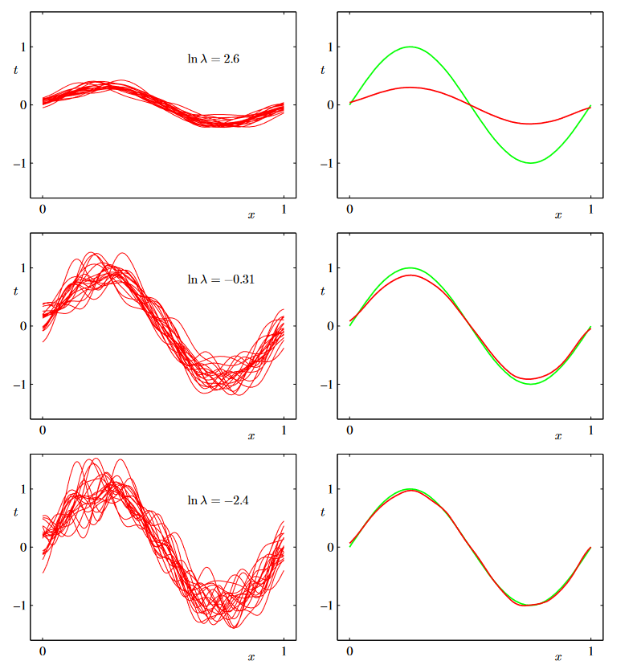

# PRML Chapter 3: Linear Models for Regression

## 3.1 Linear Basis Function Models

The simplest linear model we used for regression is the one that involves a linear combination of fixed nonlinear functions of the input variables. This is known as a linear basis function model.

$$
y(\mathbf{x}, \mathbf{w}) = w_0 + w_1x_1 + \dots + w_nx_n 
$$

But the it is the linear function both for the coefficients $\mathbf{w}$ and the input variables $\mathbf{x}$. We can generalize this model by considering linear combinations of fixed nonlinear functions of the input variables. This leads to the following form for the regression function:

$$
y(\mathbf{x}, \mathbf{w}) = w_0 + \sum_{j=1}^{M-1} w_j \phi_j(\mathbf{x})
$$

where $\phi_j(\mathbf{x})$ are fixed nonlinear functions of the input variables. So the linear model is the linear in the parameters $\mathbf{w}$, but it is nonlinear in the input variables $\mathbf{x}$.

Also, if we rewrite the above equation in vector form, we have:

$$
y(\mathbf{x}, \mathbf{w}) = \mathbf{w}^T\mathbf{\phi}(\mathbf{x})
$$

where $\mathbf{w} = (w_0, w_1, \dots, w_{M-1})^T$ and $\mathbf{\phi}(\mathbf{x}) = (\phi_0(\mathbf{x}), \phi_1(\mathbf{x}), \dots, \phi_{M-1}(\mathbf{x}))^T$. Specifically, $\phi_0(\mathbf{x}) = 1$.

In pattern recognition, the functions $\phi_j(\mathbf{x})$ are known as basis function, it can be expressed by the features of the input variables. There are many choices for the basis functions, such as polynomial basis functions, Gaussian basis functions, sigmoidal basis functions, etc. The equation of Gaussian basis functions and sigmoidal basis functions are as follows:

$$
\phi_j(\mathbf{x}) = \exp\left\{-\frac{(x-\mu_j)^2}{2s^2}\right\}
$$

$$
\phi_j(\mathbf{x}) = \sigma\left(\frac{x-\mu_j}{s}\right)
$$

where $\mu_j$ and $s$ are the parameters of the basis functions.

### 3.1.1 Maximum likelihood and least squares

Assume that we are fitting a variable $t$ is given by a deterministic function $y(\mathbf{x}, \mathbf{w})$ with additive Gaussian noise so that

$$
t = y(\mathbf{x}, \mathbf{w}) + \epsilon
$$

where $\epsilon$ is a zero mean Gaussian random variable with precision $\beta$. According the property of Gaussian distribution, we can write:

$$

p(t|\mathbf{x}, \mathbf{w}, \beta) = \mathcal{N}(t|y(\mathbf{x}, \mathbf{w}), \beta^{-1})
$$

where $\mathcal{N}(x|\mu, \sigma^2)$ is the Gaussian distribution with mean $\mu$ and variance $\sigma^2$. The likelihood function is given by:

$$
p(\mathbf{t}|\mathbf{X}, \mathbf{w}, \beta) = \prod_{n=1}^{N} \mathcal{N}(t_n|\mathbf{w}^T\mathbf{\phi}(\mathbf{x}_n), \beta^{-1})
$$

where $\mathbf{t} = (t_1, t_2, \dots, t_N)^T$, $\mathbf{X} = (\mathbf{x}_1, \mathbf{x}_2, \dots, \mathbf{x}_N)^T$. And the log likelihood function is given by:

$$
\ln p(\mathbf{t}|\mathbf{X}, \mathbf{w}, \beta) = \frac{N}{2}\ln\beta - \frac{N}{2}\ln(2\pi) - \beta E_D(\mathbf{w})
$$

where $E_D(\mathbf{w}) = \frac{1}{2}\sum_{n=1}^{N}\{t_n - \mathbf{w}^T\mathbf{\phi}(\mathbf{x}_n)\}^2$ is the sum-of-squares error function. The maximum likelihood solution for $\mathbf{w}$ is obtained by minimizing $E_D(\mathbf{w})$. Then,let's calculate the derivative of $E_D(\mathbf{w})$ with respect to $\mathbf{w}$:

$$
\frac{\partial E_D(\mathbf{w})}{\partial \mathbf{w}} = -\sum_{n=1}^{N}\{t_n - \mathbf{w}^T\mathbf{\phi}(\mathbf{x}_n)\}\mathbf{\phi}(\mathbf{x}_n)^T
$$

Setting this derivative to zero, we obtain the following normal equations:

$$
\sum_{n=1}^{N}\mathbf{\phi}(\mathbf{x}_n)\mathbf{\phi}^T(\mathbf{x}_n)\mathbf{w}^T = \sum_{n=1}^{N}t_n\mathbf{\phi}(\mathbf{x}_n)^T
$$

And the solution is given by:

$$
\mathbf{w}_{ML} = (\mathbf{\Phi}^T\mathbf{\Phi})^{-1}\mathbf{\Phi}^T\mathbf{t}
$$

where $\mathbf{w}_{ML}$ is the maximum likelihood solution for $\mathbf{w}$, $\mathbf{\Phi}$ is the design matrix whose elements are $\Phi_{nj} = \phi_j(\mathbf{x}_n)$, and $\mathbf{t} = (t_1, t_2, \dots, t_N)^T$.

Let's consider the cofficient $\mathbf{w_0}$:

$$
E_D(\mathbf{w}) = \frac{1}{2}\sum_{n=1}^{N}\{t_n - \mathbf{w}^T\mathbf{\phi}(\mathbf{x}_n)\}^2 = \frac{1}{2}\sum_{n=1}^{N}\{t_n - w_0 - \sum_{j=1}^{M-1}w_j\phi_j(\mathbf{x}_n)\}^2
$$

Taking the derivative of $E_D(\mathbf{w})$ with respect to $w_0$ and setting it to zero, we have:

$$
\frac{\partial E_D(\mathbf{w})}{\partial w_0} = -\sum_{n=1}^{N}\{t_n - w_0 - \sum_{j=1}^{M-1}w_j\phi_j(\mathbf{x}_n)\} = 0
$$

Then we can get the solution for $w_0$:

$$
w_0 = \bar{t} - \sum_{j=1}^{M-1}w_j\bar{\phi}_j
$$

where $\bar{t} = \frac{1}{N}\sum_{n=1}^{N}t_n$, $\bar{\phi}_j = \frac{1}{N}\sum_{n=1}^{N}\phi_j(\mathbf{x}_n)$.

So the bias $w_0$ compensates for the difference between the average of the target values and the weighted sum of the averages of the basis functions.

### 3.1.3 Sequential Learning

In training process, if we use the whole training set to update the parameters, the computational cost is high. So we can use the sequential learning to update the parameters. The training data is coming in a continuous stream, and we can update the parameters one by one. The famous updating method is Stochastic Gradient Descent (SGD). The update rule is given by:

$$
\mathbf{w}^{(\tau+1)} = \mathbf{w}^{(\tau)} - \eta\nabla E_n

$$

where $\eta$ is the learning rate, and $\nabla E_n = -\{t_n - \mathbf{w}^T\mathbf{\phi}(\mathbf{x}_n)\}\mathbf{\phi}(\mathbf{x}_n)^T$ is the gradient of the error function with respect to $\mathbf{w}$. And is is also known as LMS (Least Mean Squares) algorithm.

### 3.1.4 Regularized Least Squares

We know that the insight of regularization is to add a penalty term to the error function in order to find the solution with smaller norm. The regularized sum-of-squares error function is given by:

$$
E_D(\mathbf{w}) + \lambda E_W(\mathbf{w})
$$

where $E_W(\mathbf{w}) = \frac{1}{2}\mathbf{w}^T\mathbf{w}$ is the weight decay term, and $\lambda$ is the regularization coefficient. So the total error function is given by:

$$
E(\mathbf{w}) = \frac{1}{2}\sum_{n=1}^{N}\{t_n - \mathbf{w}^T\mathbf{\phi}(\mathbf{x}_n)\}^2 + \frac{\lambda}{2}\mathbf{w}^T\mathbf{w}
$$

We can get the closed-form solution for $\mathbf{w}$ by minimizing the error function. The solution is given by:

$$
\mathbf{w} = (\lambda\mathbf{I} + \mathbf{\Phi}^T\mathbf{\Phi})^{-1}\mathbf{\Phi}^T\mathbf{t}
$$

where $\mathbf{I}$ is the identity matrix. Let's consider a general form of the regularizer:

$$
E_W(\mathbf{w}) = \frac{1}{2}\sum_{j=0}^{M-1}w_j^q
$$

If $q = 1$, it is called Lasso regression, and if $q = 2$, it is called Ridge regression. Lasso regression has the property taht if $\lambda$ is large, some of the coefficients will be zero, leading to a sparse model.

And consider, the regularization can be seen as a constraint on the parameters that forces them to be small, we can write a constraint:

$$
\sum_{j=0}^{M-1}w_j^2 \leq \eta
$$

where $\eta$ is a positive constant. We want to minimize the error function with a regularization term is equivalent to minimizing the error function with a constraint. We can use the Lagrange multiplier to solve this problem. 

### 3.1.5 Multiple Outputs

In the above discussion, we only consider the single output regression. But we can also consider the multiple outputs regression. The regression function is given by:

$$
\mathbf{y}(\mathbf{x}, \mathbf{w}) = \mathbf{W}^T\mathbf{\phi}(\mathbf{x})
$$

where $\mathbf{y} = (y_1, y_2, \dots, y_D)^T$, $\mathbf{W}$ is the matrix of the coefficients, and $\mathbf{\phi}(\mathbf{x}) = (\phi_0(\mathbf{x}), \phi_1(\mathbf{x}), \dots, \phi_{M-1}(\mathbf{x}))^T$. We know that if $y$ is a single output, the probability distribution of $t$ is given by:

$$
p(t|\mathbf{x}, \mathbf{w}, \beta) = \mathcal{N}(t|\mathbf{w}^T\mathbf{\phi}(\mathbf{x}), \beta^{-1})
$$

And now we have a set of observation, we can combine them into a matrix $\mathbf{T} = (\mathbf{t}_1, \mathbf{t}_2, \dots, \mathbf{t}_N)^T$, where $\mathbf{t}_n = (t_{n1}, t_{n2}, \dots, t_{nD})^T$. The likelihood function is given by:

$$
p(\mathbf{T}|\mathbf{X}, \mathbf{W}, \beta) = \prod_{n=1}^{N}\mathcal{N}(\mathbf{t}_n|\mathbf{W}^T\mathbf{\phi}(\mathbf{x}_n), \beta^{-1})
$$

And the log likelihood function is given by:

$$
\begin{aligned}
\ln p(\mathbf{T}|\mathbf{X}, \mathbf{W}, \beta) &= \sum_{n=1}^{N}\ln\mathcal{N}(\mathbf{t}_n|\mathbf{W}^T\mathbf{\phi}(\mathbf{x}_n), \beta^{-1})\\
 &= \frac{ND}{2}\ln\beta - \frac{ND}{2}\ln(2\pi) - \beta E_D(\mathbf{W})
\end{aligned}
$$

where $E_D(\mathbf{W}) = \frac{1}{2}\sum_{n=1}^{N}||\mathbf{t}_n - \mathbf{W}^T\mathbf{\phi}(\mathbf{x}_n)||^2$ is the sum-of-squares error function. The maximum likelihood solution for $\mathbf{W}$ is obtained by minimizing $E_D(\mathbf{W})$. Then, let's calculate the derivative of $E_D(\mathbf{W})$ with respect to $\mathbf{W}$:

$$
\frac{\partial E_D(\mathbf{W})}{\partial \mathbf{W}} = -\sum_{n=1}^{N}(\mathbf{t}_n - \mathbf{W}^T\mathbf{\phi}(\mathbf{x}_n))\mathbf{\phi}(\mathbf{x}_n)^T
$$

Setting this derivative to zero, we obtain the following normal equations:

$$
\sum_{n=1}^{N}\mathbf{\phi}(\mathbf{x}_n)\mathbf{\phi}^T(\mathbf{x}_n)\mathbf{W}^T = \sum_{n=1}^{N}\mathbf{t}_n\mathbf{\phi}(\mathbf{x}_n)^T
$$

And the solution is given by:

$$
\mathbf{W}_{ML} = (\mathbf{\Phi}^T\mathbf{\Phi})^{-1}\mathbf{\Phi}^T\mathbf{T}
$$

where $\mathbf{W}_{ML}$ is the maximum likelihood solution for $\mathbf{W}$, $\mathbf{\Phi}$ is the design matrix whose elements are $\Phi_{nj} = \phi_j(\mathbf{x}_n)$, and $\mathbf{T} = (\mathbf{t}_1, \mathbf{t}_2, \dots, \mathbf{t}_N)^T$.

## 3.2 The Bias-Variance Decomposition

So far in our discussion, we have assumed that the form and number of basis functions are both fixed. If we directly use maximize likelihood or least squares to estimate the parameters, the model will be overfitting. Even if we can add a penalty term to prevent overfitting, the penalty term parameter is still remain difficult to choose. 

Maximizing likelihood function has the risk of overfitting while in Bayesian framework, when we calculate the edge posterior distribution, we can avoid overfitting because we consider the whole distribution of the parameters rather than only calculate the maximum likelihood.

The expected value of the predictive distribution is given by:

$$
h(\mathbf{x}) = \mathbb{E}[t|\mathbf{x}] = \int t p(t|\mathbf{x})dt
$$

where $p(t|\mathbf{x})$ is the predictive distribution of $t$ given $\mathbf{x}$. The expected value of the sum-of-squares error function is given by:

$$
\begin{aligned}
\mathbb{E}[L] &= \mathbb{E}[(t - y(\mathbf{x}))^2]\\
&= \mathbb{E}[(t - h(\mathbf{x}) + h(\mathbf{x}) - y(\mathbf{x}))^2]\\
&= \mathbb{E}[(t - h(\mathbf{x}))^2] + \mathbb{E}[(h(\mathbf{x}) - y(\mathbf{x}))^2] + 2\mathbb{E}[(t - h(\mathbf{x}))(h(\mathbf{x}) - y(\mathbf{x}))]\\
&= \mathbb{E}[(t - h(\mathbf{x}))^2] + \mathbb{E}[(h(\mathbf{x}) - y(\mathbf{x}))^2] + 2\mathbb{E}[t - h(\mathbf{x})]\mathbb{E}[h(\mathbf{x}) - y(\mathbf{x})]\\
&= \mathbb{E}[(t - h(\mathbf{x}))^2] + \mathbb{E}[(h(\mathbf{x}) - y(\mathbf{x}))^2]\\
&= \int\int \{t - h(\mathbf{x})\}^2p(t,\mathbf{x})dtdx + \int \{h(\mathbf{x}) - y(\mathbf{x})\}^2p(\mathbf{x})dx\\
\end{aligned}
$$

Similarly, we have:

$$\begin{aligned}&\{y(\mathbf{x};\mathcal{D})-\mathbb{E}_{\mathcal{D}}[y(\mathbf{x};\mathcal{D})]+\mathbb{E}_{\mathcal{D}}[y(\mathbf{x};\mathcal{D})]-h(\mathbf{x})\}^{2}\\&=\quad\{y(\mathbf{x};\mathcal{D})-\mathbb{E}_{\mathcal{D}}[y(\mathbf{x};\mathcal{D})]\}^{2}+\{\mathbb{E}_{\mathcal{D}}[y(\mathbf{x};\mathcal{D})]-h(\mathbf{x})\}^{2}\\&+2\{y(\mathbf{x};\mathcal{D})-\mathbb{E}_{\mathcal{D}}[y(\mathbf{x};\mathcal{D})]\}\{\mathbb{E}_{\mathcal{D}}[y(\mathbf{x};\mathcal{D})]-h(\mathbf{x})\}.\end{aligned}$$

Then, 

$$\begin{aligned}&\mathbb{E}_{\mathcal{D}}\left[\{y(\mathbf{x};\mathcal{D})-h(\mathbf{x})\}^{2}\right]\\&=\quad\underbrace{\{\mathbb{E}_{\mathcal{D}}[y(\mathbf{x};\mathcal{D})]-h(\mathbf{x})\}^{2}}_{(\mathbf{bias})^{2}}+\underbrace{\mathbb{E}_{\mathcal{D}}\left[\{y(\mathbf{x};\mathcal{D})-\mathbb{E}_{\mathcal{D}}[y(\mathbf{x};\mathcal{D})]\}^{2}\right]}_{\text{variance}}.\end{aligned}$$

We re-write the sum-of-squares error function as:

$$
\begin{aligned}
\mathbb{E}[L] &= \mathbb{E}[(t - h(\mathbf{x}))^2] + \mathbb{E}[(h(\mathbf{x}) - y(\mathbf{x}))^2]\\
&= \mathbb{E}[(t - h(\mathbf{x}))^2] + \mathbb{E}[(y(\mathbf{x};\mathcal{D}) - h(\mathbf{x}))^2] + \mathbb{E}[(y(\mathbf{x};\mathcal{D}) - \mathbb{E}_{\mathcal{D}}[y(\mathbf{x};\mathcal{D})])^2]\\
\end{aligned}

$$

The first term is the sum-of-squares error function, the second term is the variance of the model, and the third term is the square of the bias of the model. The bias-variance decomposition is a useful tool to analyze the model. The bias-variance decomposition is given by:

$$
\begin{aligned}
\text{Expected loss} &= \text{Bias}^2 + \text{Variance} + \text{Noise}\\
&= \int\{y(\mathbf{x};\mathcal{D}) - \mathbb{E}_{\mathcal{D}}[y(\mathbf{x};\mathcal{D})]\}^2p(\mathbf{x})d\mathbf{x} + \int\mathbb{E}_{\mathcal{D}}\left[\{y(\mathbf{x};\mathcal{D}) - \mathbb{E}_{\mathcal{D}}[y(\mathbf{x};\mathcal{D})]\}^2\right]p(\mathbf{x})d\mathbf{x} + \int\{t - y(\mathbf{x};\mathcal{D})\}^2p(t,\mathbf{x})dtd\mathbf{x}\\
\end{aligned}
$$

We want to minimize the expected loss, and we have decomposed the expected loss into three terms: bias, variance, and noise. The bias is the error between the average prediction of the model and the true value which is the model's inability to represent the variance is the variability of the model prediction for a given data point which is the model's sensitivity to the fluctuations in the training set. The noise is the error between the true value and the average prediction of the model which is the inherent noise in the data.

The image above shows $h(x) = sin 2\pi x$. The red curve in the right figure shows the average prediction of the model, and the green curve shows the true value. The left figure shows the average prediction of the model for different training sets. We can see that with $\lambda$ increasing, the model becomes more smooth, and the variance decreases, but the bias increases.

## 3.3 Bayesian Linear Regression

