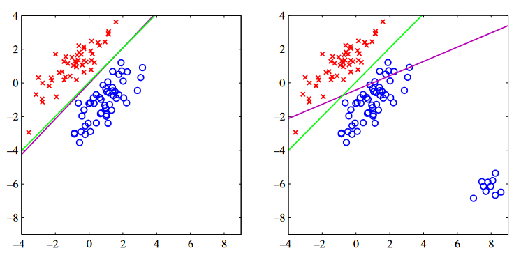

# PRML Chapter 4: Linear Models For Classification

In previous chapter, we discussed about the linear regression and little classification. If the input data is $D-$dimensional, the decision boundary is a $D-1$ dimensional hyperplane. And if the datasets whose classes can be separated exactly by a hyperplane, then the datasets are linearly separable. In this chapter, we will discuss about the linear models for classification.

Compared with regression problem, the classification problem is somewhere easily because the output is discrete. Previous methods can be concluded as follows:

$$
y(\mathbf{x}) = \mathbf{w}^T\mathbf{x} + w_0
$$

Here is the regression model. The output is continuous, and now we want to convert it to discrete. The simplest way is to use a threshold function. For example, we can use the following function:

$$
y(\mathbf{x}) = \begin{cases} C_1 & \text{if } \mathbf{w}^T\mathbf{x} + w_0 \geq 0 \\ C_2 & \text{otherwise} \end{cases}
$$

## 4.1 Discriminant Functions

A discriminant is a function that takes an input vector $\mathbf{x}$ and assigns it to one of $K$ classes, denoted $C_k$.

### 4.1.1 Two classes

For two classes, we can use the following function:

$$
y(\mathbf{x}) = \begin{cases} C_1 & \text{if } w^T\mathbf{x} + w_0 \geq 0 \\ C_2 & \text{otherwise} \end{cases}
$$

Here, $w$ is the weight vector, and $w_0$ is the bias. The decision boundary is defined by the equation $w^T\mathbf{x} + w_0 = 0$. The decision boundary is a $D-1$ dimensional hyperplane. Consider two vectors $\mathbf{x}_A$ and $\mathbf{x}_B$ on the decision boundary, then we have:

$$
w^T(\mathbf{x}_A - \mathbf{x}_B) = 0
$$

This means that the vector $w$ is orthogonal to every vector lying within the decision boundary. The distance from the origin to the decision boundary is given by:

$$
\frac{w^T\mathbf{x}}{\|w\|} = -\frac{w_0}{\|w\|}
$$

If $\mathbf{x}$ is a 2-dimensional vector, as shown below, then the decision boundary is a line, as shown in red. The vector $w$ is orthogonal to the decision boundary. And for any vector $\mathbf{x}$, the distance from the origin to the decision boundary is given by the above equation.

### 4.1.2 Multiple classes

A natural thought is to combine multiple two-class discriminant functions to form a multi-class discriminant function, but it can lead some problems. If we want to do $k$ classes classification problem, we will use $k-1$ binary classifiers to do so, the $i$-th classifier will separate class $C_i$ from the other classes. The problem is that the decision boundaries are not unique. For example, in the following figure, we have three classes, and we can use three different decision boundaries to separate them.

The image left shows the situation that we want to do 3 classes classification and we have 2 binary classifiers which is shown in red line. We can see that the decision region is not unique, the green area is both classified as class 1 and class 2. And the right image shows that we use three binary classifiers to do the 3 class classification. Each classifier will used to separate a pair of class $c_k$ and $c_j$. And we can see that similar to the left image, the green area is not unique to be classified as class 1, 2 or class 3.

We can avoid these difficulties by using a single $k$-class discriminant function. The simplest way is to use the following function:

$$
y(\mathbf{x}) = \arg\max_k w_k^T\mathbf{x} + w_{k0}
$$

Here, $w_k$ is the weight vector for class $C_k$, and $w_{k0}$ is the bias for class $C_k$. The decision boundary between class $C_k$ and $C_j$ is defined by the equation $w_k^T\mathbf{x} + w_{k0} = w_j^T\mathbf{x} + w_{j0}$. The decision boundary is a $D-1$ dimensional hyperplane. The decision region is the intersection of half-spaces defined by the decision boundaries.

### 4.1.3 Least squares for classification

In chapter 3, we discussed about the least squares for regression which uses the MSE as the loss function and we give the closed-form solution. We want to do the same thing for classification. 

Consider we are doing $k$ classes classification problem, the objective vector $t$ is a $k$-dimensional vector. For each class $k$, there are a linear classifier $y_k(\mathbf{x}) = \mathbf{w}_k^T\mathbf{x} + w_{k0}$. Combine them together, we have:

$$
\mathbf{y}(\mathbf{x}) = \begin{bmatrix} y_1(\mathbf{x}) \\ y_2(\mathbf{x}) \\ \vdots \\ y_k(\mathbf{x}) \end{bmatrix} = \begin{bmatrix} \mathbf{w}_1^T\mathbf{x} + w_{10} \\ \mathbf{w}_2^T\mathbf{x} + w_{20} \\ \vdots \\ \mathbf{w}_k^T\mathbf{x} + w_{k0} \end{bmatrix} = \begin{bmatrix} \mathbf{w}_1^T \\ \mathbf{w}_2^T \\ \vdots \\ \mathbf{w}_k^T \end{bmatrix}\mathbf{x} + \begin{bmatrix} w_{10} \\ w_{20} \\ \vdots \\ w_{k0} \end{bmatrix} = \mathbf{W}^T\mathbf{x} + \mathbf{w}_0 = \mathbf{W}^T \hat{\mathbf{x}}
$$

where $\hat{\mathbf{x}} = \begin{bmatrix} 1 \\ \mathbf{x} \end{bmatrix}$, $\mathbf{W} = \begin{bmatrix} \mathbf{w}_1^T \\ \mathbf{w}_2^T \\ \vdots \\ \mathbf{w}_k^T \end{bmatrix}$ and $\mathbf{w}_0 = \begin{bmatrix} w_{10} \\ w_{20} \\ \vdots \\ w_{k0} \end{bmatrix}$. The objective vector $t$ is a $k$-dimensional vector, and we can use the one-hot encoding to represent it. For example, if the class is $C_2$, then the objective vector is $t = \begin{bmatrix} 0 \\ 1 \\ 0 \end{bmatrix}$.

If the datasets is ${\mathbf{x_n},\mathbf{t_n}}$ where $n=1,2,\cdots,N$, we define a matrix $\mathbf{T} = \begin{bmatrix} \mathbf{t}_1 & \mathbf{t}_2 & \cdots & \mathbf{t}_N \end{bmatrix}$, and the matrix $\mathbf{Y} = \begin{bmatrix} \mathbf{y}(\mathbf{x}_1) & \mathbf{y}(\mathbf{x}_2) & \cdots & \mathbf{y}(\mathbf{x}_N) \end{bmatrix} = \begin{bmatrix} \mathbf{W}^T\hat{\mathbf{x}}_1 & \mathbf{W}^T\hat{\mathbf{x}}_2 & \cdots & \mathbf{W}^T\hat{\mathbf{x}}_N \end{bmatrix} = \mathbf{W}^T\begin{bmatrix} \hat{\mathbf{x}}_1 & \hat{\mathbf{x}}_2 & \cdots & \hat{\mathbf{x}}_N \end{bmatrix} = \mathbf{W}^T\hat{\mathbf{X}}$. The loss function is the sum-of-squares error:

$$
E_D(\mathbf{W}) = \frac{1}{2} \text{Tr}\left\{ (\mathbf{T} - \mathbf{Y})^T(\mathbf{T} - \mathbf{Y}) \right\}
$$

where $\text{Tr}$ is the trace of a matrix. The optimal solution is:

$$
\mathbf{W} = (\hat{\mathbf{X}}\hat{\mathbf{X}}^T)^{-1}\hat{\mathbf{X}}\mathbf{T}^T
$$

So the discriminant function is:

$$
\mathbf{y}(\mathbf{x}) = \mathbf{W}^T\hat{\mathbf{x}} = \hat{\mathbf{x}}^T(\hat{\mathbf{X}}\hat{\mathbf{X}}^T)^{-1}\hat{\mathbf{X}}\mathbf{T}^T
$$

A property of the linear least squares classifier is that if the target vector in training set satisfies the linear constraints:

$$
\mathbf{a}^T\mathbf{t}_n = \text{constant}
$$

then the model prediction will also satisfy the same constraints:

$$
\mathbf{a}^T\mathbf{y}(\mathbf{x}_n) = \text{constant}
$$

This is because the linear least squares classifier is invariant to any linear transformation of the target vector.

Even if we give the closed-form solution of the $1-to-k$ coding schema, but in practice, it is not good because it will cause a bad performance near the decision boundary and even lead to the probability is over 1. We will solve this problem by using the logistic regression in the next section.

The image above shows the difference between logitic regression and least squares for classification. The right-hand plot shows the corresponding results obtained when extra data points are added at the bottom left of the diagram, showing that least squares is highly sensitive to outliers, unlike logistic regression.

### 4.1.4 Fisher's linear discriminant

The input vector $\mathbf{x}$ can be very complex, but the model will reflect the complex vector into a single value, this process can be seen as dimension reduction. Fisher's linear discriminant is a method that projects the input vector $\mathbf{x}$ into a lower-dimensional space. 

Consider the dimension reduction, if we want to reduce the dimension, in previous high-dimensional space, each item belongs to different class will separate far away, but in the low-dimensional space, it is possible that they are closed to each other. So we need to do the first thing is maximize the distance between different class by adjusting the parameter vector $\mathbf{w}$. If there are two class, the expectation vector is:

$$
\mathbf{m_1} = \frac{1}{N_1} \sum_{n\in C_1} \mathbf{x}_n, \quad \mathbf{m_2} = \frac{1}{N_2} \sum_{n\in C_2} \mathbf{x}_n
$$

After reducing the dimension, the distance between two classes is:

$$
m_2 - m_1 = \mathbf{w}^T(\mathbf{m_2} - \mathbf{m_1})
$$

And then, a good separation will also minimize the variance in the same class so that the cluster will be close to each other. After reducing, the variance is:

$$
s_k^2 = \sum_{n \in C_k} (y_n - m_k)^2
$$

where $y_n = \mathbf{w}^T\mathbf{x}_n$. The total variance is:

$$
s^2 = \sum_{n \in C_1} (y_n - m_1)^2 + \sum_{n \in C_2} (y_n - m_2)^2
$$

The Fisher's linear discriminant is defined as:

$$
J(\mathbf{w}) = \frac{(m_2 - m_1)^2}{s_1^2 + s_2^2}
$$

We want to maximize the distance between different classes and minimize the variance in the same class. So we want to maximize the objective function $J$. We can rewrite the objective function:

$$
J(\mathbf{w}) = \frac{\mathbf{w}^T\mathbf{S}_B\mathbf{w}}{\mathbf{w}^T\mathbf{S}_W\mathbf{w}}
$$

where $\mathbf{S}_B = (\mathbf{m}_2 - \mathbf{m}_1)(\mathbf{m}_2 - \mathbf{m}_1)^T$ is the between-class scatter matrix, and $\mathbf{S}_W = \sum_{n \in C_1} (\mathbf{x}_n - \mathbf{m}_1)(\mathbf{x}_n - \mathbf{m}_1)^T + \sum_{n \in C_2} (\mathbf{x}_n - \mathbf{m}_2)(\mathbf{x}_n - \mathbf{m}_2)^T$ is the within-class scatter matrix. The optimal solution is the eigenvector of $\mathbf{S}_W^{-1}\mathbf{S}_B$ corresponding to the largest eigenvalue. And we can get the best weight vector $\mathbf{w}$:

$$
\mathbf{w} = \mathbf{S}_W^{-1}(\mathbf{m}_2 - \mathbf{m}_1)
$$

We need to claim that the Fisher's linear discriminant is not a discriminant function, but it provide a best choice about how to calculate the parameter vector $\mathbf{w}$.

### 4.1.5 Relation to least squares

If we use one-hot encoding schema, the solution is different compared with the Fisher's linear discriminant, but if we change a encoding schema, the solution will be the same.

Firstly, the loss function of sum-of-squares is:

$$
E = \frac{1}{2} \sum_{n=1}^N (\mathbf{w}^T\mathbf{x}_n +\mathbf{w_0} - \mathbf{t}_n)^2
$$

And taking the derivative with respect to $\mathbf{w}$, and set to zero, we have:

$$
\sum_{n=1}^N (\mathbf{w}^T\mathbf{x}_n +\mathbf{w_0} - \mathbf{t}_n)\mathbf{x}_n = 0
$$

And we can get the optimal solution:

$$
\mathbf{w} = (\mathbf{X}\mathbf{X}^T)^{-1}\mathbf{X}\mathbf{T}^T
$$

We can get the bias $w_0$ by:

$$
w_0 = \frac{1}{N} \sum_{n=1}^N  - \mathbf{w}^T\mathbf{x}_n
$$

Putting them into the equation, we can get the same solution form as the Fisher's linear discriminant.  

### 4.1.6 Fisher's discriminant for multiple classes

The Fisher's linear discriminant can be extended to multiple classes. The objective function is:

$$
J(\mathbf{W}) = \frac{|\mathbf{W}^T\mathbf{S}_B\mathbf{W}|}{|\mathbf{W}^T\mathbf{S}_W\mathbf{W}|}
$$

where $\mathbf{W} = \begin{bmatrix} \mathbf{w}_1 & \mathbf{w}_2 & \cdots & \mathbf{w}_k \end{bmatrix}$ is the weight matrix, and $\mathbf{S}_B = \sum_{k=1}^K N_k(\mathbf{m}_k - \mathbf{m})(\mathbf{m}_k - \mathbf{m})^T$ is the between-class scatter matrix, and $\mathbf{S}_W = \sum_{k=1}^K \sum_{n \in C_k} (\mathbf{x}_n - \mathbf{m}_k)(\mathbf{x}_n - \mathbf{m}_k)^T$ is the within-class scatter matrix. The optimal solution is the eigenvector of $\mathbf{S}_W^{-1}\mathbf{S}_B$ corresponding to the largest eigenvalue.

### 4.1.7 The perceptron algorithm

Another example of a linear discriminant model is the perceptron which is a simplify version of MLP. It is used to do 2 class classification in which the input vector $\mathbf{x}$ is first transformed using a fixed non-linear function to give a feature vector $\phi(\mathbf{x})$. The model is defined as:

$$
y(\mathbf{x}) = \begin{cases} C_1 & \text{if } \mathbf{w}^T\phi(\mathbf{x}) + w_0 \geq 0 \\ C_2 & \text{otherwise} \end{cases}

$$

Consider an alternative error function called the perceptron criterion:

$$
E_p(\mathbf{w}) = -\sum_{n \in M} \mathbf{w}^T\phi(\mathbf{x}_n)t_n
$$

where $M$ is the set of all misclassified patterns. The perceptron learning algorithm is an iterative algorithm that considers each pattern in turn and updates the weight vector whenever a pattern is misclassified. And $t_n$ is the target vector, if the pattern is misclassified, then $t_n = 1$, otherwise $t_n = -1$. The update rule is:

$$
\mathbf{w}^{(\tau+1)} = \mathbf{w}^{(\tau)} + \eta \phi(\mathbf{x}_n)t_n
$$

where $\eta$ is the learning rate. The perceptron learning algorithm is guaranteed to converge if the two classes are linearly separable. The perceptron learning algorithm is a special case of the stochastic gradient descent algorithm.

The perceptron grantees to converge if the two classes are linearly separable. But if the two classes are not linearly separable, the perceptron will not converge.

The image above shows the perceptron algorithm and its converge process. Perceptron algorithm has a shortcoming is that it can only use for two classes classification problem and it can not converge if the two classes are not linearly separable. Moreover, it will not output the probability of the class.

## 4.2 Probabilistic Generative Models

Let's rethinking the problem in probability viewpoint. Consider the two class classification, the posterior probablity for class $C_1$ can be written as:

$$
p(C_1|\mathbf{x}) = \frac{p(\mathbf{x}|C_1)p(C_1)}{p(\mathbf{x}|C_1)p(C_1) + p(\mathbf{x}|C_2)p(C_2)} = \frac{1}{1 + \frac{p(\mathbf{x}|C_2)p(C_2)}{p(\mathbf{x}|C_1)p(C_1)}} = \frac{1}{1+exp(-a)} = \sigma(a)
$$

where $a = \ln \frac{p(\mathbf{x}|C_1)p(C_1)}{p(\mathbf{x}|C_2)p(C_2)}$ and $\sigma(a)$ is the logistic sigmoid function. The logistic sigmoid function is a monotonic function, and it maps the input to the range $(0,1)$. The logistic sigmoid function is a good choice for the activation function in the neural network.

As for $k>2$ classes, we can use the softmax function:

$$
p(C_k|\mathbf{x}) = \frac{exp(a_k)}{\sum_j exp(a_j)}
$$

where $a_k = \ln p(\mathbf{x}|C_k)p(C_k)$. The softmax function is a generalization of the logistic sigmoid function to multiple classes. The softmax function is also a monotonic function, and it maps the input to the range $(0,1)$.

### 4.2.1 Continuous inputs

Assume that the class-conditional density are Gaussian and share the same co-variance matrix. Tues the density for class $c_k$ is given by:

$$p(\mathbf{x}|\mathcal{C}_{k})=\frac{1}{(2\pi)^{D/2}}\frac{1}{|\boldsymbol{\Sigma}|^{1/2}}\operatorname{exp}\left\{-\frac{1}{2}(\mathbf{x}-\boldsymbol{\mu}_{k})^{\mathrm{T}}\boldsymbol{\Sigma}^{-1}(\mathbf{x}-\boldsymbol{\mu}_{k})\right\} = \sigma(\mathbf{w}^T\mathbf{x} + w_0).$$

where $\mathbf{w} = \boldsymbol{\Sigma}^{-1}(\boldsymbol{\mu}_1 - \boldsymbol{\mu}_2)$, $w_0 = -\frac{1}{2}\boldsymbol{\mu}_1^T\boldsymbol{\Sigma}^{-1}\boldsymbol{\mu}_1 + \frac{1}{2}\boldsymbol{\mu}_2^T\boldsymbol{\Sigma}^{-1}\boldsymbol{\mu}_2 + \ln \frac{p(\mathcal{C}_1)}{p(\mathcal{C}_2)}$.

### 4.2.2 Maximum likelihood solution

For a data point $\mathbf{x}_n$ from class $C_1$, the likelihood function is:

$$
p(\mathbf{x}_n, t_n=1) = p(\mathbf{x}_n|t_n=1)p(t_n=1) = p(\mathbf{x}_n|t_n=1)p(\mathcal{C}_1)
= \pi \mathcal{N}(\mathbf{x}_n|\boldsymbol{\mu}_1, \boldsymbol{\Sigma})
$$

where $\pi$ is the prior probability of class $C_1$. Similar to the class $C_2$, we can get the likelihood function $p(\mathbf{x}_n, t_n=0) = (1-\pi)\mathcal{N}(\mathbf{x}_n|\boldsymbol{\mu}_2, \boldsymbol{\Sigma})$. The likelihood function is:

$$
p(\mathbf{X}, \mathbf{T}|\boldsymbol{\mu}_1, \boldsymbol{\mu}_2, \boldsymbol{\Sigma}, \pi) = \prod_{n=1}^N \left\{ \pi \mathcal{N}(\mathbf{x}_n|\boldsymbol{\mu}_1, \boldsymbol{\Sigma}) \right\}^{t_n} \left\{ (1-\pi) \mathcal{N}(\mathbf{x}_n|\boldsymbol{\mu}_2, \boldsymbol{\Sigma}) \right\}^{1-t_n}
$$

We consider the terms that depend on $\pi$ are:

$$
\sum_{n=1}^N \left\{ t_n\ln\pi + (1-t_n)\ln(1-\pi) \right\}
$$

And setting the derivative with respect to $\pi$ to zero, we have:

$$
\pi = \frac{N_1}{N} = \frac{N_1}{N_1+N_2}
$$

where $N_1$ is the number of data points in class $C_1$.

Similarly, consider the maximization with respect to $\mathbf{\mu}_1$:

$$
\sum_{n=1}^N t_n \boldsymbol{\Sigma}^{-1}(\mathbf{x}_n - \boldsymbol{\mu}_1) = -\frac{1}{2}\sum_{n=1}^N t_n \boldsymbol{\Sigma}^{-1}\boldsymbol{\mu}_1 + \frac{1}{2}\sum_{n=1}^N t_n \boldsymbol{\Sigma}^{-1}\mathbf{x}_n
$$

Setting the derivative with respect to $\boldsymbol{\mu}_1$ to zero, we have:

$$
\boldsymbol{\mu}_1 = \frac{1}{N_1} \sum_{n=1}^N t_n \mathbf{x}_n
$$

Similarly, we can get the optimal solution for $\boldsymbol{\mu}_2$:

$$
\boldsymbol{\mu}_2 = \frac{1}{N_2} \sum_{n=1}^N (1-t_n) \mathbf{x}_n
$$

Finally, consider the covariance matrix $\boldsymbol{\Sigma}$, we can get the optimal solution:

$$
\boldsymbol{\Sigma} = \frac{1}{N} \sum_{n=1}^N (t_n(\mathbf{x}_n - \boldsymbol{\mu}_1)(\mathbf{x}_n - \boldsymbol{\mu}_1)^T + (1-t_n)(\mathbf{x}_n - \boldsymbol{\mu}_2)(\mathbf{x}_n - \boldsymbol{\mu}_2)^T)
$$

### 4.3 Probabilistic Discriminative Models

We will discuss another method taht directly using maximum likelihood to estimate the parameters. Previous method can be seen as a indirect method to determine the parameter by fitting class-conditional densities and calss priors which is also called generative model because we could take such a model and generate synthetic data by drawing samples from the class-conditional.

In contrast, we now want to maximize the likelihood function by the conditional distribution directly, which is called discriminative model.

### 4.3.1 Fixed basis functions

Even if we talk the "linear" model, all of the algorithms are equally applicable if we first make a fixed non-linear transformation of the inputs using a vector of basis function $\phi(\mathbf{x})$. As a result, the decision boundary is linear in the feasure space defined by the basis functions, but non-linear in the input space.

### 4.3.2 Logistic regression

The logistic regression model is a linear model for binary classification. The posterior probability is given by the logistic sigmoid function:

$$
p(C_1|\mathbf{x}) = \sigma(\mathbf{w}^T\phi(\mathbf{x}))
$$

For an $M-$dimensional feasure space $\phi$, the model has $M$ adjustable parameters. And if we had fitted Gaussian class conditional densitied using maximum likelihood, we will have $2M$ parameters for the means and $M(M+1)/2$ parameters for the covariance matrix. The logistic regression model has fewer parameters than the Gaussian model.

We now use maximum likelihood to determine the parameters of the logistic regression model. The likelihood function is:

$$
p(\mathbf{T}|\mathbf{w}) = \prod_{n=1}^N y_n^{t_n} (1-y_n)^{1-t_n}
$$

Taking derivative to the sigmoid function, we have:

$$
\frac{d\sigma(a)}{da} = \sigma(a)(1-\sigma(a))
$$

We use cross-entropy error function:

$$
E(\mathbf{w}) = -\ln p(\mathbf{T}|\mathbf{w}) = -\sum_{n=1}^N \left\{ t_n \ln y_n + (1-t_n)\ln(1-y_n) \right\}
$$

Taking the derivative with respect to $\mathbf{w}$, we have:

$$
\nabla E(\mathbf{w}) = \sum_{n=1}^N (y_n - t_n)\phi_n
$$

Which is the same as the least squares solution. 

### 4.3.3 Iterative reweighted least squares

Due to the non-linear of the sigmoid function, there are no longer a closed-form solution of logitic regression. We can use the iterative reweighted least squares algorithm to solve the problem. The idea is to use the Newton-Raphson optimization method to maximize the likelihood function. The Newton-Raphson update is:

$$
\mathbf{w}^{(\tau+1)} = \mathbf{w}^{(\tau)} - \mathbf{H}^{-1}\nabla E(\mathbf{w})
$$

where $\mathbf{H}$ is the Hessian matrix, and $\nabla E(\mathbf{w})$ is the gradient of the error function. The Hessian matrix is:

$$
\mathbf{H} = \nabla \nabla E(\mathbf{w}) = \sum_{n=1}^N y_n(1-y_n)\phi_n\phi_n^T
$$

### 4.3.4 Multiclass logistic regression

The logistic regression model can be extended to multiple classes. The posterior probability is given by the softmax function:

$$
p(C_k|\mathbf{x}) = y_k(\mathbf{x}) = \frac{exp(a_k)}{\sum_j exp(a_j)}
$$

where $a_k = \mathbf{w}_k^T\phi(\mathbf{x})$. The likelihood function is:

$$
p(\mathbf{T}|\mathbf{W}) = \prod_{n=1}^N \prod_{k=1}^K y_k(\mathbf{x}_n)^{t_{nk}}
$$

Taking the derivative with respect to $\mathbf{w}_k$, we have:

$$
\nabla E(\mathbf{w}_k) = \sum_{n=1}^N (y_k(\mathbf{x}_n) - t_{nk})\phi_n

$$

### 4.3.5 Probit regression

The logistic regression model is based on the logistic sigmoid function. Another popular choice is the probit function:

$$
p(C_1|\mathbf{x}) = f(\mathbf{w}^T\phi(\mathbf{x}))
$$

where $\Phi(a)$ is the cumulative distribution function of the standard normal distribution. We can calculate the activate function by the cumulative distribution function:

$$
f(a) = \Phi(a) = \int_{-\infty}^a \mathcal{N}(a|0,1)da = \int_{-\infty}^a p(\theta) d\theta
$$

The $\Phi$ function is known as the probit function. And we can use another error function:

$$
\text{erf}(a) = \frac{2}{\sqrt{\pi}} \int_0^a \exp(-\theta^2)d\theta
$$

The probit regression model is also a linear model, and we can use the same method to solve the problem.

$$
\Phi(a) = \frac{1}{2} \left\{ 1 + \text{erf}\left(\frac{a}{\sqrt{2}}\right) \right\}
$$

### 4.3.6 Canonical link functions

The logistic sigmoid function and the probit function are examples of canonical link functions. The canonical link function is the function that connects the linear combination of the input features to the output of the model. The canonical link function is chosen so that the model is a generalized linear model. The logistic regression model is a generalized linear model with a canonical link function which is given by:

$$

y = f(\mathbf{w}^T\phi(\mathbf{x})) = \sigma(\mathbf{w}^T\phi(\mathbf{x}))

$$

where the $f$ is activate function. The generalized linear model is a linear model for the parameters, but the output is a non-linear function of the input features. Assume that the objective vector $t$ is exponential family, the likelihood function is:

$$p(t|\eta,s)=\frac1sh\left(\frac ts\right)g(\eta)\exp\left\{\frac{t\eta}s\right\}$$

where $\eta$ is the natural parameter, $s$ is the scale parameter, $h(t)$ is the sufficient statistics, and $g(\eta)$ is the normalizing function. 

The conditional expectation of the objective vector is:

$$
\mathbb{E}[t|\mathbf{x},\mathbf{w}] = -s\frac{d}{d\eta}\ln g(\eta)
$$

The log likelihood function is:

$$
\ln p(\mathbf{T}|\mathbf{w}) = \sum_{n=1}^N \left\{ t_n\mathbf{w}^T\phi_n - s\ln g(\mathbf{w}^T\phi_n) \right\}
$$

Taking the derivative with respect to $\mathbf{w}$, we have:

$$
\nabla E(\mathbf{w}) = \sum_{n=1}^N \left\{ t_n - s\frac{d}{d\eta}\ln g(\mathbf{w}^T\phi_n) \right\}\phi_n
$$

## 4.4 The Laplace Approximation

In Bayesian logitic regression, we need the posterior distribution, but is no longer the Gaussian distribution so we need a method to approximate the value of it.

Laplace approximation is a method to approximate the posterior distribution. The idea is to approximate the posterior distribution by a Gaussian distribution. The Laplace approximation is based on the second-order Taylor expansion of the log posterior distribution. The log posterior distribution is:

$$
\ln p(\mathbf{w}|\mathbf{T}) \approx \ln p(\mathbf{w}|\mathbf{X},\mathbf{T}) = \ln p(\mathbf{T}|\mathbf{w}) + \ln p(\mathbf{w}) + \text{const}
$$

Taking the second-order Taylor expansion of the log posterior distribution, we have:

$$
\ln q(\mathbf{w}) \approx \ln q(\mathbf{w}_0) - \frac{1}{2}(\mathbf{w} - \mathbf{w}_0)^T\mathbf{A}(\mathbf{w} - \mathbf{w}_0)
$$

where $\mathbf{A}$ is the Hessian matrix of the log posterior distribution evaluated at $\mathbf{w}_0$. The optimal solution is:

$$
\mathbf{w}_0 = \text{argmax}_{\mathbf{w}} p(\mathbf{w}|\mathbf{T})
$$

### 4.1.1 Model comparison and BIC

The Bayesian information criterion (BIC) is a method to compare the models. The BIC is defined as:

$$
BIC = -2\ln p(\mathbf{T}|\mathbf{w}_{\text{MAP}}) + M\ln N
$$

where $M$ is the number of adjustable parameters, and $N$ is the number of data points. The BIC is a trade-off between the goodness of fit and the complexity of the model. The BIC is a method to compare the models, and the model with the smallest BIC is the best model.

## 4.5 Bayesian Logistic Regression

### 4.5.1 Laplace approximation

We need to find the approximate posterior distribution of the parameter vector $\mathbf{w}$ given the data $\mathbf{X}$ and $\mathbf{T}$. The posterior distribution is:

$$
p(\mathbf{w}|\mathbf{X},\mathbf{T}) = \frac{p(\mathbf{T}|\mathbf{X},\mathbf{w})p(\mathbf{w})}{p(\mathbf{T}|\mathbf{X})}
$$

The Laplace approximation is based on the second-order Taylor expansion of the log posterior distribution. The log posterior distribution is:

$$
\ln p(\mathbf{w}|\mathbf{X},\mathbf{T}) \approx \ln p(\mathbf{T}|\mathbf{X},\mathbf{w}) + \ln p(\mathbf{w}) + \text{const}
$$

Taking the second-order Taylor expansion of the log posterior distribution, we have:

$$
\ln q(\mathbf{w}) \approx \ln q(\mathbf{w}_0) - \frac{1}{2}(\mathbf{w} - \mathbf{w}_0)^T\mathbf{A}(\mathbf{w} - \mathbf{w}_0)
$$

where $\mathbf{A}$ is the Hessian matrix of the log posterior distribution evaluated at $\mathbf{w}_0$. The optimal solution is:

$$
\mathbf{w}_0 = \text{argmax}_{\mathbf{w}} p(\mathbf{w}|\mathbf{T})
$$