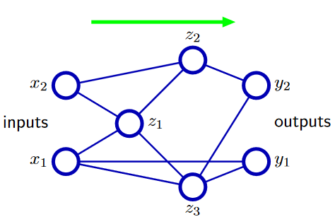

# PRML Chapter 5: Neural Networks

Traditional classification and regression methods have great analytical and computational properties but the performance is not good enough due to the curse of the diemnsionality. Neural networks are a class of flexible nonlinear models that can learn complex relationships between inputs and outputs. In this chapter, we will introduce the basic concepts of neural networks and discuss the training algorithms.

## 5.1 Feed-forward Neural Networks

We have discussed the linear model in previous chapters which are based on linear combinations of fixed non-linear basis function $\phi_j(x)$ and take the form:

$$
y(x, w) = f(\sum_{j=1}^{M} w_j \phi_j(x)) = f(w^T \phi(x))
$$

where $f(\cdot)$ is the activation function. The neural network is a generalization of this model in which the basis functions are adaptive and can be learned from the data. The basic neural network mmodel can be described as a series of functional transformations. First we construct $M$ linear combinations of the input variables $x$:

$$
a_j = \sum_{i=1}^{D} w_{ji}^{(1)} x_i + w_{j0}^{(1)}
$$

where $j = 1, \cdots, M$ and $i = 1, \cdots, D$. The $w_{ji}^{(1)}$ are the parameters of the network and are called the weights. The $w_{j0}^{(1)}$ are called the biases. The $a_j$ are called the activation of the hidden units. Then, we apply a nonlinear function $h(\cdot)$ to each of the activations:

$$
z_j = h(a_j)
$$

where $z_j$ are the outputs of the hidden units. Finally, we construct $K$ linear combinations of the $z_j$:

$$
a_k = \sum_{j=1}^{M} w_{kj}^{(2)} z_j + w_{k0}^{(2)}
$$

where $k = 1, \cdots, K$. The outputs of the network are then given by:

$$
y_k = f(a_k)
$$

where $f(\cdot)$ is the activation function. The network can be represented graphically as shown in the following figure:

Specifically, if we want to do multiple binary classification, we can use the softmax function as the activation function:

$$
y_k = \frac{\exp(a_k)}{\sum_{j=1}^{K} \exp(a_j)}
$$

Then, the whole neural network takes the form:

$$
y_k(x, w) = \frac{\exp(\sum_{j=1}^{M} w_{kj}^{(2)} h(\sum_{i=1}^{D} w_{ji}^{(1)} x_i + w_{j0}^{(1)}) + w_{k0}^{(2)})}{\sum_{j=1}^{K} \exp(\sum_{j=1}^{M} w_{kj}^{(2)} h(\sum_{i=1}^{D} w_{ji}^{(1)} x_i + w_{j0}^{(1)}) + w_{k0}^{(2)})}
$$

The parameters of the network are the weights $w_{ji}^{(1)}$ and $w_{kj}^{(2)}$ and the biases $w_{j0}^{(1)}$ and $w_{k0}^{(2)}$. The activation function $h(\cdot)$ is usually a sigmoid function or a hyperbolic tangent function. The output function $f(\cdot)$ is usually a linear function or a softmax function. The architecture below is called Multi-Layer Perceptron (MLP) which have three layers: input layer, hidden layer and output layer.

The MLP is a fully connected feed-forward neural network. And there is another link methods that includes the skip layer connections, like the image below:

Due to the adaptive parameters in the neural network, the neural network is a universal approximator. That is, given any continuous function $f(x)$ and any $\epsilon > 0$, there exists a neural network with one hidden layer and a finite number of hidden units that approximates $f(x)$ to within $\epsilon$.

### 5.1.1 Weight-space symmetries

Consider a two-layer neural network with the tanh activation function. There are two transformations in the neural network(input layer->hidden & layer->output layer); if we total change the sign of the weight and bias, the first layers output will change too but the final output will remain. This is because the tanh function is an odd function. This symmetry is called weight-space symmetry. The weight-space symmetry is a problem because it means that the neural network has multiple equivalent solutions. This can be solved by using the absolute value of the weights.

And for $M$ hidden unit neural networks, the weight-space symmetry is more complex. It can generate $2^M$ equivalent solutions. And if we consider the order of the hidden unit, we have another symmetry, we can swap any of the hidden units and the output will remain the same. By this way, it can generate $M!$ equivalent solutions. So, combine the first symmetry, the total equivalent solutions are $2^M \times M!$.

## 5.2 Network Training

Similar to the chapter 1, given a input vectors ${\mathbf{x}_n}$ and corresponding target vectors ${\mathbf{t}_n}$, we need to minimize the error function:

$$
E(\mathbf{w}) = \frac{1}{2} \sum_{n=1}^{N} ||\mathbf{y}(\mathbf{x}_n, \mathbf{w}) - \mathbf{t}_n||^2
$$

where $\mathbf{y}(\mathbf{x}_n, \mathbf{w})$ is the output of the neural network. The error function is a non-linear function of the parameters $\mathbf{w}$. If we consider the regression problem and assume $t$ is Gaussian distributed, the probability of the target vector $\mathbf{t}$ is given by:

$$
p(\mathbf{t}|\mathbf{x}, \mathbf{w}, \beta) = \prod_{n=1}^{N} \mathcal{N}(t_n|y(\mathbf{x}_n, \mathbf{w}), \beta^{-1})
$$

where $\beta$ is the precision of the Gaussian distribution. The log likelihood function is:

$$
\ln p(\mathbf{t}|\mathbf{x}, \mathbf{w}, \beta) = \frac{N}{2} \ln \beta - \frac{\beta}{2} \sum_{n=1}^{N} ||\mathbf{y}(\mathbf{x}_n, \mathbf{w}) - \mathbf{t}_n||^2 + \text{const}
$$

In neural network, we usually consider to use minimization the error function rather than maximize the likelihood function. And we can get the solution of $\beta$ by maximizing the likelihood function:

$$
\frac{1}{\beta_{\text{ML}}} = \frac{1}{N} \sum_{n=1}^{N} ||\mathbf{y}(\mathbf{x}_n, \mathbf{w}) - \mathbf{t}_n||^2
$$

### 5.2.1 Parameter optimization

Let's consider the graphical representation of the error function in the weight space. If we take a little step in the weight space, from $\mathbf{w}$ to $\mathbf{w} + \delta \mathbf{w}$, the change of the error function is $\delta E = \nabla E \cdot \delta \mathbf{w}$. The minimum of the error function is the point where the gradient is zero.

But the problem is that, there are a lot of the minimum points in the error function. We call the point that minimize the error function in global called global minimum, and the point that minimize the error function in local called local minimum. The gradient descent method is easy to fall into the local minimum. So, we can use the stochastic gradient descent method to avoid the local minimum. The stochastic gradient descent method is:

$$
\mathbf{w}^{(\tau+1)} = \mathbf{w}^{(\tau)} - \eta \nabla E_n
$$

where $n$ is a randomly selected data point. The stochastic gradient descent method is more robust than the gradient descent method.

### 5.3 Error Backpropagation

The error backpropagation is a method to calculate the gradient of the error function. The error function is a function of the output of the neural network. The error function can be calculated by the chain rule:

$$
\frac{\partial E_n}{\partial w_{ji}^{(1)}} = \frac{\partial E_n}{\partial a_j} \frac{\partial a_j}{\partial w_{ji}^{(1)}}
$$

where $a_j$ is the activation of the hidden unit. The first term can be calculated by the chain rule:

$$
\frac{\partial E_n}{\partial a_j} = \sum_{k} \frac{\partial E_n}{\partial a_k} \frac{\partial a_k}{\partial a_j}
$$

where $a_k$ is the activation of the output unit. The second term can be calculated by the chain rule:

$$
\frac{\partial a_k}{\partial a_j} = \frac{\partial a_k}{\partial z_j} \frac{\partial z_j}{\partial a_j}
$$

where $z_j$ is the output of the hidden unit. The first term can be calculated by the chain rule:

$$
\frac{\partial a_k}{\partial z_j} = w_{kj}^{(2)}
$$

The second term can be calculated by the chain rule:

$$
\frac{\partial z_j}{\partial a_j} = h'(a_j)
$$

where $h'(\cdot)$ is the derivative of the activation function. The first term can be calculated by the chain rule:

$$
\frac{\partial E_n}{\partial a_k} = \frac{\partial E_n}{\partial y_k} \frac{\partial y_k}{\partial a_k}
$$

where $y_k$ is the output of the neural network. The second term can be calculated by the chain rule:

$$
\frac{\partial y_k}{\partial a_k} = f'(a_k)
$$

where $f'(\cdot)$ is the derivative of the activation function. The first term can be calculated by the chain rule:

$$
\frac{\partial E_n}{\partial y_k} = y_k - t_k
$$

where $t_k$ is the target value. The second term can be calculated by the chain rule:

$$
\frac{\partial a_j}{\partial w_{ji}^{(1)}} = x_i
$$

The step of the error backpropagation is:

1. Forward pass: Calculate the output of the neural network.

2. Calculate the error of the output layer.

3. Calculate the error of the hidden layer.

4. Calculate the gradient of the error function.

5. Update the weights.

Consider the computational complexity of the error backpropagation, the computational complexity is $O(NMK)$ where $N$ is the number of data points, $M$ is the number of hidden units and $K$ is the number of output units. The error backpropagation is a very efficient method to train the neural network.

## 5.5 Regularization in Neural Networks

We need to control the model complexity to avoid overfitting. The regularization term can be added to the error function:

$$
E(\mathbf{w}) = \frac{1}{2} \sum_{n=1}^{N} ||\mathbf{y}(\mathbf{x}_n, \mathbf{w}) - \mathbf{t}_n||^2 + \frac{\lambda}{2} ||\mathbf{w}||^2
$$

where $\lambda$ is the regularization coefficient. The regularization term is called the weight decay term. The weight decay term can be considered as a Gaussian prior on the weights. The weight decay term can be considered as a Laplace prior on the weights. The weight decay term can be considered as a Cauchy prior on the weights. The weight decay term can be considered as a Student's t prior on the weights. The weight decay term can be considered as a spike-and-slab prior on the weights.

### 5.5.1 Consistent Gaussian Priors

The regularization term provided above has limitation that it is not consistent with the neural netwoek model. Consider a MLP network, which is given the reflection from the input variable ${x_i}$ to the output variable ${y_k}$. The hidden layer is represented by:

$$
z_j = h(a_j) = h(\sum_{i=1}^{D} w_{ji}^{(1)} x_i + w_{j0}^{(1)})
$$

And the output layer is represented by:

$$
y_k = f(a_k) = f(\sum_{j=1}^{M} w_{kj}^{(2)} z_j + w_{k0}^{(2)})
$$

If we do a linear transformation to the input variable $x_i$:

$$
x_i \rightarrow ax_i + b
$$

We want the output variable $y_k$ to be the same:

$$
y_k \rightarrow y_k
$$

The transformation of the weights is:

$$
w_{ji}^{(1)} \rightarrow \frac{1}{a} w_{ji}^{(1)}
$$

$$
w_{j0}^{(1)} \rightarrow w_{j0}^{(1)} - \frac{b}{a} \sum_{i=1}^{D} w_{ji}^{(1)}
$$

Similarly, if we want to do a linear transformation to the output variable $y_k$:

$$
y_k \rightarrow ay_k + b
$$

We can get the transformation of the weights:

$$
w_{kj}^{(2)} \rightarrow aw_{kj}^{(2)}
$$

$$
w_{k0}^{(2)} \rightarrow aw_{k0}^{(2)} + b
$$

If we use the original data to train the neural network and use the linear-transformation data to train another neural network, all of the weights should only be scaled by the same factor. Any regularization term must be consistent with this property. So we need to find a consistent term to regularize the weights:

$$
E(\mathbf{w}) = \frac{1}{2} \sum_{n=1}^{N} ||\mathbf{y}(\mathbf{x}_n, \mathbf{w}) - \mathbf{t}_n||^2 + \frac{\lambda_1}{2} \sum_{i} \sum_{j} (w_{ji}^{(1)})^2 + \frac{\lambda_2}{2} \sum_{j} \sum_{k} (w_{kj}^{(2)})^2
$$

where $\lambda_1$ and $\lambda_2$ are the regularization coefficients. The regularization term is consistent with the neural network model which has the prior of the form:

$$p(\mathbf{w}|\alpha_1,\alpha_2)\propto\exp\left(-\frac{\alpha_1}{2}\sum_{w\in\mathcal{W}_1}w^2-\frac{\alpha_2}{2}\sum_{w\in\mathcal{W}_2}w^2\right).$$

where $\lambda_1 = \alpha_1/2$ and $\lambda_2 = \alpha_2/2$.

### 5.5.2 Early Stopping

Another method to avoid overfitting is early stopping. The idea is to stop the training process when the validation error starts to increase. The early stopping is a simple and effective method to avoid overfitting.

### 5.5.3 Invariances

In some applications, when we do some transformations to the input variable, the output variable results should be the same or called invariances. For example, when we do the transformation like translating or scaling to the input image, the output of the image classification should be the same. 

Use image classification as the example, a simple way to do so is to add more samples in the training datasets to cover all the transformations. But it is not efficient and if there are more invariances, this methods is not useful. So we need to find another way to do so. There are four classes of methods to do so:

- By copying the training patterns and do augmentation to the training datasets.

- By adding the regularization term to the error function.

- By extracting the invariant features from the input variable.

- By adding the invariance property to the neural network.

### 5.5.4 Tangent Propagation

TanProp is a method to add the invariance property to the neural network. The idea is to add the tangent vector to the neural network. The tangent vector is the derivative of the output with respect to the input. The tangent vector can be calculated by the chain rule:

$$
\frac{\partial y_k}{\partial x_i} = \sum_{j} \frac{\partial y_k}{\partial z_j} \frac{\partial z_j}{\partial a_j} \frac{\partial a_j}{\partial x_i}
$$

The tangent vector can be calculated by the chain rule:
$$
\frac{\partial y_k}{\partial z_j} = w_{kj}^{(2)}
$$

The core idea of TanProp is to add the tangent vector to the neural network. The neural network can be represented as:

$$
y_k = f(a_k, \frac{\partial y_k}{\partial x_i})
$$

With TanProp, the neural network can learn the invariance property. The regularization term can be added to the error function:

$$
E(\mathbf{w}) = \frac{1}{2} \sum_{n=1}^{N} ||\mathbf{y}(\mathbf{x}_n, \mathbf{w}) - \mathbf{t}_n||^2 + \frac{\lambda}{2} ||\mathbf{w}||^2 + \frac{\mu}{2} ||\frac{\partial y_k}{\partial x_i}||^2
$$

where $\mu$ is the regularization coefficient of the tangent vector. The TanProp is a method to add the invariance property to the neural network.

### 5.5.5 Training with Transformations

Consider we have a transformation $s(x,\xi)$ where $\xi$ is the transformation parameter. For the original input, the error function is:

$$
E(\mathbf{w}) = \frac{1}{2} \int\int p(x, t) ||\mathbf{y}(x, \mathbf{w}) - \mathbf{t}||^2 dx dt
$$

After the transformation, the error function is:

$$
E(\mathbf{w}) = \frac{1}{2} \int\int\int  ||\mathbf{y}(s(x, \xi), \mathbf{w}) - \mathbf{t}||^2 p(t|x)p(x)p(\xi) dx dt d\xi
$$

Assume that the distribution $p(\xi)$ is 0 expectation and little variance as well as we only consider to do little transformation to the input variable, we can extent the transformation function $s(x, \xi)$ respect to $\xi$:

$$
s(x, \xi) = s(x, 0) + \xi \frac{\partial s(x, \xi)}{\partial \xi}|_{\xi=0} + \frac{\xi^2}{2} \frac{\partial^2 s(x, \xi)}{\partial \xi^2}|_{\xi=0} + O(\xi^3)  
$$

$$
s(x, \xi) = x + \xi \tau(x) + \frac{\xi^2}{2} \tau'+ O(\xi^3)
$$

where $\tau'$ is the second derivative of the transformation function when $\xi=0$. Then, we can extent the model function:

$$
\mathbf{y}(s(x, \xi), \mathbf{w}) = \mathbf{y}(x, \mathbf{w}) + \xi \frac{\partial \mathbf{y}(x, \mathbf{w})}{\partial x} \tau(x) + \frac{\xi^2}{2} \frac{\partial^2 \mathbf{y}(x, \mathbf{w})}{\partial x^2} \tau(x) + O(\xi^3)
$$

Then, we can get the error function:

$$\begin{aligned}
\tilde{E}& =\frac{1}{2}\int\int\{y(\boldsymbol{x})-t\}^{2}p(t\mid\boldsymbol{x})p(\boldsymbol{x}) \mathrm{d}\boldsymbol{x} \mathrm{d}t \\
&+\mathbb{E}[\xi]\int\int\{y(\boldsymbol{x})-t\}\boldsymbol{\tau}^T\nabla y(\boldsymbol{x})p(t\mid\boldsymbol{x})p(\boldsymbol{x}) \mathrm{d}\boldsymbol{x} \mathrm{d}t \\
&+\mathbb{E}[\xi^{2}]\frac{1}{2}\int\int\left[\{y(\boldsymbol{x})-t\}\left\{(\tau^{\prime})^{T}\nabla y(\boldsymbol{x})+\tau^{T}\nabla\nabla y(\boldsymbol{x})\boldsymbol{\tau}\right\}\right. \\
&+\left(\boldsymbol{\tau}^T\nabla y(\boldsymbol{x})\right)^2\Big|p(t\mid\boldsymbol{x})p(\boldsymbol{x}) \mathrm{d}\boldsymbol{x} \mathrm{d}t+O(\xi^3)
\end{aligned}$$

Due to the expectation of $\xi$ is 0, the first term is 0. The second term is 0 because the transformation is little. The third term is the regularization term. The regularization term is the second derivative of the transformation function. The regularization term can be added to the error function:

$$\tilde{E}=E+\lambda\Omega $$

where $\Omega$ is given by:

$$
\Omega=\frac{1}{2}\int\int\left[\{y(\boldsymbol{x})-t\}\left\{(\tau^{\prime})^{T}\nabla y(\boldsymbol{x})+\tau^{T}\nabla\nabla y(\boldsymbol{x})\boldsymbol{\tau}\right\}\right. \\
+\left(\boldsymbol{\tau}^T\nabla y(\boldsymbol{x})\right)^2\Big|p(t\mid\boldsymbol{x})p(\boldsymbol{x}) \mathrm{d}\boldsymbol{x} \mathrm{d}t
$$

And we can simplify the regularization term:

$$
\Omega=
\int \left(\boldsymbol{\tau}^T\nabla y(\boldsymbol{x})\right)^2\Big|p(t\mid\boldsymbol{x})p(\boldsymbol{x}) \mathrm{d}\boldsymbol{x} \mathrm{d}t
$$

### 5.5.6 Convolutional Neural Networks

Consider the written digit recognition problem. Fully connected neural networks are not efficient because it ignore one thing that the near pixel is more important than the far pixel. And the FFN is not consider the local structure or the feature of the image. So CNN is proposed to solve this problem. The CNN is a feed-forward neural network that has the convolutional layer and the pooling layer. The convolutional layer is used to extract the local structure of the image. The pooling layer is used to reduce the dimension of the image. The CNN is a very efficient method to solve the image recognition problem.

There are three components in the CNN:

- Convolutional layer: The convolutional layer is used to extract the local structure of the image. The convolutional layer is a set of filters that are applied to the image. The filters are learned from the data. The filters are used to extract the local structure of the image. The filters are applied to the image by the convolution operation. The convolution operation is a linear operation. The convolutional layer is a very efficient method to extract the local structure of the image.

- Pooling layer(Down Sampling): The pooling layer is used to reduce the dimension of the image. The pooling layer is a set of pooling functions that are applied to the image. The pooling functions are used to reduce the dimension of the image. The pooling functions are applied to the image by the pooling operation. The pooling operation is a non-linear operation. The pooling layer is a very efficient method to reduce the dimension of the image.

- Fully connected layer: The fully connected layer is used to classify the image. The fully connected layer is a set of neurons that are connected to the output of the pooling layer. The fully connected layer is a very efficient method to classify the image.
